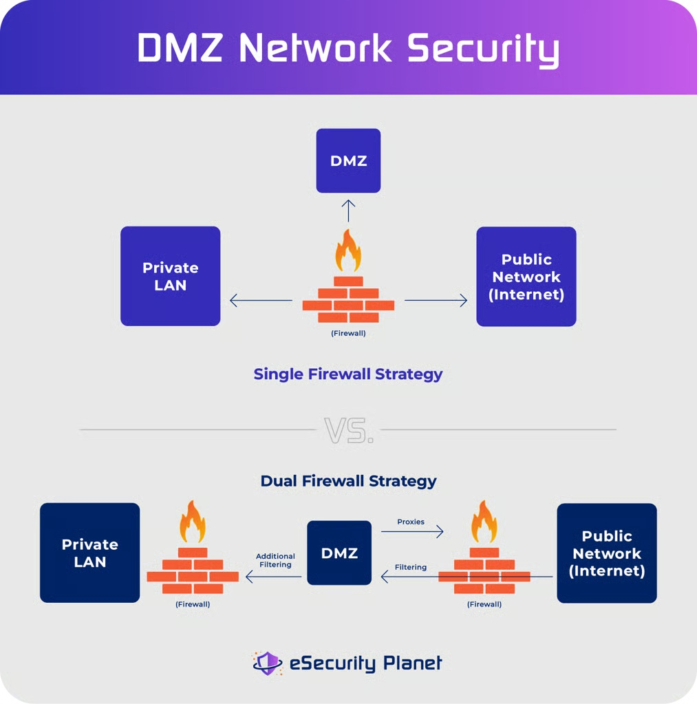
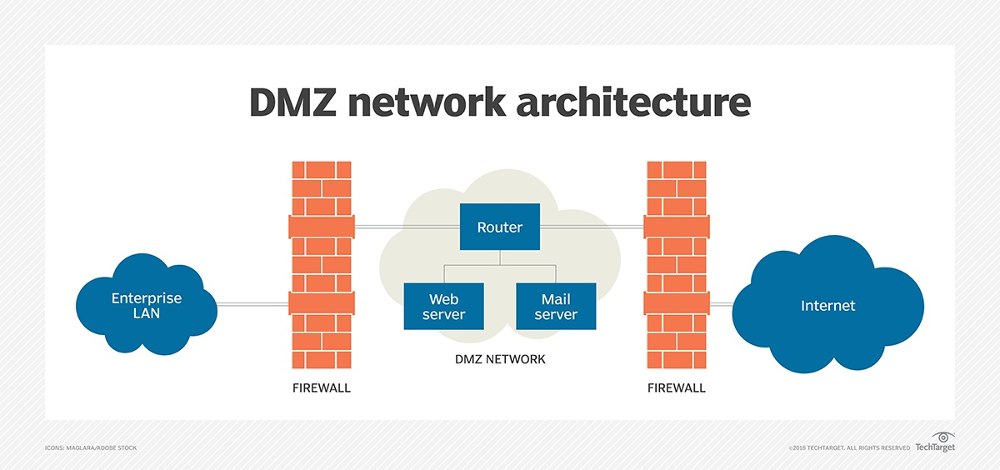
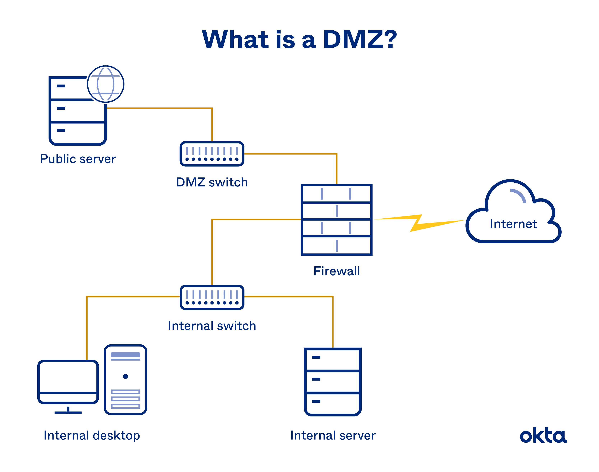
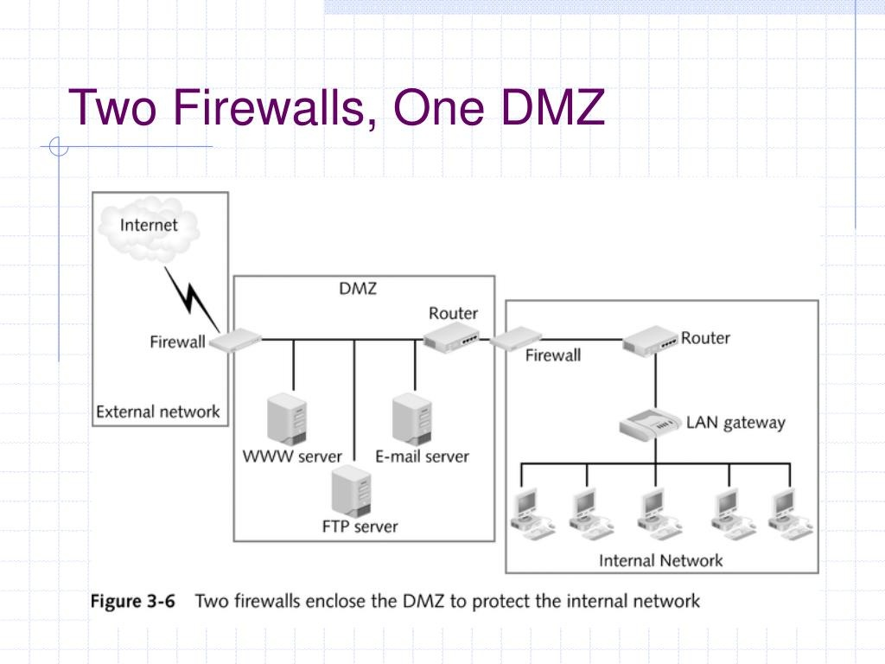

## Cos’è una DMZ (Demilitarized Zone)

Una **DMZ** è una **rete separata** destinata a ospitare servizi che devono essere accessibili dall’esterno. E' creata e progettata per non esporre direttamente la LAN.

Obiettivo:

* separare i sistemi pubblici (es. web server) dalla rete interna
* ridurre l’impatto di una compromissione

La DMZ è una **zona di rete distinta**, con 
- propria subnet IP, 
- proprie regole firewall e 
- routing controllato.

---

# Tipologie effettivamente usate

Le implementazioni realmente diffuse sono tre:

1. DMZ a 3 interfacce (single firewall)
2. DMZ con doppio firewall (dual firewall)
3. “DMZ” domestica (funzione semplificata nei router SOHO)

---

# 1) DMZ a 3 interfacce (architettura più comune in ambito aziendale)

Le tre zone hanno livelli di fiducia diversi:  
- WAN → non trusted  
- DMZ → semi-trusted  
- LAN → trusted  

Le regole puntuali seguenti sono l'applicazione di questi livelli di fiducia


Struttura hardware:

Firewall con 3 interfacce fisiche:

* NIC1 → WAN (Internet)
* NIC2 → LAN interna
* NIC3 → DMZ

Collocazione componenti:

WAN

* Internet
* Gateway ISP (router/ONT del provider)

Firewall (dispositivo fisico unico) con  

* Interfaccia WAN
* Interfaccia LAN
* Interfaccia DMZ
* NAT
* Firewall stateful
* **Routing controllato e filtrato** tra le tre zone
* Eventuale IPS/IDS

DMZ (rete separata)

* Web server
* Mail server
* Reverse proxy
* Server DNS pubblico

LAN

* PC aziendali
* File server interni
* Database non esposti

Logica di funzionamento:

* WAN → DMZ: consentito solo traffico verso servizi pubblici,tipicamente  tramite NAT (es. TCP 443 verso web server)
* WAN → LAN: bloccato
* DMZ → LAN: bloccato di default, consentito solo per flussi applicativi specifici (es. web → database)
* LAN → DMZ: consentito solo per flussi applicativi specifici (principio di minimo privilegio), monitorato/loggato
* LAN → WAN: consentito con NAT in uscita (PC su lan ha indirizzo privato, l'altro dispositivo non può comunicare direttamente con un indirizzo privato)


Il firewall è il punto centrale di controllo.

---

Di seguito la versione **estesa, rigorosa e allineata** (stesso livello della precedente a 3 interfacce), mantenendo la tua struttura ma aggiungendo i dettagli mancanti.

---

# 2) DMZ con doppio firewall (maggiore isolamento)

Le zone hanno livelli di fiducia distinti:

* WAN → non trusted
* DMZ → semi-trusted
* LAN → trusted

La separazione è **fisica e logica**: ogni firewall controlla un confine diverso.

---

## Struttura hardware

Internet  
|  
Firewall esterno (perimetro)  
|  
DMZ  
|  
Firewall interno (core security)  
|  
LAN  

Sono presenti **due dispositivi distinti**, spesso anche di vendor diversi (defence-in-depth).

---

## Collocazione componenti

WAN  
* Internet
* Gateway ISP (router/ONT del provider)

Firewall esterno (edge firewall)

* Interfaccia WAN
* Interfaccia DMZ
* NAT pubblico (DNAT/port forwarding per pubblicazione servizi)
* Firewall stateful
* Eventuale IPS/IDS, anti-DDoS, rate limiting
* Routing controllato tra WAN e DMZ
* Logging del traffico Internet

**Ruolo principale:**

* esporre i servizi pubblici in modo controllato
* bloccare completamente l’accesso diretto alla LAN

DMZ (rete esposta)

* Web server
* Reverse proxy / WAF
* Mail server (MX)
* DNS pubblico

Caratteristiche:

* rete isolata sia dalla WAN sia dalla LAN
* contiene sistemi esposti → **considerata potenzialmente compromettibile**
* non contiene dati critici (es. database aziendali interni)

Firewall interno

* Interfaccia DMZ
* Interfaccia LAN
* Firewall stateful
* Filtri molto restrittivi DMZ → LAN
* Logging dettagliato
* Eventuale IDS/IPS interno

**Ruolo principale:**

* proteggere la LAN anche in caso di compromissione della DMZ
* applicare il principio di minimo privilegio tra DMZ e rete interna

LAN

* PC aziendali
* File server interni
* Database
* Sistemi gestionali

Caratteristiche:

* rete ad alta fiducia
* **mai esposta direttamente verso Internet o DMZ**

---

## Logica di funzionamento

* WAN → DMZ: consentito solo traffico verso servizi pubblici tramite NAT sul firewall esterno (es. TCP 443 verso reverse proxy)

* WAN → LAN: sempre bloccato (non esiste percorso diretto)

* DMZ → WAN: consentito per traffico necessario (es. aggiornamenti, risposte alle connessioni), **generalmente con NAT sul firewall esterno**  

* DMZ → LAN: bloccato di default; consentito solo per flussi applicativi specifici e strettamente controllati (es. web server → database interno su porta specifica)

* LAN → DMZ: consentito solo per flussi necessari, monitorati e loggati (es. amministrazione server, deploy)

* LAN → WAN: consentito con NAT in uscita (PAT/masquerading), gestito tipicamente dal firewall esterno oppure, in alcune architetture, dal firewall interno con routing verso l’esterno

---

## Ruolo dei due firewall

### Firewall esterno

* prima linea di difesa
* esposto direttamente a Internet
* gestisce:

  * NAT pubblico
  * pubblicazione servizi
  * filtraggio traffico Internet

### Firewall interno

* seconda linea di difesa
* protegge la LAN da:

  * attacchi provenienti dalla DMZ
  * movimenti laterali (lateral movement)
* applica controlli più restrittivi e granulari

---

## Vantaggi

* isolamento forte tra DMZ e LAN
* compromissione del firewall esterno **non implica accesso alla LAN**
* difesa a più livelli (defence-in-depth)
* possibilità di usare tecnologie e policy diverse sui due firewall

---

## Svantaggi

* maggiore costo (due apparati)
* maggiore complessità di configurazione e gestione
* necessità di coordinare le policy tra i due firewall

---

## Quando si usa

Questa architettura è tipica di:

* ambienti ad alta sicurezza
* grandi aziende
* infrastrutture critiche
* contesti con requisiti normativi stringenti (es. settori finanziari, PA, sanità)

---

## Confronto sintetico con DMZ a 3 interfacce

* 3 interfacce → soluzione più semplice ed economica
* doppio firewall → soluzione più sicura e robusta

---

## Conclusione

La DMZ con doppio firewall realizza una separazione più forte tra rete pubblica e rete interna, introducendo un secondo livello di controllo che riduce drasticamente il rischio che una compromissione della DMZ si propaghi verso la LAN.


---

# 3) “DMZ” nei router domestici (SOHO)

Nei router casalinghi la voce “DMZ” NON è una vera zona di rete separata.

È semplicemente:

* una o più regole NAT che inoltrano tutto il traffico in ingresso verso uno o alcuni IP interni.

Collocazione reale:


WAN  
* Internet  

Router domestico  
* NAT
* Firewall base
* Regola “DMZ host” → inoltra tutte le porte verso 192.168.1.100

LAN  
* PC 192.168.x.y (esposto)


Non esiste una subnet separata.
Non esiste isolamento reale dalla LAN.
È solo un port forwarding totale.

---

# Componenti hardware e logici – dove sono collocati

Firewall (hardware o appliance virtuale)

* Posizione: confine tra zone (WAN/DMZ/LAN)
* Funzione: filtraggio, NAT, routing

Switch DMZ

* Posizione: rete DMZ
* Funzione: collegare server pubblici

Server pubblici

* Posizione: subnet DMZ
* IP dedicati (privati o pubblici)

NAT

* Posizione: firewall (tra WAN e DMZ o WAN e LAN)

Routing

* Posizione: firewall e router ISP

Reverse proxy

* Posizione: server nella DMZ

WAF

* Posizione: nella DMZ (davanti ai server web) oppure integrato nel firewall

DNS pubblico

* Posizione: DMZ o cloud esterno

---

# Flussi tipici

Internet → DMZ

* Consentito solo verso servizi pubblici

Internet → LAN

* Bloccato

DMZ → LAN

* Bloccato (salvo eccezioni controllate)

LAN → DMZ

* Consentito

LAN → Internet

* Consentito con NAT

---

# Esempio 1 – Piccola azienda con DMZ a 3 interfacce

Rete ISP

* IP pubblico: 203.0.113.10

Firewall:

* WAN: 203.0.113.10
* DMZ: 192.168.10.1/24
* LAN: 192.168.1.1/24

DMZ:

* Web server: 192.168.10.10
* Mail server: 192.168.10.20

LAN:

* PC1: 192.168.1.100
* DB server: 192.168.1.200

Regole:

* NAT 203.0.113.10:443 → 192.168.10.10:443
* WAN → LAN: negato
* DMZ → LAN: negato

---

# Esempio 2 – Router domestico con “DMZ host”

Router:

* WAN: 93.45.67.80
* LAN: 192.168.1.1/24

PC gaming:

* 192.168.1.50

Impostazione “DMZ”:

* Tutto il traffico in ingresso su 93.45.67.80 → inoltrato a 192.168.1.50

Non esiste subnet separata.
Il PC è direttamente esposto a Internet tramite NAT completo.

---

## Diagrammi delle tre architetture con evidenziazione delle zone e dei flussi consentiti/bloccati.

---

Di seguito sono forniti **diagrammi per le tre principali architetture DMZ** utilizzate nei contesti reali: singolo firewall con tre interfacce, doppio firewall (dual firewall), e la “DMZ host” semplificata dei router domestici.

## 1) Architettura DMZ con singolo firewall (Three-legged)





<!--  -->


Questa configurazione prevede un **firewall con tre interfacce** distinte:

* WAN verso Internet
* DMZ verso la sottorete pubblica
* LAN verso la rete interna
  Il firewall gestisce **routing, filtraggio delle connessioni e NAT** tra tutte e tre le zone. ([Wikipedia][1])

**Zone e dispositivi tipici**

```
Internet
   |
  Firewall (interface WAN)
   |---------- (interface DMZ) ----> Server pubblici (es. web, mail)
   |
  (interface LAN) ----> Rete interna (workstation, DB)
```

In questo modello il firewall è il **punto centrale di controllo** per tutte le connessioni entranti e uscenti.

## 2) Architettura DMZ con doppio firewall (Dual Firewall)




In questa configurazione si usano **due firewall separati**:

* Firewall esterno tra Internet e DMZ
* Firewall interno tra DMZ e LAN
  Questo aumenta l’isolamento: se il firewall esterno è compromesso non si accede direttamente alla LAN. ([Edrawsoft][2])

**Zone e dispositivi tipici**

```
Internet
   |
Firewall esterno
   |
   ---> DMZ (server web, mail, DNS)
   |
Firewall interno
   |
LAN (workstation, database, file server)
```

I server pubblici sono collocati fisicamente nella subnet DMZ, separata dalla rete interna e controllata da due livelli di firewall.

## 3) DMZ “host” nei router domestici

Nei router casalinghi la voce “DMZ” **non crea una subnet separata**. È semplicemente:

* un **inoltro completo di tutte le porte** dalla WAN verso un singolo dispositivo interno
* il router mantiene l’unica LAN

In realtà non è una DMZ isolata ma un **host esposto al pubblico tramite NAT**. ([Wikipedia][3])

**Struttura semplificata**

```
Internet
   |
Router domestico (WAN ↔ LAN)
   |--- NAT totale verso 192.168.1.50 (host DMZ)
LAN (altri dispositivi)
```

In questo caso non esiste isolamento mediante subnet o firewall separati per una zona DMZ.

---

Se si desidera posso fornire **diagrammi in stile testo puro (ASCII o SVG)** per uso in documentazione tecnica o presentazioni.

[1]: https://en.wikipedia.org/wiki/DMZ_%28computing%29?utm_source=chatgpt.com "DMZ (computing)"
[2]: https://www.edrawsoft.com/it/for-it-service/network-diagram-tips.html?srsltid=AfmBOoqPgULCoiINW7eRMZBuMXoSbHNiU3gAnVakzY_ZYzDeJ2UUMmVw&utm_source=chatgpt.com "Esempi di diagrammi di rete firewall"
[3]: https://it.wikipedia.org/wiki/Demilitarized_zone?utm_source=chatgpt.com "Demilitarized zone"

