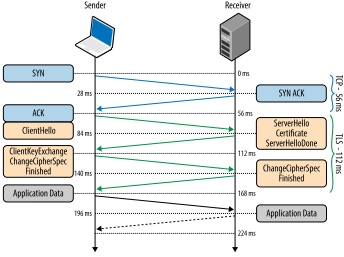

## Certificato digitale – Overview


## 1. Definizione

Un **certificato digitale** è un documento elettronico standardizzato (formato **X.509**) che:

* associa una **chiave pubblica** a un’identità
* è firmato digitalmente da un’autorità fidata (Certification Authority, CA)
* consente autenticazione, cifratura e verifica di integrità

È un elemento centrale della **PKI (Public Key Infrastructure)**.

In termini semplici:
è una carta d’identità crittografica che collega una chiave pubblica a un soggetto (persona, server, organizzazione).

---

## 2. Struttura di un certificato X.509

Un singolo certificato contiene:

* Version
* Serial Number
* Signature Algorithm
* Issuer (chi lo ha firmato)
* Validity (Not Before / Not After)
* Subject (identità)
* Subject Alternative Name (SAN)
* Subject Public Key
* Extensions (Key Usage, Extended Key Usage, ecc.)
* Digital Signature della CA

### Diagramma logico semplificato

```
+--------------------------------------------------+
|                 X.509 Certificate                |
+--------------------------------------------------+
| Version                                          |
| Serial Number                                    |
| Signature Algorithm                              |
+--------------------------------------------------+
| Issuer (CA che firma)                            |
+--------------------------------------------------+
| Validity                                         |
+--------------------------------------------------+
| Subject (es. www.example.com)                    |
+--------------------------------------------------+
| Public Key                                       |
+--------------------------------------------------+
| Extensions (SAN, Key Usage, ecc.)                |
+--------------------------------------------------+
| Firma digitale dell'Issuer                       |
+--------------------------------------------------+
```

NB:
la **catena di fiducia non è contenuta dentro questo certificato**.  
Il certificato contiene solo l’identità dell’Issuer e la sua firma.

---

## 3. Catena di fiducia (Trust Chain)

Un browser non si fida direttamente del certificato del server.

La fiducia si basa su una **catena di certificati separati**:

```
Root CA  (già presente nel sistema)
    ↓ firma
Intermediate CA
    ↓ firma
Server Certificate
```

Il certificato del server:

* è firmato da una CA intermedia
* non contiene l’intera catena
* contiene solo il riferimento all’Issuer

Il browser ricostruisce la catena:

1. Verifica che il certificato del server sia firmato dall’intermedia.
2. Verifica che l’intermedia sia firmata dalla Root.
3. Controlla che la Root sia nel trust store locale.

Se la catena è valida → certificato accettato.

Un certificato self-signed non ha catena pubblica.

---

## 4. Tipologie e casi d’uso

### a) Certificati per Web server (HTTPS)

* autenticare un dominio
* abilitare TLS
* proteggere traffico HTTP

Ex. Un utente si collega a https://www.banca.it: il browser verifica il certificato del server per assicurarsi che il sito sia realmente della banca e poi cifra la comunicazione per proteggere password e dati sensibili.  

Ad essere precisi il X.509 garantisce che:  
- il dominio (es. www.banca.it) è associato a una chiave pubblica
- e questa associazione è stata validata e firmata da una CA
  

Quindi:

- non dice “questa è una banca” in senso assoluto
- dice “una Certification Authority ha verificato questa identità e la certifica”


---

### b) Certificati client

* autenticazione utenti
* VPN
* accesso a reti aziendali

Ex. Un dipendente si collega alla VPN aziendale: il server richiede un certificato client e consente l’accesso solo se il certificato presentato è valido e rilasciato dall’organizzazione.

---

### c) Certificati di firma digitale

* firma documenti
* firma email (S/MIME)
* code signing


Ex. Un software viene distribuito con firma digitale: il sistema operativo verifica il certificato dello sviluppatore per garantire che il programma provenga da una fonte autentica e non sia stato modificato.

---

## 5. Uso del certificato in SSL/TLS

SSL (obsoleto) e TLS (attuale) utilizzano il certificato per:

1. Autenticare il server.
2. Permettere lo scambio sicuro della chiave di sessione.
3. Abilitare cifratura simmetrica.

Sequenza semplificata:

```
ClientHello (client → server)
ServerHello (server → client)
Invio certificato (server → client)
Verifica certificato (client)
Scambio chiavi (client ↔ server)
Comunicazione cifrata (client ↔ server)
```

Il certificato contiene **solo la chiave pubblica** del soggetto del certificato cioè di www.banca.it.
La chiave privata rimane segreta nel server.





---

## 6. LAB – Creazione di un certificato self-signed

Requisito: OpenSSL installato.

### OpenSSL

E' un software open source che permette di generare certificati, gestire chiavi e stabilire connessioni cifrate.
Per alcuni è diventato sinonimo dei protocolli che implementa ma **non è un protocollo** è una **libreria software e un insieme di strumenti a riga di comando** per usare crittografia e protocolli sicuri come TLS.
Viene usato sia dagli sviluppatori (nelle applicazioni) sia dagli amministratori di sistema per operazioni pratiche di sicurezza.

Download ufficiale
[https://www.openssl.org/source/](https://www.openssl.org/source/)

Quickstart 
[https://www.openssl.org/docs/manmaster/man1/openssl.html](https://www.openssl.org/docs/manmaster/man1/openssl.html)

Guida pratica 
[https://wiki.openssl.org/index.php/Quick_Start](https://wiki.openssl.org/index.php/Quick_Start)


### Installazione in Windows

I comandi funzionano anche in Windows se:

* OpenSSL è installato
* la directory bin è nel PATH

Possibili ambienti:

* OpenSSL per Windows
* Git Bash
* WSL
* MSYS2

---

### Generare chiave privata

```
openssl genrsa -out server.key 2048
```

File generato:

* server.key → chiave privata

---

### Creare certificato self-signed

```
openssl req -new -x509 -key server.key -out server.crt -days 365
```

File generato:

* server.crt → certificato

---

### Verifica contenuto

```
openssl x509 -in server.crt -text -noout
```

---

## 7. Codice sorgente di un certificato X.509 (formato PEM)

Un certificato è codificato in ASN.1 e serializzato in DER o PEM.

***ASN.1** è un linguaggio che definisce in modo formale la struttura dei dati.
La **codifica** **DER** è una rappresentazione **binaria compatta e non ambigua** di ASN.1.  
Il **formato PEM** è una versione **testuale (Base64)** del DER, delimitata da intestazioni leggibili, più comoda per file e configurazioni.*  
  
  
Esempio minimale PEM:

```
-----BEGIN CERTIFICATE-----
MIIEWTCCA0GgAwIBAgIUKnKJHMeVIH7mtnBCL+0DIY6xv1cwDQYJKoZIhvcNAQEL
BQAwgbsxCzAJBgNVBAYTAml0MQ4wDAYDVQQIDAVsYXppbzENMAsGA1UEBwwEcm9t
YTEdMBsGA1UECgwUZXNlbXBpbyBkdW1teSBlbnJpY28xJDAiBgNVBAsMG29yZ2Fu
aXp6YXppb25lIGR1bW15IGVucmljbzEfMB0GA1UEAwwWZW5yaWNvLnRpZmEuc2lu
bmVyLmNvbTEnMCUGCSqGSIb3DQEJARYYZW5yaWNvQGphbm5pY2tzaW5uZXIuY29t
MB4XDTI2MDQxMTA2MzkzM1oXDTI3MDQxMTA2MzkzM1owgbsxCzAJBgNVBAYTAml0
MQ4wDAYDVQQIDAVsYXppbzENMAsGA1UEBwwEcm9tYTEdMBsGA1UECgwUZXNlbXBp
byBkdW1teSBlbnJpY28xJDAiBgNVBAsMG29yZ2FuaXp6YXppb25lIGR1bW15IGVu
cmljbzEfMB0GA1UEAwwWZW5yaWNvLnRpZmEuc2lubmVyLmNvbTEnMCUGCSqGSIb3
DQEJARYYZW5yaWNvQGphbm5pY2tzaW5uZXIuY29tMIIBIjANBgkqhkiG9w0BAQEF
AAOCAQ8AMIIBCgKCAQEAuIJJavLcFZisnKFMVLCBRtMbaD2wmTJ56kq6p9Z09iMB
o1I2cDK7UWeZfFLEgiZv2/LtZcq2uTvazao8VffafZXsVwjp42IQjENHyJU9r5qR
a6CvGQ+czmlVzmvYqFWLd062bYjclEAV2Q9I5lPchGjt6rKXGpa+MBBZNJHHqpcq
o2esGFcVdIdPhi31FBNJDt2YTjKR+rbU6VszbWsideG2dTz+rvJHvfKcr/oemMvk
RPC/1WYGNF4nYpddu4svAmaSRv9bYLbFWu9iwtdYBFoqum5T/Ww8lVEyLe4HQfWO
M34gZ1L6szT1XEOcjQ4HfAUiXMYAhHznVYAiu0M5KQIDAQABo1MwUTAdBgNVHQ4E
FgQUHqB5bhEWSGa7MkULuRXpq+MxzdUwHwYDVR0jBBgwFoAUHqB5bhEWSGa7MkUL
uRXpq+MxzdUwDwYDVR0TAQH/BAUwAwEB/zANBgkqhkiG9w0BAQsFAAOCAQEAeUTE
63OFPJof2fzUQcNdaY1oOuH/PWQo+oiOPwE367uPT2TCFJQZnzH5LeahmY87WL6J
3OZcAACXKn3m9VwY+U13Da/jr5dtm2TPolbIoDk8xCTPzqjmbMG6Yf40iPy+r+tO
9RLN+R/KtLIkXAWINGdmnyWqsRwmgb1MCmebuYOPhpiAh5EtFfAg7IaRpcKOffaB
z3p3daDWwBshiQucWCftLmJ90Q2Fm5/ooNuowumbCK9upkB/pFhn0MyYB9sLf5Ob
pDvoZAUllOeYLd9RwSBgunWiQm64O/8FORd4VbaZqKt8rCNqbPygJoKLvCUaMonz
uZO3NrjENvvbIIiwPA==
-----END CERTIFICATE-----

```

È una rappresentazione Base64 del certificato binario DER.
Visualizzazione contenuti dummy 

```
D:\delete_contents\key>openssl x509 -in server.crt -text -noout
Certificate:
    Data:
        Version: 3 (0x2)
        Serial Number:
            2a:72:89:1c:c7:95:20:7e:e6:b6:70:42:2f:ed:03:21:8e:b1:bf:57
        Signature Algorithm: sha256WithRSAEncryption
        Issuer: C = it, ST = lazio, L = roma, O = esempio dummy enrico, OU = organizzazione dummy enrico, CN = enrico.tifa.sinner.com, emailAddress = enrico@jannicksinner.com
        Validity
            Not Before: Apr 11 06:39:33 2026 GMT
            Not After : Apr 11 06:39:33 2027 GMT
        Subject: C = it, ST = lazio, L = roma, O = esempio dummy enrico, OU = organizzazione dummy enrico, CN = enrico.tifa.sinner.com, emailAddress = enrico@jannicksinner.com
        Subject Public Key Info:
            Public Key Algorithm: rsaEncryption
                Public-Key: (2048 bit)
                Modulus:
                    00:b8:82:49:6a:f2:dc:15:98:ac:9c:a1:4c:54:b0:
                    81:46:d3:1b:68:3d:b0:99:32:79:ea:4a:ba:a7:d6:
                    74:f6:23:01:a3:52:36:70:32:bb:51:67:99:7c:52:
                    c4:82:26:6f:db:f2:ed:65:ca:b6:b9:3b:da:cd:aa:
                    3c:55:f7:da:7d:95:ec:57:08:e9:e3:62:10:8c:43:
                    47:c8:95:3d:af:9a:91:6b:a0:af:19:0f:9c:ce:69:
                    55:ce:6b:d8:a8:55:8b:77:4e:b6:6d:88:dc:94:40:
                    15:d9:0f:48:e6:53:dc:84:68:ed:ea:b2:97:1a:96:
                    be:30:10:59:34:91:c7:aa:97:2a:a3:67:ac:18:57:
                    15:74:87:4f:86:2d:f5:14:13:49:0e:dd:98:4e:32:
                    91:fa:b6:d4:e9:5b:33:6d:6b:22:75:e1:b6:75:3c:
                    fe:ae:f2:47:bd:f2:9c:af:fa:1e:98:cb:e4:44:f0:
                    bf:d5:66:06:34:5e:27:62:97:5d:bb:8b:2f:02:66:
                    92:46:ff:5b:60:b6:c5:5a:ef:62:c2:d7:58:04:5a:
                    2a:ba:6e:53:fd:6c:3c:95:51:32:2d:ee:07:41:f5:
                    8e:33:7e:20:67:52:fa:b3:34:f5:5c:43:9c:8d:0e:
                    07:7c:05:22:5c:c6:00:84:7c:e7:55:80:22:bb:43:
                    39:29
                Exponent: 65537 (0x10001)
        X509v3 extensions:
            X509v3 Subject Key Identifier:
                1E:A0:79:6E:11:16:48:66:BB:32:45:0B:B9:15:E9:AB:E3:31:CD:D5
            X509v3 Authority Key Identifier:
                1E:A0:79:6E:11:16:48:66:BB:32:45:0B:B9:15:E9:AB:E3:31:CD:D5
            X509v3 Basic Constraints: critical
                CA:TRUE
    Signature Algorithm: sha256WithRSAEncryption
    Signature Value:
        79:44:c4:eb:73:85:3c:9a:1f:d9:fc:d4:41:c3:5d:69:8d:68:
        3a:e1:ff:3d:64:28:fa:88:8e:3f:01:37:eb:bb:8f:4f:64:c2:
        14:94:19:9f:31:f9:2d:e6:a1:99:8f:3b:58:be:89:dc:e6:5c:
        00:00:97:2a:7d:e6:f5:5c:18:f9:4d:77:0d:af:e3:af:97:6d:
        9b:64:cf:a2:56:c8:a0:39:3c:c4:24:cf:ce:a8:e6:6c:c1:ba:
        61:fe:34:88:fc:be:af:eb:4e:f5:12:cd:f9:1f:ca:b4:b2:24:
        5c:05:88:34:67:66:9f:25:aa:b1:1c:26:81:bd:4c:0a:67:9b:
        b9:83:8f:86:98:80:87:91:2d:15:f0:20:ec:86:91:a5:c2:8e:
        7d:f6:81:cf:7a:77:75:a0:d6:c0:1b:21:89:0b:9c:58:27:ed:
        2e:62:7d:d1:0d:85:9b:9f:e8:a0:db:a8:c2:e9:9b:08:af:6e:
        a6:40:7f:a4:58:67:d0:cc:98:07:db:0b:7f:93:9b:a4:3b:e8:
        64:05:25:94:e7:98:2d:df:51:c1:20:60:ba:75:a2:42:6e:b8:
        3b:ff:05:39:17:78:55:b6:99:a8:ab:7c:ac:23:6a:6c:fc:a0:
        26:82:8b:bc:25:1a:32:89:f3:b9:93:b7:36:b8:c4:36:fb:db:
        20:88:b0:3c

D:\delete_contents\key>
```


---

## 8. Installazione su Web server

### File coinvolti

Self-signed:

* server.key
* server.crt

Certificato CA reale:

* server.key
* server.crt
* intermediate.crt
* oppure fullchain.pem (server + intermedi)

La Root CA non viene inviata: è già nel browser.

---

### Configurazione Apache

Configurazione minima:

```
SSLEngine on
SSLCertificateFile "C:/percorso/server.crt"
SSLCertificateKeyFile "C:/percorso/server.key"
```

Configurazione con CA intermedia:

```
SSLEngine on
SSLCertificateFile "C:/percorso/server.crt"
SSLCertificateKeyFile "C:/percorso/server.key"
SSLCertificateChainFile "C:/percorso/intermediate.crt"
```

Configurazione moderna consigliata:

```
SSLEngine on
SSLCertificateFile "C:/percorso/fullchain.pem"
SSLCertificateKeyFile "C:/percorso/server.key"
```

Riavviare Apache dopo la modifica.

---

## 9. Differenze tra certificato self-signed e certificato CA

| Caratteristica      | Self-signed         | CA pubblica   |
| ------------------- | ------------------- | ------------- |
| Firma               | Autonoma            | Firmato da CA |
| Catena di fiducia   | Assente             | Presente      |
| Fiducia browser     | Avviso di sicurezza | Accettato     |
| Identità verificata | No                  | Sì            |
| Uso produzione      | No                  | Sì            |

Limiti del certificato creato nel LAB:

* genera warning nel browser
* non garantisce identità verificata
* non ha fiducia globale

È adatto solo per:

* laboratorio
* test locali
* ambienti didattici

---

## esaminare un certificato

Il certificato TLS del server è pubblico per definizione: viene inviato dal server durante il TLS handshake.  
È ovviamente possibile scaricare il certificato pubblico di un web server, non è necessario alcun permesso speciale. 

---

### 1. Modalità semplici per scaricare un certificato

#### Metodo 1 – Browser (Chrome / Edge / Firefox)

Procedura tipica:

1. Aprire un sito HTTPS (es. [https://www.google.com](https://www.google.com)).
2. Cliccare sull’icona del lucchetto nella barra degli indirizzi.
3. Visualizzare certificato.
4. Esportare il certificato in formato .crt o .pem.

Si ottiene il certificato del server oppure l’intera catena (server + intermediate).

---

#### Metodo 2 – OpenSSL (più didattico)

Da terminale:

```
openssl s_client -connect www.google.com:443 -showcerts
```

Questo comando:

* apre una connessione TLS
* stampa tutti i certificati della catena
* mostra handshake e parametri crittografici

Per salvare solo il certificato server:

```
openssl s_client -connect www.google.com:443 -showcerts </dev/null 2>/dev/null | openssl x509 -outform PEM > server.pem
```

Questo è il metodo migliore a fini didattici perché permette di:

* analizzare Subject
* Issuer
* validità
* SAN (Subject Alternative Name)
* algoritmo di firma
* chiave pubblica
* estensioni

---

#### Metodo 3 – Siti di analisi TLS (molto utili didatticamente)

SSL Labs – SSL Server Test
[https://www.ssllabs.com/ssltest/](https://www.ssllabs.com/ssltest/)

Permette di:

* analizzare qualsiasi dominio
* vedere la catena completa
* controllare versioni TLS abilitate
* verificare cipher suite
* analizzare configurazioni errate

Didatticamente molto utile.

---

### 2. Certificati consigliabili per uso didattico

Conviene scegliere siti con caratteristiche diverse.

#### 1) [www.google.com](http://www.google.com)

Ottimo per:

* vedere certificati con SAN multipli
* osservare catene complesse
* analizzare firme moderne (RSA/ECDSA)

---

#### 2) badssl.com

[https://badssl.com/](https://badssl.com/)

Sito è specificamente progettato per test didattici su TLS.

Offre:

* certificati scaduti
* self-signed
* SHA1
* hostname errato
* chain incomplete
* TLS vecchie versioni

È probabilmente il migliore in assoluto per laboratorio.

---

#### 3) un sito con certificato Let's Encrypt

Esempio:

[https://letsencrypt.org/](https://letsencrypt.org/)

Utile per mostrare:

* certificati DV (Domain Validation)
* catena Let's Encrypt
* ACME ecosystem

---

### 3. Cosa analizzare didatticamente nel certificato

Durante l’analisi è utile osservare:

* Versione X.509
* Subject (CN)
* SAN (Subject Alternative Names)
* Issuer
* Validità (Not Before / Not After)
* Key Usage
* Extended Key Usage
* Signature Algorithm
* Public Key Algorithm (RSA o ECDSA)
* Lunghezza chiave (es. 2048 bit)


---

### 4. Collegamento con HTTPS e TLS

Durante il TLS handshake:

```
Server → Client : Certificate
```

Il certificato viene inviato in chiaro (non cifrato), ma l’integrità è garantita dal protocollo TLS.  
*(Le prime fasi come ClientHello, ServerHello e invio del certificato non sono cifrate perché la chiave di sessione non esiste ancora. Dopo lo scambio dei parametri crittografici, client e server derivano una chiave condivisa e da quel momento i messaggi dell’handshake e tutti i dati successivi vengono autenticati e cifrati.)*


Il client:

* verifica la firma
* controlla la catena di fiducia
* verifica che il dominio richiesto sia presente nel SAN

Solo dopo procede con la generazione delle chiavi di sessione.

---

### 5. Conclusione

Un certificato digitale:

* lega una chiave pubblica a un’identità
* è firmato da una CA
* si basa su una catena di fiducia esterna
* è essenziale per TLS/HTTPS

Un certificato self-signed dimostra il meccanismo tecnico,
ma solo un certificato firmato da una CA consente utilizzo sicuro e riconosciuto in produzione.
