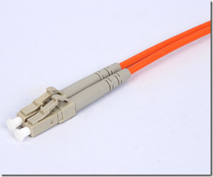

---

marp: false
theme: portrait
paginate: true

--- 

# Cavi Ethernet in rame

Obiettivo: comprendere quale cavo scegliere in base a velocità, distanza e ambiente di utilizzo.

<!-- slideseparator -->

## 1. Struttura del cavo Ethernet

Un cavo Ethernet in rame è composto da:

* 4 coppie di fili intrecciati
* guaina esterna protettiva
* eventuale schermatura metallica
* connettore RJ-45

L’intreccio dei fili riduce le interferenze tra le coppie (**diafonia**).

<!-- slideseparator -->

## 2. Le due classificazioni fondamentali

Quando si sceglie un cavo occorre considerare due parametri distinti:

1. **Categoria (Cat5e, Cat6, Cat6a, …)** → prestazioni elettriche
2. **Schermatura (UTP, STP, FTP, S/FTP)** → protezione dalle interferenze

Sono indipendenti e si combinano tra loro.

Esempio: Cat6 UTP, Cat6a S/FTP.

<!-- slideseparator -->

## 3. Le categorie principali

### Cat5e

{width=50%}

{width=50%}

* Frequenza: 100 MHz
* Velocità: fino a 1 Gbit/s
* Distanza massima: 100 m

Uso tipico:

* abitazioni
* laboratori scolastici
* piccoli uffici

<!-- slideseparator -->

### Cat6

* Frequenza: 250 MHz
* 1 Gbit/s fino a 100 m
* 10 Gbit/s fino a circa 55 m

Uso tipico:

* uffici moderni
* nuove installazioni

<!-- slideseparator -->

### Cat6a

* Frequenza: 500 MHz
* 10 Gbit/s fino a 100 m

Uso tipico:

* reti aziendali evolute
* sale server

<!-- slideseparator -->

## 4. Tipi di schermatura

### UTP (Unshielded Twisted Pair)

* Nessuna schermatura metallica
* Più economico
* Adeguato in ambienti normali

### STP / FTP / S/FTP

* Presenza di schermatura metallica
* Maggiore protezione da interferenze
* Richiede messa a terra corretta

Uso consigliato:

* ambienti industriali
* vicinanza a linee elettriche o macchinari

<!-- slideseparator -->

## 5. Lunghezza massima

Per tutti i cavi Ethernet in rame:

* Lunghezza massima standard: **100 metri**

Oltre questa distanza:

* il segnale si degrada
* è necessario uno switch intermedio o fibra ottica

<!-- slideseparator -->

## 6. Guida pratica alla scelta

Casa o scuola (1 Gbit/s):

* Cat5e UTP
* Cat6 UTP per maggiore durata nel tempo

Ufficio moderno:

* Cat6 UTP

Rete 10 Gigabit:

* Cat6a

Ambiente con interferenze:

* Cat6 o Cat6a schermato

<!-- slideseparator -->

## Conclusione

La scelta dipende da:

* velocità richiesta
* distanza
* ambiente elettromagnetico
* possibilità di espansione futura

Per la maggior parte delle installazioni moderne, **Cat6 UTP rappresenta un buon compromesso tra costo, prestazioni e affidabilità**.

# ISO/IEC 11801 – Cablaggio strutturato per edifici e campus

{width=70%}

{width=70%}{width=70%}

{width=70%}

{width=70%}

### 1. Che cos’è ISO/IEC 11801

**ISO/IEC 11801** è uno standard internazionale che definisce i requisiti per il **cablaggio strutturato generico** negli edifici (uffici, scuole, industrie, data center) e nei campus.

È pubblicato da:

* International Organization for Standardization
* International Electrotechnical Commission

Obiettivo principale:
progettare un’infrastruttura di cablaggio **neutra rispetto alle applicazioni**, capace di supportare voce, dati, video e servizi futuri senza rifare l’impianto.

<!-- slideseparator -->

### 2. Concetto di cablaggio strutturato

Il cablaggio strutturato non è un insieme casuale di cavi, ma un sistema organizzato basato su:

* topologia gerarchica
* punti di concentrazione (armadi, rack)
* permutazioni tramite patch panel
* separazione tra cablaggio permanente e cordoni di permutazione

Principio fondamentale:
l’infrastruttura fisica deve essere stabile nel tempo, mentre gli apparati attivi (switch, router) possono cambiare.

<!-- slideseparator -->

### 3. Architettura definita dallo standard

ISO/IEC 11801 definisce una struttura a livelli:

1. **Campus (complesso/comprensorio)backbone**
2. **Building backbone**
3. **Horizontal cabling**
4. **Work area**

Topologia logica: **a stella gerarchica**.

Caratteristiche principali:

* lunghezza massima collegamento orizzontale: 90 m (permanent link)
* 100 m complessivi includendo patch cord
* separazione tra dorsali e cablaggio orizzontale

<!-- slideseparator -->

### 4. Classi e categorie

Lo standard distingue tra:

* **Categorie (Category)** → riferite ai componenti (cavi, connettori)
* **Classi (Class)** → riferite al canale completo

Esempi:

* Cat 5e → Classe D
* Cat 6 → Classe E
* Cat 6A → Classe EA
* Cat 7 → Classe F
* Cat 8 → Classe I / II

Le classi sono definite in base alla **frequenza massima supportata** (MHz).

<!-- slideseparator -->

### 5. Supporto ai servizi Ethernet

Il cablaggio conforme ISO/IEC 11801 consente di supportare standard IEEE come:

* IEEE 802.3

Esempi:

* 1000BASE-T (1 Gbps)
* 10GBASE-T (10 Gbps)
* 25G/40GBASE-T (Cat 8)

Il principio è che lo standard di cablaggio è **indipendente dal protocollo**, ma deve garantire parametri elettrici adeguati (attenuazione, NEXT, FEXT, ecc.).

<!-- slideseparator -->

### 6. Parametri tecnici principali

ISO/IEC 11801 definisce limiti per:

* attenuazione (insertion loss)
* diafonia (NEXT, PSNEXT)
* perdita di ritorno (return loss)
* ritardo di propagazione
* differenza di ritardo (skew)

Questi parametri vengono verificati tramite certificatori di cablaggio.

<!-- slideseparator -->

### 7. Varianti dello standard

Lo standard è suddiviso in più parti:

* ISO/IEC 11801-1 → requisiti generali
* ISO/IEC 11801-2 → edifici per uffici
* ISO/IEC 11801-3 → ambienti industriali
* ISO/IEC 11801-4 → data center
* ISO/IEC 11801-5 → edifici residenziali

Ogni parte adatta i requisiti all’ambiente operativo.

<!-- slideseparator -->

### 8. Differenze rispetto ad altri standard

ISO/IEC 11801 è lo standard internazionale.

Esiste anche lo standard americano:

* Telecommunications Industry Association
* ANSI/TIA-568

Le differenze sono minime a livello tecnico; la scelta dipende dal contesto geografico e normativo.

<!-- slideseparator -->

### 9. Perché è importante in azienda

Vantaggi concreti:

* scalabilità
* interoperabilità tra vendor
* supporto a nuove tecnologie
* riduzione costi nel lungo periodo
* manutenzione semplificata

Un impianto non conforme può generare:

* problemi di performance
* difficoltà di certificazione
* incompatibilità future

Un impianto conforme garantisce:

* prestazioni prevedibili
* documentazione tecnica standardizzata
* longevità dell’infrastruttura

<!-- slideseparator -->

### 10. Sintesi finale

ISO/IEC 11801:

* definisce l’architettura del cablaggio strutturato
* stabilisce classi e categorie
* impone limiti elettrici misurabili
* separa infrastruttura passiva da apparati attivi
* garantisce compatibilità con le tecnologie Ethernet moderne

È la base tecnica di qualsiasi rete aziendale moderna progettata correttamente.

---   

## Fibra ottica per la progettazione di rete (approccio pratico)

{width=70%}

{width=70%}

{width=70%}

{width=70%}

{width=70%}

la fibra ottica serve per:

* collegare switch tra loro (al momento poco usata in access layer)
* realizzare uplink ad alta velocità
* coprire distanze dove il rame non è sufficiente

---

## Tipologie realmente usate  

### Multimodale (MM)

* tipicamente colore **arancione o acqua (OM3/OM4)**
* usata in LAN e data center
* costo più basso

Distanze tipiche:

* 1 Gbps → fino a **~550** m
* 10 Gbps → **300–400** m (OM3/OM4)

Uso tipico:

* access switch → core (stesso edificio)
* collegamenti tra rack

---

### Monomodale (SM)

* tipicamente colore **giallo**
* usata per lunghe distanze

Distanze tipiche:

* 1 Gbps / 10 Gbps → da km fino a **decine di km**
  (dipende dal modulo SFP)

Uso tipico:

* collegamenti tra edifici
* campus
* connessioni WAN / ISP

---

## Dispositivi necessari

Per usare la fibra con uno switch servono sempre:

### 1. Slot SFP nello switch

* presenti sugli switch professionali
* spesso usati per uplink

---

### 2. Modulo SFP / SFP+

* converte segnale elettrico ↔ ottico
* determina:

  * velocità (1G, 10G, …)
  * distanza
  * tipo di fibra

---

### 3. Cavo in fibra

* connettore tipico: **LC duplex**
* due fibre:

  * TX (trasmissione)
  * RX (ricezione)

---

## Tabella pratica (da usare nei progetti)

| Scenario                   | Tecnologia consigliata | Motivazione                       |
| -------------------------- | ---------------------- | --------------------------------- |
| Stesso rack                | DAC o fibra corta      | economico e semplice              |
| Stesso edificio            | Multimode (OM3/OM4)    | costo basso, distanza sufficiente |
| Tra edifici (100 m – 2 km) | Monomode               | evita limiti multimode            |
| Distanze elevate           | Monomode               | unica soluzione                   |

---

## Monomode vs Multimode, scelta, criteri pratici

### 1. Distanza

* < 100–300 m → multimode
* > 300–500 m → monomode

---

### 2. Velocità richiesta

* 1 Gbps → entrambe
* 10 Gbps → attenzione ai limiti della multimode
* > 10 Gbps → spesso monomode

---

### 3. Budget

* multimode:

  * cavi più costosi
  * moduli più economici

* monomode:

  * cavi più economici
  * moduli più costosi

---

### 4. Scalabilità futura

Scelta tipica professionale:

> usare direttamente **monomode** per evitare rifacimenti futuri

---

## Compatibilità (punto critico negli esami e nella realtà)

### 1. Compatibilità SFP ↔ switch

* standard esistono
* ma vendor come Cisco Systems o Hewlett Packard Enterprise possono limitare i moduli

Soluzione pratica:

* usare moduli certificati o compatibili

---

### 2. Compatibilità fibra ↔ modulo

* multimode ↔ SFP multimode
* monomode  ↔ SFP monomode

* **non** sono intercambiabili

---

### 3. Compatibilità connettori

* standard più comune: **LC**
* verificare sempre il tipo nell'uso reale

---

### 4. Velocità

* SFP 1G ≠ SFP+ 10G
* devono essere compatibili su entrambi i lati

---

## Errori tipici (da evitare)

* usare multimode per distanze troppo lunghe (monomode è la scelta giusta)
* scegliere moduli non compatibili con lo switch (incompatibilità artificiose)
* non verificare TX/RX (fibra invertita)
* mescolare standard diversi (1G vs 10G)
* sottodimensionare gli uplink

---

## Sintesi operativa

In progettazione:

* usare **rame per utenti**
* usare **fibra per collegamenti tra apparati**
* scegliere:

  * multimode → distanze brevi, costo contenuto
  * monomode → distanze lunghe, maggiore flessibilità

e ricordare sempre:

> la fibra funziona solo insieme a moduli SFP corretti e compatibili

---

## Alcuni riferimenti

* [https://it.wikipedia.org/wiki/Fibra_ottica](https://it.wikipedia.org/wiki/Fibra_ottica)
* [https://www.fs.com/blog/what-is-fiber-optic-cable-105.html](https://www.fs.com/blog/what-is-fiber-optic-cable-105.html)
* [https://www.cisco.com/c/en/us/products/interfaces-modules/transceiver-modules/index.html](https://www.cisco.com/c/en/us/products/interfaces-modules/transceiver-modules/index.html)

---

