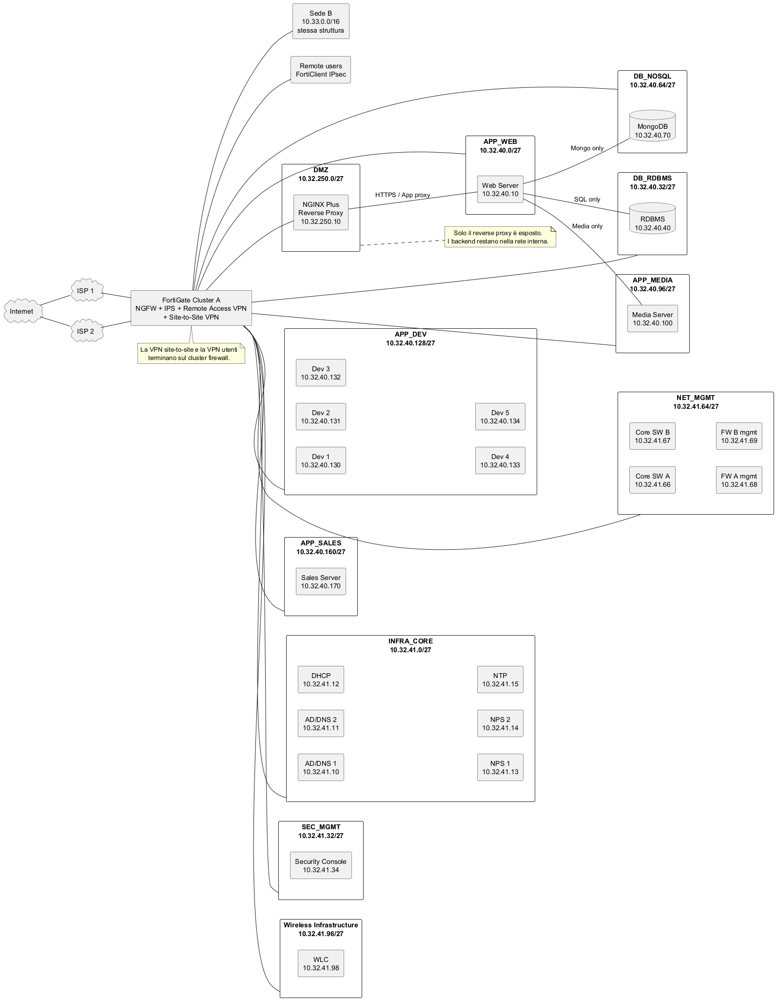
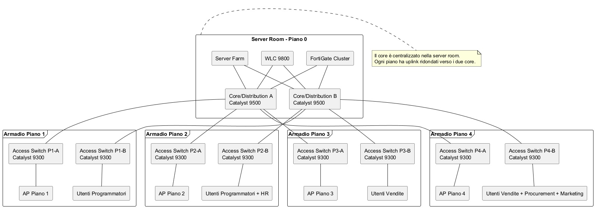
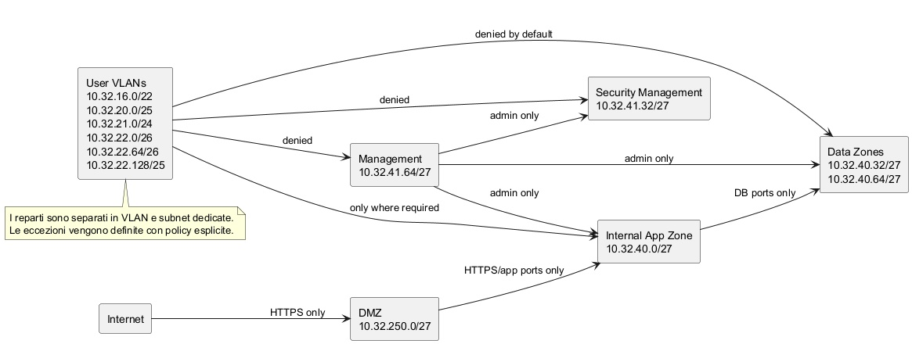
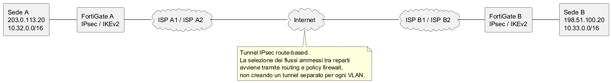
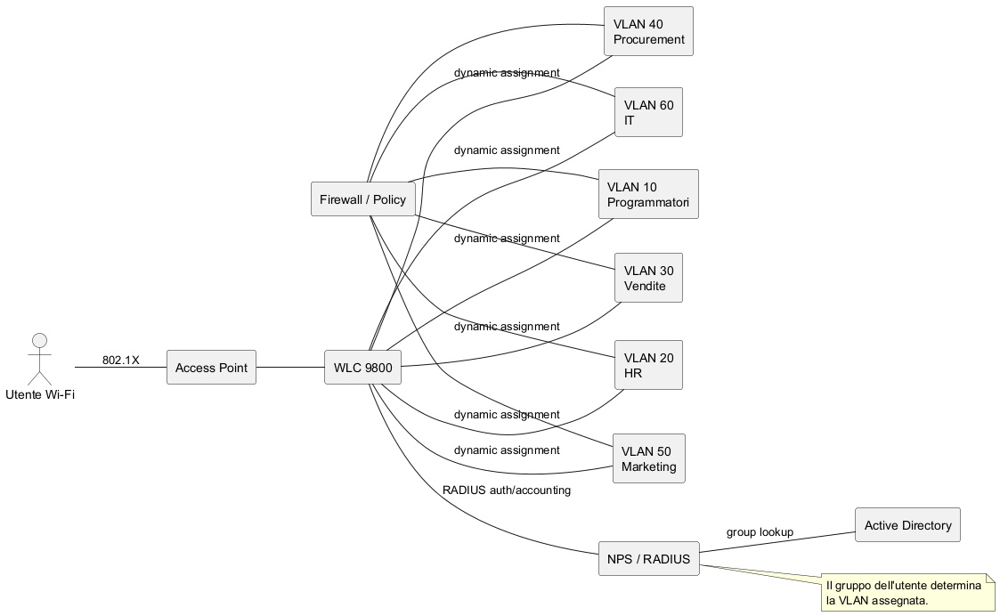

# Obiettivo

Questa dispensa presenta una caso non totalmente reaaslistico ma comunque più realistico degli esercizi didattici.

Il criterio guida per la soluzione è stato scegliere una soluzione realmente plausibile in grandi aziende, ma anche abbastanza trasparente da risultare didatticamente leggibile.

# Traccia

Definire un'architettura di rete professionale per una ditta di grandi dimensioni che produce software.

La ditta ha le seguenti unità organizzative le cui reti debbono essere separate:

* programmatori, 300 dipendenti, occupano il primo piano e parte del secondo
* human resources, con 30 dipendenti al secondo piano assieme ai programmatori
* vendite, con 100 dipendenti, al terzo piano e al quarto
* procurement, 10 dipendenti, al quarto piano
* marketing, 20 dipendenti, al quarto piano
* IT interno, 20 persone, che gestiscono i seguenti server situati nel seminterrato (piano 0):

  * WEB server, che deve essere raggiungibile da Internet
  * RDBMS che deve essere raggiungibile dal WEB server e dal DBA che fa parte dell'IT interno
  * (NoSQL) MongoDB server che deve essere raggiungibile dal WEB server e dal DBA che fa parte dell'IT interno
  * Media server per filmati, che deve essere raggiungibile dal WEB server e dal DBA che fa parte dell'IT interno
  * Sistema di intrusion prevention, accessibile solo all'IT interno, centralizzato
  * server vendite interno, accessibile solo dal reparto vendite
  * 5 server di sviluppo che devono essere raggiungibili dai programmatori

Per i server esposti su Internet, e per i server utilizzati dai server esposti su Internet, specificare se vanno posti in DMZ o in rete interna, e perché.

È obbligatorio usare un server RADIUS; per il resto dello IAM la scelta è libera.

La connessione Internet è di importanza vitale: deve essere usata una soluzione veloce per consentire eventuali future implementazioni di hybrid cloud per big data; la connessione deve essere resiliente.

Per ogni gruppo, su tutti i piani, è disponibile accesso Wi-Fi, che deve essere integrato solo con la rete cablata a cui il gruppo ha accesso.

Per tutti i dipendenti deve essere disponibile accesso VPN limitato ai sistemi del gruppo.

Deve essere disponibile una VPN site-to-site con una seconda sede con la stessa organizzazione e dimensioni; ogni reparto dell'altra sede deve avere accesso a tutta e sola la porzione di rete dedicata al reparto corrispondente.

Deve essere mostrata e spiegata la gestione della VPN site-to-site (server dedicato? funzionalità deployata assieme ad altre?) e descritto quale protocollo viene usato, e anche una soluzione commerciale usata attualmente nel mondo corporate.

Si vogliono almeno tre zone logiche distinte: Internet, DMZ, rete interna.

Deve necessariamente essere usato un reverse proxy; la sua posizione deve essere mostrata chiaramente nell'architettura.

DHCP, DNS e NTP devono essere modellati.

Decidere se introdurre una rete di management separata; se sì, spiegare i motivi e definirla con cura.

Decidere se sono necessari o utili:

* armadi di piano
* switch di accesso per piano
* backbone verticale
* core nel seminterrato o in sala server
* eventuale distribuzione a due livelli o tre livelli

Motivare le decisioni.

Tenendo conto che si può avere qualunque indirizzo pubblico si voglia:

* scegliere l'indirizzo in modo ragionato, spiegare i motivi
* spiegare se internamente si usa un indirizzo privato, quale si sceglie e perché

È desiderabile, ma non obbligatoria se esistono soluzioni migliori, un'architettura con WPA2/WPA3-Enterprise e assegnazione VLAN tramite RADIUS.

# Soluzione

La soluzione scelta è una architettura campus enterprise a due livelli, con:

- access layer per piano
- coppia di switch core/distribution centralizzati
- coppia di firewall NGFW in alta affidabilità
- DMZ dedicata
- reverse proxy in DMZ
- server applicativi e database in rete interna protetta
- Wi-Fi enterprise con 802.1X e RADIUS
- VPN client-to-site per gli utenti
- VPN site-to-site IPsec/IKEv2 con la seconda sede
- servizi infrastrutturali centralizzati
- rete di management separata

## 2. Scenario e requisiti progettuali

L'azienda occupa un edificio principale con seminterrato tecnico e quattro piani operativi. I reparti sono i seguenti:

- Programmatori: 300 utenti, distribuiti tra primo piano e parte del secondo
- Human Resources: 30 utenti, al secondo piano
- Vendite: 100 utenti, tra terzo e quarto piano
- Procurement: 10 utenti, al quarto piano
- Marketing: 20 utenti, al quarto piano
- IT interno: 20 utenti, con gestione dell'infrastruttura e dei server collocati in sala server al piano 0

I server richiesti sono:

- Web server
- RDBMS server
- MongoDB server
- Media server
- Sistema centralizzato di intrusion prevention / security management
- Server vendite interno
- 5 server di sviluppo

Vincoli principali:

- separazione logica delle reti per reparto
- almeno tre zone logiche: Internet, DMZ, rete interna
- uso obbligatorio di un server RADIUS
- reverse proxy obbligatorio
- Wi-Fi integrato con la rete del gruppo di appartenenza
- VPN utenti limitata alle risorse del gruppo
- VPN site-to-site con sede secondaria di pari dimensioni e struttura
- modellazione di DHCP, DNS e NTP
- valutazione esplicita di rete di management separata
- motivazione delle scelte relative a armadi di piano, switch di accesso, backbone verticale, core centralizzato e modello a due o tre livelli
- scelta ragionata dell'indirizzamento pubblico e privato

## 3. Scelta architetturale

### 3.1 Modello scelto

Per un singolo edificio di grandi dimensioni, ma non multi-campus, la soluzione più equilibrata è una architettura campus a due livelli, spesso chiamata collapsed core:

- Access layer: switch di piano
- Core/Distribution layer: coppia ridondata di switch di core e distribuzione nella sala server

Questa soluzione è stata preferita a una architettura a tre livelli per tre motivi:

- un solo edificio non richiede una distribuzione separata per ciascun building
- il two-tier riduce complessità, costi e punti di guasto
- dal punto di vista didattico rende più chiari routing, segmentazione e policy

### 3.2 Alternative scartate

Architettura a tre livelli completa:
utile in campus con più edifici o domini di aggregazione più ampi, ma qui aumenterebbe la complessità senza un vantaggio reale.

Architettura flat con pochi switch e un unico firewall:
non sarebbe professionale per una grande azienda e renderebbe difficile segmentazione, crescita e troubleshooting.

Architettura full SD-Access:
moderna e reale, ma meno adatta a una dispensa che deve far vedere in modo trasparente VLAN, DMZ, VPN, ACL e ruoli degli apparati.

## 4. Scelte fisiche e topologiche

### 4.1 Armadi di piano

Gli armadi di piano sono necessari.

Motivazioni:

- riduzione della lunghezza dei cablaggi orizzontali
- miglior ordine fisico della distribuzione
- migliore manutenibilità
- possibilità di alimentazione protetta e patching ordinato

Si assume un armadio di piano per ogni livello operativo e una server room attrezzata al piano 0.

### 4.2 Switch di accesso per piano

Sono necessari switch di accesso per ciascun piano.

Ruolo:

- collegamento delle postazioni cablate
- alimentazione PoE/PoE+ agli access point
- uplink in fibra verso il core
- trasporto delle VLAN di reparto e di servizio

### 4.3 Backbone verticale

È necessario un backbone verticale in fibra.

Motivazioni:

- capacità elevata
- immunità ai disturbi elettromagnetici
- crescita futura
- migliore resilienza

Ogni armadio di piano ha due uplink in fibra, uno verso ciascuno dei due core switch.

### 4.4 Core nel seminterrato / sala server

Il core viene collocato in sala server al piano 0.

Motivazioni:

- vicinanza ai server e ai firewall
- migliore controllo ambientale
- accesso ristretto
- convergenza dei collegamenti principali

### 4.5 Ridondanza

La ridondanza minima professionale proposta è:

- 2 firewall in HA
- 2 core switch
- 2 uplink per armadio di piano
- 2 ISP
- servizi infrastrutturali in almeno 2 istanze logiche dove opportuno

## 5. Zone logiche e modello di sicurezza

Le tre zone richieste vengono modellate e affinate in sottozone interne:

- Internet
- DMZ
- rete interna utenti
- rete interna server
- rete infrastrutturale
- rete management
- rete security management

### 5.1 DMZ

In DMZ viene collocato il reverse proxy.

Scelta chiave:

- reverse proxy in DMZ
- web server applicativo in rete server interna
- RDBMS, MongoDB e media server in rete interna protetta

Motivazione:

i backend non devono essere esposti direttamente. Anche se usati dal frontend pubblicato, restano in una zona interna, accessibile solo con policy strette dal reverse proxy o dall'application tier.

### 5.2 Sistema di intrusion prevention

Per una grande azienda, la funzione IPS viene gestita principalmente dai firewall NGFW al perimetro e, se desiderato, anche su traffico inter-zone critico.

Il sistema centralizzato richiesto viene quindi interpretato come piattaforma di gestione, correlazione e visibilità della sicurezza, accessibile solo all'IT interno.

## 6. Prodotti scelti

La selezione è stata fatta privilegiando prodotti realmente usati in grandi organizzazioni.

### 6.1 Access switch

Cisco Catalyst 9300 Series
https://www.cisco.com/site/us/en/products/networking/switches/catalyst-9300-series-switches/index.html

Uso previsto:

- accesso wired di piano
- uplink trunk verso il core
- supporto PoE per AP
- eventuale 802.1X cablato

### 6.2 Core / distribution

Cisco Catalyst 9500 Series
https://www.cisco.com/site/us/en/products/networking/switches/catalyst-9500-series-switches/index.html

Uso previsto:

- core/distribution ridondato
- routing inter-VLAN
- aggregazione uplink dei piani
- collegamento verso firewall e server farm

### 6.3 Wireless controller

Cisco Catalyst 9800 Series
https://www.cisco.com/site/us/en/products/networking/wireless/wireless-lan-controllers/catalyst-9800-series/index.html

Uso previsto:

- gestione centralizzata della WLAN
- policy enterprise
- alta disponibilità e controllo degli AP

### 6.4 Access point

Cisco Catalyst 9166 Series
https://www.cisco.com/c/en/us/products/collateral/wireless/catalyst-9166-series-access-points/catalyst-9166-series-access-points-ds.html

Uso previsto:

- copertura Wi-Fi enterprise ad alta densità
- integrazione con WPA3-Enterprise e 802.1X

### 6.5 Firewall / VPN / IPS

FortiGate 200G Series
https://www.fortinet.com/it/resources/data-sheets/fortigate-200g-series

Uso previsto:

- perimetro Internet
- IPS
- VPN utenti
- VPN site-to-site
- SD-WAN / failover ISP

### 6.6 Reverse proxy

F5 NGINX Plus
https://www.f5.com/products/nginx/nginx-plus

Uso previsto:

- reverse proxy
- terminazione TLS
- bilanciamento
- protezione frontend
- controllo dei flussi HTTP/HTTPS verso il web server

### 6.7 IAM e servizi infrastrutturali

Active Directory Domain Services
https://learn.microsoft.com/en-us/windows-server/identity/ad-ds/get-started/virtual-dc/active-directory-domain-services-overview

Network Policy Server (RADIUS)
https://learn.microsoft.com/en-us/windows-server/networking/technologies/nps/nps-top

DHCP Server
https://learn.microsoft.com/en-us/windows-server/networking/technologies/dhcp/dhcp-top

Windows Time Service
https://learn.microsoft.com/en-us/windows-server/networking/windows-time-service/windows-time-service-top

Scelta: piattaforma Windows Server per identità, gruppi, autenticazione centralizzata, DHCP, DNS integrato in AD e sincronizzazione oraria.

## 7. Indirizzamento: criteri di progetto

### 7.1 Indirizzamento privato interno

Si adotta spazio RFC 1918 privato.

Scelta:

- Sede A: 10.32.0.0/16
- Sede B: 10.33.0.0/16

Motivazioni:

- ampio spazio di crescita
- aggregazione semplice
- chiarezza nelle policy tra sedi
- facile simmetria didattica

### 7.2 Indirizzamento pubblico

Poiché il testo della traccia permette di assumere qualunque blocco pubblico, si ipotizza per finalità didattiche:

- Sede A: 203.0.113.0/28
- Sede B: 198.51.100.0/28

Questi blocchi sono indirizzi di documentazione. In una rete reale verrebbero sostituiti dai prefissi assegnati dagli ISP o da blocchi PI/PA effettivi.

## 8. Piano di indirizzamento completo - Sede A

### 8.1 VLAN utente

| VLAN | Nome VLAN | Reparto / funzione | Piano prevalente | Subnet | Mask | Gateway | DHCP | Note |
|---|---|---|---|---|---|---|---|---|
| 10 | USERS_PROG | Programmatori | 1 e 2 | 10.32.16.0/22 | 255.255.252.0 | 10.32.16.1 | Sì | 1022 host utili, margine elevato |
| 20 | USERS_HR | Human Resources | 2 | 10.32.20.0/25 | 255.255.255.128 | 10.32.20.1 | Sì | 126 host utili |
| 30 | USERS_SALES | Vendite | 3 e 4 | 10.32.21.0/24 | 255.255.255.0 | 10.32.21.1 | Sì | 254 host utili |
| 40 | USERS_PROC | Procurement | 4 | 10.32.22.0/26 | 255.255.255.192 | 10.32.22.1 | Sì | 62 host utili |
| 50 | USERS_MKT | Marketing | 4 | 10.32.22.64/26 | 255.255.255.192 | 10.32.22.65 | Sì | 62 host utili |
| 60 | USERS_IT | IT interno | 0/1 | 10.32.22.128/25 | 255.255.255.128 | 10.32.22.129 | Sì | 126 host utili |

### 8.2 VLAN server e servizi

| VLAN | Nome VLAN | Funzione | Subnet | Mask | Gateway | Assegnazione IP | Note |
|---|---|---|---|---|---|---|---|
| 100 | APP_WEB | Web / application tier | 10.32.40.0/27 | 255.255.255.224 | 10.32.40.1 | Statico | web server e applicazioni interne |
| 110 | DB_RDBMS | Database relazionale | 10.32.40.32/27 | 255.255.255.224 | 10.32.40.33 | Statico | RDBMS |
| 120 | DB_NOSQL | MongoDB / NoSQL | 10.32.40.64/27 | 255.255.255.224 | 10.32.40.65 | Statico | backend documentale |
| 130 | APP_MEDIA | Media server | 10.32.40.96/27 | 255.255.255.224 | 10.32.40.97 | Statico | streaming / contenuti |
| 140 | APP_DEV | Server sviluppo | 10.32.40.128/27 | 255.255.255.224 | 10.32.40.129 | Statico | 5 development server |
| 150 | APP_SALES | Server vendite | 10.32.40.160/27 | 255.255.255.224 | 10.32.40.161 | Statico | accessibile solo a vendite |
| 160 | INFRA_CORE | AD, DNS, DHCP, NTP, NPS | 10.32.41.0/27 | 255.255.255.224 | 10.32.41.1 | Statico | servizi infrastrutturali centrali |
| 170 | SEC_MGMT | Security management | 10.32.41.32/27 | 255.255.255.224 | 10.32.41.33 | Statico | console sicurezza / logging |
| 180 | NET_MGMT | Management apparati | 10.32.41.64/27 | 255.255.255.224 | 10.32.41.65 | Statico | switch, controller, firewall, AP |
| 190 | WLC_INFRA | Infrastruttura wireless | 10.32.41.96/27 | 255.255.255.224 | 10.32.41.97 | Statico | WLC, servizi wireless dedicati |
| 250 | DMZ_FRONT | DMZ | 10.32.250.0/27 | 255.255.255.224 | 10.32.250.1 | Statico | reverse proxy e eventuali VIP |

### 8.3 Range DHCP consigliati - Sede A

| VLAN | Range DHCP consigliato | Esclusioni |
|---|---|---|
| USERS_PROG | 10.32.16.50 - 10.32.19.220 | .1 gateway, .2-.49 infrastruttura / riserve |
| USERS_HR | 10.32.20.20 - 10.32.20.110 | .1 gateway, .2-.19 riserve |
| USERS_SALES | 10.32.21.50 - 10.32.21.220 | .1 gateway, .2-.49 riserve |
| USERS_PROC | 10.32.22.10 - 10.32.22.40 | .1 gateway, .2-.9 riserve |
| USERS_MKT | 10.32.22.70 - 10.32.22.110 | .65 gateway, .66-.69 riserve |
| USERS_IT | 10.32.22.150 - 10.32.22.220 | .129 gateway, .130-.149 riserve |

### 8.4 Indirizzi statici principali - Sede A

| Sistema | VLAN | IP |
|---|---|---|
| Reverse proxy NGINX Plus | DMZ_FRONT | 10.32.250.10 |
| VIP pubblica reverse proxy | pubblico | 203.0.113.10 |
| Web server 1 | APP_WEB | 10.32.40.10 |
| Web server 2 / nodo futuro | APP_WEB | 10.32.40.11 |
| RDBMS | DB_RDBMS | 10.32.40.40 |
| MongoDB | DB_NOSQL | 10.32.40.70 |
| Media server | APP_MEDIA | 10.32.40.100 |
| Sales server | APP_SALES | 10.32.40.170 |
| Dev server 1 | APP_DEV | 10.32.40.130 |
| Dev server 2 | APP_DEV | 10.32.40.131 |
| Dev server 3 | APP_DEV | 10.32.40.132 |
| Dev server 4 | APP_DEV | 10.32.40.133 |
| Dev server 5 | APP_DEV | 10.32.40.134 |
| AD/DNS server 1 | INFRA_CORE | 10.32.41.10 |
| AD/DNS server 2 | INFRA_CORE | 10.32.41.11 |
| DHCP server 1 | INFRA_CORE | 10.32.41.12 |
| NPS/RADIUS server 1 | INFRA_CORE | 10.32.41.13 |
| NPS/RADIUS server 2 | INFRA_CORE | 10.32.41.14 |
| NTP source interno | INFRA_CORE | 10.32.41.15 |
| Security console | SEC_MGMT | 10.32.41.34 |
| WLC | WLC_INFRA | 10.32.41.98 |
| Core switch A mgmt | NET_MGMT | 10.32.41.66 |
| Core switch B mgmt | NET_MGMT | 10.32.41.67 |
| Firewall A mgmt | NET_MGMT | 10.32.41.68 |
| Firewall B mgmt | NET_MGMT | 10.32.41.69 |
| VPN public endpoint sede A | pubblico | 203.0.113.20 |

## 9. Piano di indirizzamento completo - Sede B

La sede B replica il piano della sede A cambiando il prefisso 10.32.x.x in 10.33.x.x e usando il blocco pubblico 198.51.100.0/28 per gli endpoint pubblici.

### 9.1 Tabella di corrispondenza sedi

| Funzione | Sede A | Sede B |
|---|---|---|
| Programmatori | 10.32.16.0/22 | 10.33.16.0/22 |
| HR | 10.32.20.0/25 | 10.33.20.0/25 |
| Vendite | 10.32.21.0/24 | 10.33.21.0/24 |
| Procurement | 10.32.22.0/26 | 10.33.22.0/26 |
| Marketing | 10.32.22.64/26 | 10.33.22.64/26 |
| IT | 10.32.22.128/25 | 10.33.22.128/25 |
| APP_WEB | 10.32.40.0/27 | 10.33.40.0/27 |
| DB_RDBMS | 10.32.40.32/27 | 10.33.40.32/27 |
| DB_NOSQL | 10.32.40.64/27 | 10.33.40.64/27 |
| APP_MEDIA | 10.32.40.96/27 | 10.33.40.96/27 |
| APP_DEV | 10.32.40.128/27 | 10.33.40.128/27 |
| APP_SALES | 10.32.40.160/27 | 10.33.40.160/27 |
| INFRA_CORE | 10.32.41.0/27 | 10.33.41.0/27 |
| SEC_MGMT | 10.32.41.32/27 | 10.33.41.32/27 |
| NET_MGMT | 10.32.41.64/27 | 10.33.41.64/27 |
| WLC_INFRA | 10.32.41.96/27 | 10.33.41.96/27 |
| DMZ_FRONT | 10.32.250.0/27 | 10.33.250.0/27 |
| VPN public endpoint | 203.0.113.20 | 198.51.100.20 |

## 10. Politiche di traffico principali

### 10.1 Flussi ammessi

| Sorgente | Destinazione | Servizi / porte | Esito | Motivo |
|---|---|---|---|---|
| Internet | Reverse proxy in DMZ | 443/TCP, eventuale 80->443 | Consenti | esposizione controllata del frontend |
| Reverse proxy DMZ | Web server | 443/TCP o porta app definita | Consenti | inoltro verso backend |
| Web server | RDBMS | solo porta DB necessaria | Consenti | backend relazionale |
| Web server | MongoDB | solo porta necessaria | Consenti se richiesto | backend NoSQL |
| Web server | Media server | solo porte applicative necessarie | Consenti | contenuti media |
| VLAN Vendite | Sales server | porte applicative definite | Consenti | servizio interno dedicato |
| VLAN Programmatori | Dev servers | SSH/RDP/HTTPS/Git secondo policy | Consenti | sviluppo |
| VLAN IT | NET_MGMT | protocolli amministrativi | Consenti | amministrazione |
| VLAN IT | SEC_MGMT | protocolli amministrativi | Consenti | gestione sicurezza |
| Qualsiasi altro reparto | NET_MGMT | qualsiasi | Nega | isolamento management |
| Qualsiasi altro reparto | SEC_MGMT | qualsiasi | Nega | isolamento sicurezza |
| VPN utente gruppo X | reti gruppo X | servizi consentiti | Consenti | accesso remoto limitato |
| Sede A gruppo X | Sede B gruppo X | servizi definiti | Consenti | simmetria tra reparti |
| Sede A gruppo X | Sede B gruppo Y diverso | qualsiasi | Nega per default | isolamento tra reparti |

### 10.2 Principio di sicurezza adottato

Default deny tra zone e subnet, con sole eccezioni esplicite.

## 11. Wi-Fi enterprise

### 11.1 Scelta adottata

Si adotta una WLAN enterprise con:

- WPA3-Enterprise dove supportato
- fallback WPA2-Enterprise dove necessario
- 802.1X
- autenticazione su NPS/RADIUS
- assegnazione dinamica della VLAN in base al gruppo dell'utente

### 11.2 Motivi della scelta

Questa soluzione è preferita a molti SSID distinti perché:

- riduce la proliferazione di SSID
- migliora la gestione
- mantiene la segmentazione coerente tra wired e wireless
- riflette una pratica aziendale moderna

### 11.3 Mappatura logica gruppi -> VLAN

| Gruppo directory / RADIUS | VLAN assegnata |
|---|---|
| GG_PROG | 10 |
| GG_HR | 20 |
| GG_SALES | 30 |
| GG_PROC | 40 |
| GG_MKT | 50 |
| GG_IT | 60 |

## 12. VPN utenti

La VPN utenti viene terminata sul cluster di firewall.

### 12.1 Scelta

- tecnologia: IPsec remote access
- autenticazione: AD + NPS/RADIUS
- client: FortiClient
- policy: per gruppo

### 12.2 Perché non un server VPN dedicato

In una grande azienda la terminazione sui firewall è più comune quando il perimetro è già gestito da apparati NGFW con funzioni VPN integrate.

Vantaggi:

- meno apparati
- policy concentrate sul perimetro
- migliore integrazione con HA e failover
- gestione unificata

### 12.3 Accessi previsti

| Gruppo utente remoto | Reti raggiungibili |
|---|---|
| Programmatori | USERS_PROG, APP_DEV, eventuali strumenti necessari |
| HR | USERS_HR e applicazioni HR necessarie |
| Vendite | USERS_SALES, APP_SALES |
| Procurement | USERS_PROC e applicazioni procurement necessarie |
| Marketing | USERS_MKT e applicazioni marketing necessarie |
| IT | USERS_IT, NET_MGMT, SEC_MGMT, server infrastrutturali secondo policy |

## 13. VPN site-to-site

### 13.1 Scelta

- terminazione sui firewall NGFW
- IPsec route-based
- IKEv2
- doppio underlay con due ISP
- preferibilmente doppio tunnel e monitoraggio SLA

### 13.2 Motivi

- è una pratica enterprise molto comune
- evita un concentratore dedicato separato
- integra meglio routing, security policy e failover

### 13.3 Policy inter-sede

La VPN site-to-site non viene modellata come "un tunnel per reparto", ma come trasporto protetto unico tra sedi con controllo degli accessi mediante policy di firewall e routing.

## 14. Rete di management separata

La rete di management viene introdotta esplicitamente.

### 14.1 Apparati inclusi

- switch di accesso
- core switch
- firewall
- WLC
- access point
- console di amministrazione di apparati e piattaforme
- eventuali hypervisor e sistemi di gestione

### 14.2 Motivazioni

- riduzione del rischio di accesso amministrativo da reti utenti
- miglior audit
- troubleshooting più chiaro
- aderenza a pratiche enterprise

## 15. Servizi infrastrutturali

### 15.1 Active Directory

Usato per:

- utenti
- gruppi
- criteri
- integrazione con NPS

### 15.2 RADIUS / NPS

Usato per:

- Wi-Fi 802.1X
- VPN utenti
- eventualmente accesso cablato 802.1X

### 15.3 DHCP

Distribuzione centralizzata degli indirizzi, con eventuale ridondanza o split-scope / failover a seconda della piattaforma.

### 15.4 DNS

DNS interno integrato con AD DS per la risoluzione nomi delle risorse aziendali.

### 15.5 NTP

Gerarchia temporale interna sincronizzata verso sorgenti esterne affidabili e distribuita a client, server e apparati.

## 16. Diagramma architetturale generale in testo

    INTERNET
       |
       +---------------- ISP 1 --------------------+
       |                                           |
       +---------------- ISP 2 --------------------+
                                                   |
                                         +----------------------+
                                         | FortiGate HA Cluster |
                                         | NGFW + IPS + VPN     |
                                         +----------------------+
                                             |        |        |
                                             |        |        |
                                             |        |        +--------- Remote Access VPN
                                             |        |
                                             |        +--------- DMZ
                                             |                    |
                                             |              +----------------+
                                             |              | Reverse Proxy  |
                                             |              | NGINX Plus     |
                                             |              +----------------+
                                             |                    |
                                             |              +----------------+
                                             |              | Web / App Tier |
                                             |              +----------------+
                                             |                    |
                                             |      +-------------+--------------+
                                             |      |             |              |
                                             |   RDBMS         MongoDB       Media
                                             |
                            +----------------------------------------------+
                            | Core/Distribution Pair - Cisco Catalyst 9500 |
                            +----------------------------------------------+
                               |         |         |         |
                               |         |         |         |
                            Floor1    Floor2    Floor3    Floor4
                            Access    Access    Access    Access
                            9300      9300      9300      9300
                               |         |         |         |
                           utenti + AP utenti + AP utenti + AP utenti + AP

                           INFRA_CORE: AD, DNS, DHCP, NPS, NTP
                           SEC_MGMT : sicurezza centralizzata
                           NET_MGMT : management apparati

                           Site-to-Site:
                           FortiGate A <==== IPsec / IKEv2 ====> FortiGate B

## 17. Diagramma PlantUML 1 - architettura logica complessiva

    @startuml
    skinparam componentStyle rectangle
    skinparam shadowing false
    skinparam defaultTextAlignment center
    left to right direction

    cloud "Internet" as INTERNET
    cloud "ISP 1" as ISP1
    cloud "ISP 2" as ISP2

    rectangle "FortiGate Cluster A\nNGFW + IPS + Remote Access VPN\n+ Site-to-Site VPN" as FW

    rectangle "DMZ\n10.32.250.0/27" as DMZ {
        rectangle "NGINX Plus\nReverse Proxy\n10.32.250.10" as RP
    }

    rectangle "APP_WEB\n10.32.40.0/27" as APPWEB {
        rectangle "Web Server\n10.32.40.10" as WEB1
    }

    rectangle "DB_RDBMS\n10.32.40.32/27" as DBSQL {
        database "RDBMS\n10.32.40.40" as RDBMS
    }

    rectangle "DB_NOSQL\n10.32.40.64/27" as DBNOSQL {
        database "MongoDB\n10.32.40.70" as MONGO
    }

    rectangle "APP_MEDIA\n10.32.40.96/27" as MEDIAZONE {
        rectangle "Media Server\n10.32.40.100" as MEDIA
    }

    rectangle "APP_DEV\n10.32.40.128/27" as DEVZONE {
        rectangle "Dev 1\n10.32.40.130" as D1
        rectangle "Dev 2\n10.32.40.131" as D2
        rectangle "Dev 3\n10.32.40.132" as D3
        rectangle "Dev 4\n10.32.40.133" as D4
        rectangle "Dev 5\n10.32.40.134" as D5
    }

    rectangle "APP_SALES\n10.32.40.160/27" as SALESZONE {
        rectangle "Sales Server\n10.32.40.170" as SALESAPP
    }

    rectangle "INFRA_CORE\n10.32.41.0/27" as INFRA {
        rectangle "AD/DNS 1\n10.32.41.10" as AD1
        rectangle "AD/DNS 2\n10.32.41.11" as AD2
        rectangle "DHCP\n10.32.41.12" as DHCP
        rectangle "NPS 1\n10.32.41.13" as NPS1
        rectangle "NPS 2\n10.32.41.14" as NPS2
        rectangle "NTP\n10.32.41.15" as NTP
    }

    rectangle "SEC_MGMT\n10.32.41.32/27" as SEC {
        rectangle "Security Console\n10.32.41.34" as SECCON
    }

    rectangle "NET_MGMT\n10.32.41.64/27" as MGMT {
        rectangle "Core SW A\n10.32.41.66" as COREA
        rectangle "Core SW B\n10.32.41.67" as COREB
        rectangle "FW A mgmt\n10.32.41.68" as FWA
        rectangle "FW B mgmt\n10.32.41.69" as FWB
    }

    rectangle "Wireless Infrastructure\n10.32.41.96/27" as WLAN {
        rectangle "WLC\n10.32.41.98" as WLC
    }

    rectangle "Sede B\n10.33.0.0/16\nstessa struttura" as SITEB
    rectangle "Remote users\nFortiClient IPsec" as REMOTE

    INTERNET -- ISP1
    INTERNET -- ISP2
    ISP1 -- FW
    ISP2 -- FW

    FW -- RP
    RP -- WEB1 : HTTPS / App proxy
    WEB1 -- RDBMS : SQL only
    WEB1 -- MONGO : Mongo only
    WEB1 -- MEDIA : Media only

    FW -- APPWEB
    FW -- DBSQL
    FW -- DBNOSQL
    FW -- MEDIAZONE
    FW -- DEVZONE
    FW -- SALESZONE
    FW -- INFRA
    FW -- SEC
    FW -- MGMT
    FW -- WLAN
    FW -- SITEB
    FW -- REMOTE

    note right of DMZ
    Solo il reverse proxy è esposto.
    I backend restano nella rete interna.
    end note

    note bottom of FW
    La VPN site-to-site e la VPN utenti
    terminano sul cluster firewall.
    end note
    @enduml

## 18. Diagramma PlantUML 2 - topologia fisica di piano

    @startuml
    skinparam componentStyle rectangle
    skinparam shadowing false
    top to bottom direction

    rectangle "Server Room - Piano 0" as SR {
        rectangle "Core/Distribution A\nCatalyst 9500" as CDA
        rectangle "Core/Distribution B\nCatalyst 9500" as CDB
        rectangle "FortiGate Cluster" as FG
        rectangle "WLC 9800" as WLC9800
        rectangle "Server Farm" as SF
    }

    frame "Armadio Piano 1" as F1 {
        rectangle "Access Switch P1-A\nCatalyst 9300" as P1A
        rectangle "Access Switch P1-B\nCatalyst 9300" as P1B
        rectangle "AP Piano 1" as AP1
        rectangle "Utenti Programmatori" as U1
    }

    frame "Armadio Piano 2" as F2 {
        rectangle "Access Switch P2-A\nCatalyst 9300" as P2A
        rectangle "Access Switch P2-B\nCatalyst 9300" as P2B
        rectangle "AP Piano 2" as AP2
        rectangle "Utenti Programmatori + HR" as U2
    }

    frame "Armadio Piano 3" as F3 {
        rectangle "Access Switch P3-A\nCatalyst 9300" as P3A
        rectangle "Access Switch P3-B\nCatalyst 9300" as P3B
        rectangle "AP Piano 3" as AP3
        rectangle "Utenti Vendite" as U3
    }

    frame "Armadio Piano 4" as F4 {
        rectangle "Access Switch P4-A\nCatalyst 9300" as P4A
        rectangle "Access Switch P4-B\nCatalyst 9300" as P4B
        rectangle "AP Piano 4" as AP4
        rectangle "Utenti Vendite + Procurement + Marketing" as U4
    }

    CDA -- P1A
    CDA -- P2A
    CDA -- P3A
    CDA -- P4A

    CDB -- P1B
    CDB -- P2B
    CDB -- P3B
    CDB -- P4B

    FG -- CDA
    FG -- CDB
    WLC9800 -- CDA
    WLC9800 -- CDB
    SF -- CDA
    SF -- CDB

    P1A -- AP1
    P1B -- U1
    P2A -- AP2
    P2B -- U2
    P3A -- AP3
    P3B -- U3
    P4A -- AP4
    P4B -- U4

    note right of SR
    Il core è centralizzato nella server room.
    Ogni piano ha uplink ridondati verso i due core.
    end note
    @enduml

## 19. Diagramma PlantUML 3 - zone di sicurezza e flussi

    @startuml
    skinparam componentStyle rectangle
    skinparam shadowing false
    left to right direction

    rectangle "Internet" as ZI
    rectangle "DMZ\n10.32.250.0/27" as ZDMZ
    rectangle "Internal App Zone\n10.32.40.0/27" as ZAPP
    rectangle "Data Zones\n10.32.40.32/27\n10.32.40.64/27" as ZDATA
    rectangle "User VLANs\n10.32.16.0/22\n10.32.20.0/25\n10.32.21.0/24\n10.32.22.0/26\n10.32.22.64/26\n10.32.22.128/25" as ZUSERS
    rectangle "Management\n10.32.41.64/27" as ZMGMT
    rectangle "Security Management\n10.32.41.32/27" as ZSEC

    ZI --> ZDMZ : HTTPS only
    ZDMZ --> ZAPP : HTTPS/app ports only
    ZAPP --> ZDATA : DB ports only
    ZUSERS --> ZAPP : only where required
    ZUSERS --> ZDATA : denied by default
    ZUSERS --> ZMGMT : denied
    ZUSERS --> ZSEC : denied
    ZMGMT --> ZAPP : admin only
    ZMGMT --> ZDATA : admin only
    ZMGMT --> ZSEC : admin only

    note bottom of ZUSERS
    I reparti sono separati in VLAN e subnet dedicate.
    Le eccezioni vengono definite con policy esplicite.
    end note
    @enduml

## 20. Diagramma PlantUML 4 - VPN site-to-site tra sedi

    @startuml
    skinparam componentStyle rectangle
    skinparam shadowing false
    left to right direction

    rectangle "Sede A\n203.0.113.20\n10.32.0.0/16" as SA
    rectangle "FortiGate A\nIPsec / IKEv2" as FGA
    cloud "ISP A1 / ISP A2" as ISPA
    cloud "Internet" as NET
    cloud "ISP B1 / ISP B2" as ISPB
    rectangle "FortiGate B\nIPsec / IKEv2" as FGB
    rectangle "Sede B\n198.51.100.20\n10.33.0.0/16" as SB

    SA -- FGA
    FGA -- ISPA
    ISPA -- NET
    NET -- ISPB
    ISPB -- FGB
    FGB -- SB

    note bottom of NET
    Tunnel IPsec route-based.
    La selezione dei flussi ammessi tra reparti
    avviene tramite routing e policy firewall,
    non creando un tunnel separato per ogni VLAN.
    end note
    @enduml

## 21. Diagramma PlantUML 5 - Wi-Fi enterprise con RADIUS e VLAN dinamiche

    @startuml
    skinparam componentStyle rectangle
    skinparam shadowing false
    left to right direction

    actor "Utente Wi-Fi" as USER
    rectangle "Access Point" as AP
    rectangle "WLC 9800" as WLC
    rectangle "NPS / RADIUS" as RADIUS
    rectangle "Active Directory" as AD
    rectangle "Firewall / Policy" as FW
    rectangle "VLAN 10\nProgrammatori" as V10
    rectangle "VLAN 20\nHR" as V20
    rectangle "VLAN 30\nVendite" as V30
    rectangle "VLAN 40\nProcurement" as V40
    rectangle "VLAN 50\nMarketing" as V50
    rectangle "VLAN 60\nIT" as V60

    USER -- AP : 802.1X
    AP -- WLC
    WLC -- RADIUS : RADIUS auth/accounting
    RADIUS -- AD : group lookup
    WLC -- V10 : dynamic assignment
    WLC -- V20 : dynamic assignment
    WLC -- V30 : dynamic assignment
    WLC -- V40 : dynamic assignment
    WLC -- V50 : dynamic assignment
    WLC -- V60 : dynamic assignment
    FW -- V10
    FW -- V20
    FW -- V30
    FW -- V40
    FW -- V50
    FW -- V60

    note right of RADIUS
    Il gruppo dell'utente determina
    la VLAN assegnata.
    end note
    @enduml

## 22. Esempi di interfacce gateway sul core

In un progetto reale gli SVI sarebbero configurati sui core switch Layer 3. Esempi logici:

    interface Vlan10
        description USERS_PROG
        ip address 10.32.16.1 255.255.252.0

    interface Vlan20
        description USERS_HR
        ip address 10.32.20.1 255.255.255.128

    interface Vlan30
        description USERS_SALES
        ip address 10.32.21.1 255.255.255.0

    interface Vlan250
        description DMZ_FRONT
        ip address 10.32.250.1 255.255.255.224

## 23. Esempi di allocazione per piano

La segmentazione è logica per reparto, non per piano. Tuttavia conviene indicare anche l'allocazione fisica dominante.

| Piano | Reparti principali | VLAN prevalenti | Note |
|---|---|---|---|
| Piano 1 | Programmatori | 10 | alta densità utenti e AP |
| Piano 2 | Programmatori, HR | 10, 20 | convivenza di due reparti |
| Piano 3 | Vendite | 30 | accesso sia wired sia Wi-Fi |
| Piano 4 | Vendite, Procurement, Marketing | 30, 40, 50 | tre reparti sullo stesso piano |
| Piano 0 | IT interno, server room | 60, 100-190, 250 | sala server, core, firewall, WLC |

## 24. Osservazioni finali

La soluzione scelta è realistica per grandi aziende per i seguenti motivi:

- usa una topologia campus enterprise standard
- separa chiaramente perimetro, DMZ, server interni, utenti e management
- mantiene i backend fuori dalla DMZ
- utilizza NGFW in HA come punto di sicurezza, IPS e VPN
- integra Wi-Fi enterprise con RADIUS
- introduce un piano di indirizzamento pulito e scalabile
- mantiene simmetria tra le due sedi, semplificando la VPN site-to-site

Dal punto di vista didattico, la soluzione è utile perché mostra contemporaneamente:

- segmentazione per reparti
- separazione tra topologia fisica e logica
- differenza tra DMZ e rete interna
- ruolo del reverse proxy
- uso di servizi infrastrutturali
- accesso remoto e collegamento tra sedi
- importanza della rete di management

## Alcuni riferimenti

Cisco Campus LAN and Wireless LAN Solution Design Guide
https://www.cisco.com/c/en/us/td/docs/solutions/CVD/Campus/cisco-campus-lan-wlan-design-guide.html

Cisco Catalyst 9300 Series Switches
https://www.cisco.com/site/us/en/products/networking/switches/catalyst-9300-series-switches/index.html

Cisco Catalyst 9500 Series Switches
https://www.cisco.com/site/us/en/products/networking/switches/catalyst-9500-series-switches/index.html

Cisco Catalyst 9800 Series Wireless Controllers
https://www.cisco.com/site/us/en/products/networking/wireless/wireless-lan-controllers/catalyst-9800-series/index.html

Cisco Catalyst 9166 Series Access Points
https://www.cisco.com/c/en/us/products/collateral/wireless/catalyst-9166-series-access-points/catalyst-9166-series-access-points-ds.html

FortiGate 200G Series Data Sheet
https://www.fortinet.com/it/resources/data-sheets/fortigate-200g-series

F5 NGINX Plus
https://www.f5.com/products/nginx/nginx-plus

Active Directory Domain Services overview
https://learn.microsoft.com/en-us/windows-server/identity/ad-ds/get-started/virtual-dc/active-directory-domain-services-overview

Network Policy Server (NPS) overview
https://learn.microsoft.com/en-us/windows-server/networking/technologies/nps/nps-top

DHCP Server
https://learn.microsoft.com/en-us/windows-server/networking/technologies/dhcp/dhcp-top

Windows Time Service
https://learn.microsoft.com/en-us/windows-server/networking/windows-time-service/windows-time-service-top

RFC 5737 - IPv4 Address Blocks Reserved for Documentation
https://datatracker.ietf.org/doc/html/rfc5737
