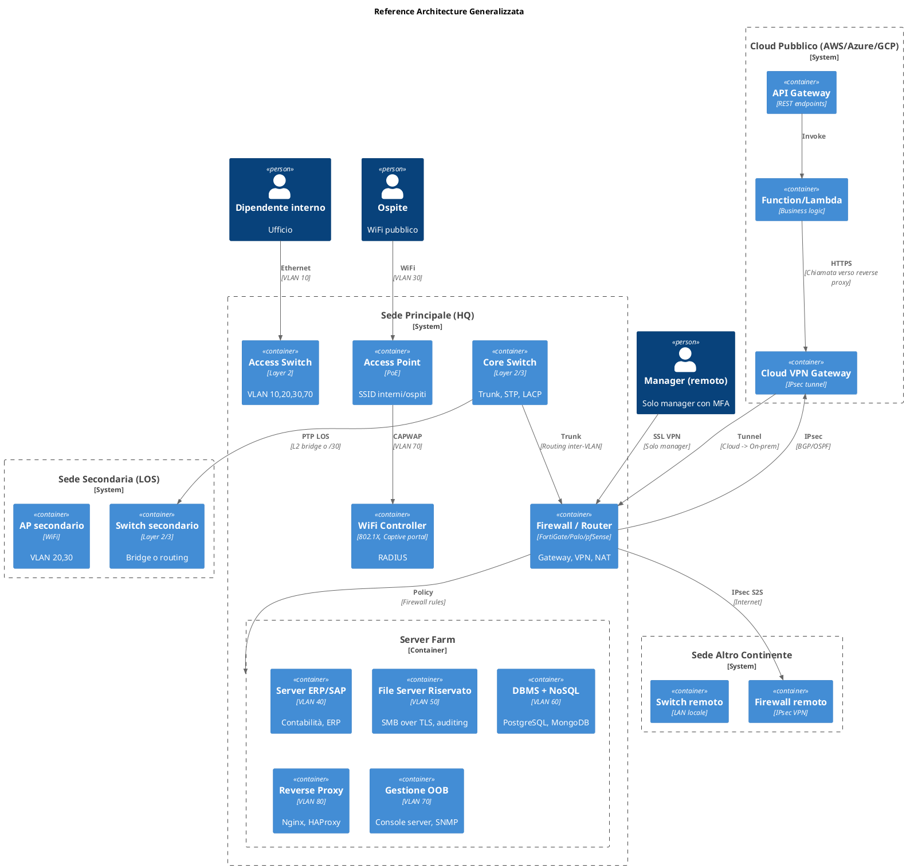
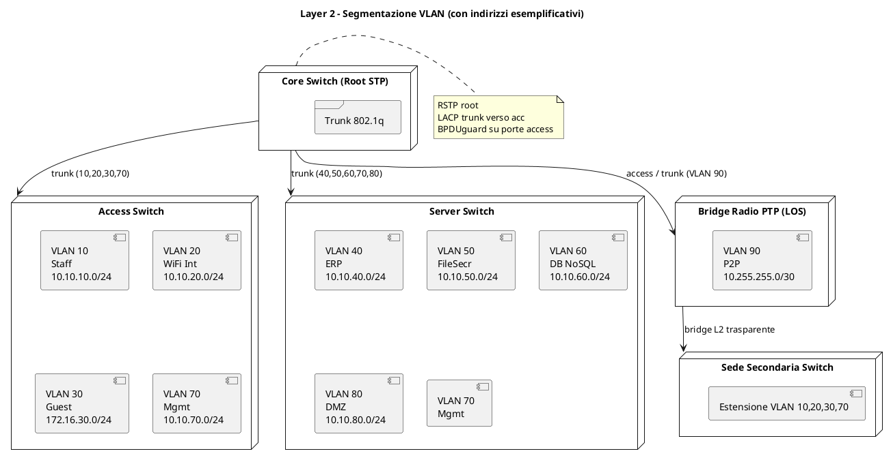
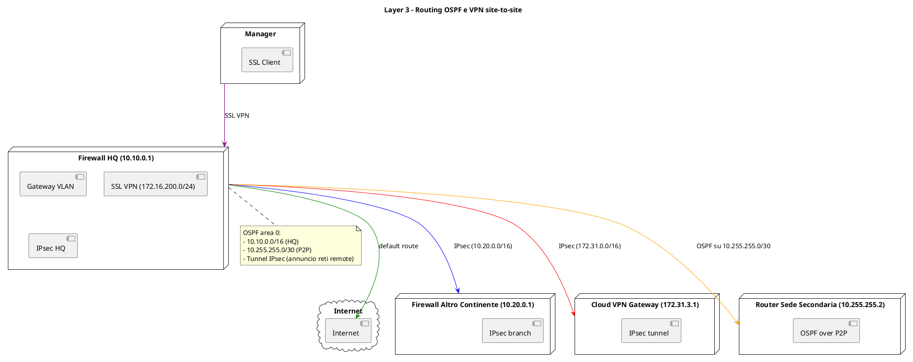

---

# Reference Architecture Generale per Aziende Multinazionali

## Indice esteso
1. Scopo e ambito
2. Requisiti generici (checklist)
3. Piano di indirizzamento IP flessibile
4. Layer 2 – Data Link (dettagli completo)
   - VLAN standard e opzionali
   - Spanning Tree, LACP, LLDP
   - WiFi enterprise (802.1X, captive portal)
5. Layer 3 – Network (routing avanzato)
   - Subnetting e aggregazione
   - OSPF / BGP / ridondanza
   - NAT, VRF, QoS
6. Sicurezza perimetrale e interna
   - Firewall policy template
   - IDS/IPS, segmentazione zero trust
7. Connettività geografica
   - PTP bridge LOS (L2/L3)
   - VPN site-to-site (IPsec, DMVPN, SD-WAN)
8. Cloud ibrido (AWS, Azure, GCP)
   - VPN / Direct Connect
   - Reverse proxy per chiamate on-prem
9. Remote access per soli ruoli privilegiati (Manager)
   - SSL VPN, MFA, split tunneling
10. Rete di gestione (Out-of-Band)
    - Console server, OOB switch, monitoring
11. Tabella dei flussi di dati (esempi)
12. Diagrammi PlantUML (estesi)
13. Diagrammi ASCII testuali
14. Snippet di configurazione (esempi reali)
15. Checklist di verifica per studenti

---

## 1. Scopo e ambito

Questa architettura di riferimento è **generale** e può essere adattata a qualsiasi organizzazione che necessiti di:
- Segmentazione di rete (VLAN) per dipendenti, ospiti, server critici, gestione.
- Connettività WiFi separata per interni e ospiti.
- Server interni: ERP/SAP, contabilità, file server con dati sensibili, DBMS relazionali e NoSQL.
- Collegamento con una sede secondaria in line-of-sight (max 1 km).
- Collegamento con un’altra sede principale in un continente diverso via VPN site-to-site.
- Accesso remoto solo per personale con ruolo manageriale.
- Esposizione di servizi REST su cloud pubblico (AWS, Azure, GCP) che richiamano API interne on-premises.
- Rete di gestione out-of-band dedicata.

L’architettura è indipendente dal vendor e può essere implementata con Cisco, Juniper, Fortinet, Palo Alto, Ubiquiti, MikroTik, o open-source (pfSense, OPNsense).

---

## 2. Requisiti generici (checklist)

| ID   | Requisito                                                                 | Priorità |
|------|---------------------------------------------------------------------------|----------|
| R01  | Segmentazione traffico interno (wired) e WiFi con VLAN separate           | Alta     |
| R02  | WiFi interni con autenticazione 802.1X (RADIUS)                           | Alta     |
| R03  | WiFi ospiti con captive portal e isolamento client                        | Media    |
| R04  | Server SAP/contabilità su VLAN dedicata, accesso solo da LAN interna      | Alta     |
| R05  | File server con dati riservati (SMB cifrato, auditing)                    | Alta     |
| R06  | Database relazionale (PostgreSQL/MySQL) e NoSQL (MongoDB) su VLAN server | Alta     |
| R07  | Collegamento L2 o L3 a sede secondaria LOS (max 1 km)                     | Media    |
| R08  | VPN site-to-site IPsec con altra sede continentale                        | Alta     |
| R09  | Remote access SSL VPN solo per manager (filtro AD)                        | Alta     |
| R10  | Rete di gestione out-of-band (console, SNMP, syslog)                      | Alta     |
| R11  | Servizi REST su cloud che invocano API interne on-prem                    | Media    |
| R12  | Piano di indirizzamento gerarchico e aggregabile                          | Alta     |
| R13  | Ridondanza link e dispositivi (opzionale ma consigliata)                  | Bassa    |

---

## 3. Piano di indirizzamento IP flessibile

Si consiglia l’uso dello spazio privato `10.0.0.0/8` con suddivisione per **sede**, **funzione** e **tipo**.

### 3.1 Schema di allocazione generico

| Sede                     | Blocco CIDR assegnato | Sotto-blocchi tipici                     |
|--------------------------|------------------------|------------------------------------------|
| Sede principale (EU)     | 10.10.0.0/16           | 10.10.VLAN.0/24                          |
| Sede secondaria (LOS)    | 10.11.0.0/16           | 10.11.VLAN.0/24 (o estensione L2)        |
| Sede altro continente    | 10.20.0.0/16           | 10.20.VLAN.0/24                          |
| Cloud (AWS/Azure/GCP)    | 172.31.0.0/16          | Subnet pubbliche/private                  |
| VPN remote (manager)     | 172.16.200.0/24        | Pool dinamico                            |
| P2P /30 (se routing L3)  | 10.255.255.0/30        | Link punto-punto tra sedi                |

### 3.2 VLAN consigliate (per ogni sede, salvo diversa indicazione)

| VLAN | Nome funzione            | Subnet (esempio per sede principale) | Note                                      |
|------|--------------------------|--------------------------------------|-------------------------------------------|
| 10   | Wired Staff              | 10.10.10.0/24                        | Dipendenti standard                        |
| 20   | WiFi Interni (802.1X)    | 10.10.20.0/24                        | Dispositivi aziendali                     |
| 30   | WiFi Ospiti              | 172.16.30.0/24                       | Solo Internet (NAT)                        |
| 40   | Server ERP/SAP           | 10.10.40.0/24                        | SAP, Oracle, contabilità                  |
| 50   | File Server Confidenziali| 10.10.50.0/24                        | SMB con encryption, auditing              |
| 60   | DBMS + NoSQL             | 10.10.60.0/24                        | PostgreSQL, MongoDB, Redis                |
| 70   | Management (OOB)         | 10.10.70.0/24                        | Console, SNMP, SSH, RADIUS                |
| 80   | DMZ (Reverse Proxy)      | 10.10.80.0/24                        | Per esposizione controllata               |
| 90   | P2P LOS (se L3)          | 10.255.255.0/30                      | Collegamento punto-punto                  |

> **Nota di generalizzazione**: Gli indirizzi possono essere modificati in base alle esigenze (es. `192.168.0.0/16` per piccole sedi). L’importante è mantenere la gerarchia.

---

## 4. Layer 2 – Data Link (dettaglio completo)

### 4.1 VLAN e trunking
- **Core switch** con trunk 802.1q verso access switch e server farm.
- **Native VLAN** non utilizzata (disabilitata per sicurezza) o messa su VLAN fantasma.
- **Port security** sulle porte di accesso: max 2 MAC address, violazione shutdown.
- **DHCP snooping** e **IP Source Guard** su VLAN clienti.

### 4.2 Spanning Tree Protocol
- **RSTP (802.1w)** o **MSTP**.
- Root bridge primario sul core switch, secondario su un altro switch di distribution.
- **Portfast** su porte di accesso (con BPDUguard).
- **Loopguard** e **Rootguard** su porte trunk.

### 4.3 LACP (Link Aggregation)
- Tra core e distribution switch: bundle da 2-4 porte Gigabit/10GbE.
- Modalità attiva (LACP active).

### 4.4 WiFi enterprise
- **Controller WiFi** o **cloud-based** (Cisco Meraki, UniFi, Aruba Central).
- **SSID interno**:
  - VLAN 20.
  - Autenticazione 802.1X (EAP-PEAP/MSCHAPv2 o EAP-TLS).
  - RADIUS server su VLAN 70 (es. FreeRADIUS o Windows NPS).
- **SSID ospiti**:
  - VLAN 30.
  - Captive portal (autenticazione via social, voucher o solo accettazione termini).
  - Client isolation, limitazione banda (es. 2 Mbps down/up).
  - Filtro DNS per bloccare contenuti malevoli.

---

## 5. Layer 3 – Network (routing avanzato)

### 5.1 Gateway e routing interno
- **Firewall** o **router L3** fa da gateway per ogni VLAN (SVI – Switch Virtual Interface).
- **Routing statico** per reti semplici, **OSPF area 0** per medie/grandi.
- **ECMP** (Equal Cost Multi-Path) se ci sono più link.

### 5.2 Routing dinamico consigliato (OSPF)
- Area 0 backbone.
- Annuncio delle subnet /24 e delle reti P2P.
- Metriche: costi più alti per tunnel VPN (es. 1000) rispetto a link diretti (10).

### 5.3 NAT e firewall
- **NAT overload** (masquerading) per VLAN ospiti e per traffico verso Internet.
- **NAT statico** per reverse proxy se esposto (opzionale).

### 5.4 VRF (Virtual Routing and Forwarding)
Opzionale per isolare completamente la rete di gestione e la rete ospiti.

---

## 6. Sicurezza perimetrale e interna

### 6.1 Firewall policy – template generico

| Origine                    | Destinazione               | Azione  | Porte/protocollo                        | Note                                         |
|----------------------------|----------------------------|---------|------------------------------------------|----------------------------------------------|
| VLAN 10,20 (Staff+WiFi int)| VLAN 40 (SAP/ERP)          | Allow   | TCP 32xx, 33xx, 1433                     | Solo IP specifici                           |
| VLAN 10,20                 | VLAN 50 (File segreti)     | Allow   | TCP 445 (SMB over TLS)                   | Autenticazione AD, logging                  |
| VLAN 10,20                 | VLAN 60 (DB)               | Allow   | TCP 5432, 27017, 3306                    | Solo application server                     |
| VLAN 30 (Ospiti)           | any                        | Allow   | TCP 80,443, UDP 53                       | NAT verso Internet, nessuna LAN             |
| VLAN 70 (Management)       | VLAN 10,20,40,50,60,80     | Allow   | TCP 22, 161, 514, 1812 (RADIUS)          | Solo da jump host (10.10.70.10)            |
| VLAN 80 (DMZ)              | VLAN 40,50,60 (server)     | Allow   | HTTP/HTTPS                               | Solo reverse proxy autorizzato              |
| Cloud VPN (172.31.0.0/16)  | VLAN 80                    | Allow   | TCP 443,80                               | Chiamate REST da Lambda/ECS                 |
| VPN Manager (172.16.200.0/24) | VLAN 40,50,60          | Allow   | Porte applicative                         | MFA obbligatorio                            |
| Internet                   | VLAN 80 (Reverse Proxy)    | Deny   | (salvo eccezioni)                         | Se esposto, solo HTTPS con WAF              |

### 6.2 IDS/IPS
- **IPS** attivo sul firewall sul traffico Internet-bound e tra VLAN critiche.
- **File server** con FIM (File Integrity Monitoring).

### 6.3 Zero Trust Network Access (ZTNA) – opzionale
- Micro-segmentazione con agenti sui client per accesso solo a servizi autorizzati.

---

## 7. Connettività geografica

### 7.1 Sede secondaria in line-of-sight (LOS) – 600m / 1 km

#### Opzione A: Bridge L2 trasparente (semplice)
- Bridge radio (Ubiquiti airFiber, MikroTik Wireless Wire).
- Estende le stesse VLAN della sede principale.
- **Vantaggi**: IP unico, mobilità client.
- **Svantaggi**: dominio di broadcast condiviso, rischio loop.

#### Opzione B: Routing L3 (consigliata per sicurezza)
- Assegnare una subnet /30 (es. `10.255.255.0/30`) tra i due firewall/router.
- La sede secondaria ha il proprio firewall che annuncia le sue LAN (es. `10.11.0.0/16`) via OSPF.
- **Vantaggi**: isolamento guasti, controllo traffico granulare.

### 7.2 VPN site-to-site con altro continente
- **IPsec IKEv2** con crittografia AES256-GCM, PFS (DH group 14+).
- **Routing**: OSPF o BGP over tunnel (BGP preferito per grandi reti).
- **Redundancy**: secondo tunnel su link di backup (LTE, MPLS).
- **NAT traversal** abilitato.

### 7.3 SD-WAN (opzionale per generalizzazione)
In alternativa a IPsec manuale, si può usare SD-WAN (Fortinet SD-WAN, Cisco Viptela, VMware Velocloud) per gestire più link, traffic steering e failover automatico.

---

## 8. Cloud ibrido (AWS, Azure, GCP)

### 8.1 Connettività VPN
- **Cloud VPN Gateway** (AWS VPN Gateway, Azure VPN Gateway, Google Cloud VPN).
- Tunnel IPsec verso il firewall on-prem.
- **BGP dinamico** per scambio route (opzionale ma consigliato).

### 8.2 Chiamate da servizi REST cloud verso server interno on-prem
1. Il servizio REST (API Gateway + Lambda/Cloud Function) risiede in una **subnet privata** della VPC.
2. La funzione apre una connessione HTTP/HTTPS verso il **reverse proxy** on-prem (in VLAN 80).
3. Il reverse proxy (Nginx, HAProxy, Apache) inoltra al server interno (es. legacy su VLAN 40).
4. Il firewall on-prem consente il traffico solo dalla subnet cloud (es. `172.31.2.0/24`) verso il reverse proxy.

### 8.3 Sicurezza cloud
- Security group: permette solo traffico uscita verso on-prem.
- Nessuna esposizione diretta del reverse proxy su Internet.

---

## 9. Remote access per soli ruoli privilegiati (Manager)

### 9.1 Componenti
- **VPN concentrator** (integrato nel firewall o appliance dedicata).
- **SSL VPN** (AnyConnect, OpenVPN, WireGuard con interfaccia web).

### 9.2 Autenticazione e autorizzazione
- **LDAP / Active Directory** per autenticare utenti.
- Filtro gruppo: solo `CN=Managers,OU=...`.
- **MFA obbligatorio** (TOTP, SMS, push notifica).
- **Client certificate** opzionale per rafforzamento.

### 9.3 Pool IP e routing
- Pool dedicato: `172.16.200.0/24`.
- **Split tunneling**:
  - Instradare solo le subnet aziendali necessarie (VLAN 40,50,60).
  - Traffico Internet esce direttamente dal client.
- **Session timeout** massimo 8 ore, idle 30 minuti.
- **Logging** di tutti gli accessi remoti.

---

## 10. Rete di gestione (Out-of-Band – OOB)

### 10.1 Architettura OOB
- **Console server** (Opengear, Raritan, o Raspberry Pi con ser2net) collegato alle porte console di:
  - Switch core, access switch, firewall, router, bridge radio.
- **Switch di gestione dedicato** (VLAN 70 fisicamente separata o logicalmente isolata).
- **Jump host** (Linux o Windows) su VLAN 70 con accesso SSH e strumenti di network management.

### 10.2 Protocolli di gestione
- **SSHv2** per accesso CLI.
- **SNMPv3** (sola lettura) per monitoraggio (Zabbix, PRTG, LibreNMS).
- **Syslog** centralizzato (rsyslog o Graylog) su 10.10.70.20.
- **RADIUS / TACACS+** per autenticazione centralizzata degli admin.

### 10.3 Accesso di emergenza
- **Modem 4G/5G** collegato al console server per accesso OOB remoto se la rete primaria è down.

---

## 11. Tabella dei flussi di dati (esempi concreti)

| Caso d'uso                                      | IP sorgente (es.)    | IP destinazione (es.) | Porta  | Attraversa                                    |
|-------------------------------------------------|----------------------|-----------------------|--------|-----------------------------------------------|
| Dipendente wired → SAP                          | 10.10.10.105         | 10.10.40.20           | 3200   | Firewall (policy VLAN10→VLAN40)               |
| WiFi interno → file segreti                     | 10.10.20.50          | 10.10.50.10           | 445    | Firewall + AD autenticazione                  |
| Ospite → Internet                               | 172.16.30.110        | 8.8.8.8               | 443    | Firewall (NAT, captive portal)                |
| Manager remoto → MongoDB                        | 172.16.200.15        | 10.10.60.30           | 27017  | SSL VPN → Firewall → VLAN 60                  |
| AWS Lambda → Reverse proxy on-prem              | 172.31.2.45          | 10.10.80.10           | 443    | AWS VPN → Firewall → DMZ                      |
| Amministratore → Core switch (SSH)              | 10.10.70.10 (jump)   | 10.10.70.2            | 22     | VLAN 70 (OOB)                                 |
| Sede secondaria (L3) → file server segreti      | 10.11.10.20          | 10.10.50.10           | 445    | Firewall secondario → Firewall EU → VLAN 50   |

---

## 12. Diagrammi PlantUML (estesi)

### 12.1 Architettura generale (C4 style)



### 12.2 Layer 2 dettagliato con VLAN e indirizzi



### 12.3 Layer 3 con routing dinamico e VPN



---

## 13. Diagrammi ASCII testuali (pronti per documenti)

### 13.1 Architettura fisica/logica

```text
                          +-------------------------+
                          |       Cloud (AWS)       |
                          |  API Gateway -> Lambda  |
                          +------------+------------+
                                       | IPsec VPN
+------------------------+             |
| Sede Altro Continente  |             |
| (USA)                  |             |
| Firewall -> LAN locale |             |
+-----------+------------+             |
            | IPsec S2S                |
            | (Internet)               |
+-----------+------------+             |
|     Sede Principale    |             |
|     (EU) - Firewall    |<------------+
+-----------+------------+
            |
   +--------+---------+
   |   Core Switch    |
   | (Trunk, STP)     |
   +--------+---------+
            |
   +--------+---------+       +--------------------+
   | Access Switch    |       | Server Farm Switch |
   | VLAN 10,20,30,70 |       | VLAN 40,50,60,70,80|
   +--------+---------+       +--------------------+
            |                           |
   +--------+---------+                 |
   | WiFi AP (20,30)  |                 |
   +------------------+                 |
            |                           |
   +--------+---------+                 |
   | Bridge PTP (LOS) |                 |
   +--------+---------+                 |
            | (600m)                    |
   +--------+---------+                 |
   | Sede Secondaria  |                 |
   | Switch + AP      |                 |
   +------------------+                 |
                                        |
   +------------------------------------+
   | Rete di Gestione (VLAN 70)         |
   | Console server, Jump host, SNMP    |
   +------------------------------------+
```

### 13.2 Flussi di sicurezza

```text
[Internet] --> [FW] --> [DMZ (VLAN80)] --> [Reverse Proxy] --> [Server Interno (VLAN40/50/60)]
                ^
                |
[Manager remoto] --> SSL VPN --> [FW] --> [VLAN40/50/60]
                |
[Ospiti] --> WiFi (VLAN30) --> [FW] --> NAT --> Internet (blocco LAN)
```

---

## 14. Snippet di configurazione (esempi reali)

### 14.1 Cisco IOS – configurazione trunk e VLAN

```cisco
vlan 10
 name Wired_Staff
vlan 20
 name WiFi_Internal
vlan 30
 name WiFi_Guest
vlan 40
 name Server_ERP
vlan 50
 name Server_File_Segreti
vlan 60
 name Server_DB
vlan 70
 name Management
vlan 80
 name DMZ
vlan 90
 name P2P_LOS

interface GigabitEthernet1/0/1
 description Trunk to Core
 switchport mode trunk
 switchport trunk allowed vlan 10,20,30,40,50,60,70,80,90
 switchport trunk native vlan 999
 spanning-tree portfast trunk
!
interface GigabitEthernet1/0/2
 description Access Staff
 switchport mode access
 switchport access vlan 10
 spanning-tree portfast
 switchport port-security maximum 2
 switchport port-security violation shutdown
```

### 14.2 FortiGate – policy inter-VLAN (CLI)

```fortinet
config firewall policy
    edit 1
        set name "Staff_to_SAP"
        set srcintf "VLAN10"
        set dstintf "VLAN40"
        set srcaddr "10.10.10.0/24"
        set dstaddr "10.10.40.20"
        set action accept
        set schedule "always"
        set service "SAP_3200" "SAP_3300"
        set logtraffic all
    next
    edit 2
        set name "Guest_to_Internet"
        set srcintf "VLAN30"
        set dstintf "wan1"
        set srcaddr "172.16.30.0/24"
        set dstaddr "all"
        set action accept
        set nat enable
        set schedule "always"
        set service "HTTP" "HTTPS" "DNS"
    next
end
```

### 14.3 OpenVPN server (accesso manager) – snippet `server.conf`

```openvpn
port 443
proto tcp
dev tun
server 172.16.200.0 255.255.255.0
push "route 10.10.40.0 255.255.255.0"
push "route 10.10.50.0 255.255.255.0"
push "route 10.10.60.0 255.255.255.0"
push "dhcp-option DNS 10.10.70.5"
client-to-client
duplicate-cn
auth SHA256
cipher AES-256-GCM
tls-version-min 1.2
<ldap>
    URL ldap://10.10.70.10
    BindDN cn=admin,dc=global,dc=local
    Password secret
    BaseDN ou=Users,dc=global,dc=local
    SearchFilter "(cn=%u)"
    RequireGroup CN=Managers,OU=Groups,dc=global,dc=local
</ldap>
```

---

## 15. Checklist di verifica per studenti

| Area          | Elemento da verificare                                      | Fatto |
|---------------|-------------------------------------------------------------|-------|
| Layer 2       | VLAN definite e trunk configurati                           | ☐     |
| Layer 2       | STP root bridge e portfast configurati                      | ☐     |
| Layer 2       | WiFi con due SSID (802.1X e captive portal)                 | ☐     |
| Layer 3       | Gateway SVI su firewall o router                            | ☐     |
| Layer 3       | OSPF o routing statico tra sedi                             | ☐     |
| Sicurezza     | Firewall policy tra VLAN (es. nessun accesso da guest)      | ☐     |
| Sicurezza     | File server segreti con SMB over TLS e auditing             | ☐     |
| Sicurezza     | MFA su VPN manager                                          | ☐     |
| Geografica    | Bridge PTP funzionante (L2 o L3)                            | ☐     |
| Geografica    | VPN site-to-site IPsec con altra sede                       | ☐     |
| Cloud         | Tunnel VPN verso AWS/Azure/GCP                              | ☐     |
| Cloud         | Reverse proxy on-prem che riceve chiamate dal cloud         | ☐     |
| Gestione      | VLAN 70 isolata, console server, jump host                  | ☐     |
| Remote access | Solo manager possono connettersi (verifica gruppo AD)       | ☐     |

---

