# PRIMA PARTE

Assunzioni:

* ogni veicolo appartiene a una sola azienda cliente;
* ogni veicolo ha un solo dispositivo di bordo principale;
* il dispositivo comunica tramite rete mobile 4G/5G;
* la piattaforma ACME è SaaS multi-tenant, cioè una infrastruttura unica condivisa da più aziende, ma con isolamento logico dei dati;
* gli operatori aziendali accedono tramite browser web;
* i dispositivi inviano telemetria periodica e segnalazioni di evento e possono ricevere comandi, percorsi, cartografia e messaggi.

---

# 1. Analisi della realtà di riferimento, modello grafico del sistema, componenti e interconnessioni, con motivazione delle scelte

La realtà di riferimento è quella di una piattaforma centralizzata di Fleet Management che deve permettere:

* monitoraggio continuo dei mezzi;
* scambio bidirezionale di informazioni tra centro e veicolo;
* accesso separato e sicuro per più aziende clienti;
* gestione di operatori con ruoli diversi;
* sicurezza delle comunicazioni e riservatezza dei dati.

Dal punto di vista architetturale, la soluzione più realistica è una piattaforma centralizzata composta da:

* front-end web;
* API applicative;
* modulo di ingestione dati dai dispositivi;
* broker MQTT;
* database relazionale per dati gestionali;
* archivio telemetria time-series;
* modulo IAM per autenticazione, ruoli e controllo accessi.

MQTT (Message Queuing Telemetry Transport) è un protocollo standard di comunicazione.
Definisce un modello publish/subscribe in cui i client inviano (publish) e ricevono (subscribe) messaggi tramite un broker.

Broker MQTT: software server che implementa il protocollo MQTT e gestisce la distribuzione dei messaggi tra i client secondo il modello publish/subscribe.

Questa scelta è motivata da ragioni di:

* scalabilità: i dispositivi possono essere molti e inviare dati frequentemente;
* sicurezza: separazione dei componenti e controllo centralizzato;
* manutenibilità: aggiornare il servizio SaaS è più semplice che aggiornare installazioni distribuite presso ogni cliente;
* multitenancy: una sola piattaforma può servire molte aziende, mantenendo però separati i dati.

La piattaforma ACME deve essere raggiunta da due categorie di client esterni:

* operatori umani, che accedono via browser al portale web;
* dispositivi di bordo, che comunicano via rete mobile con il servizio centrale.

Dal punto di vista di rete, si adotta una architettura con:

* router di frontiera;
* firewall perimetrale;
* DMZ;
* firewall interno;
* rete server interna.

Nella DMZ vengono pubblicati solo i servizi che devono essere raggiungibili dall’esterno, in particolare:

* reverse proxy / WAF per il traffico web HTTPS;
* broker MQTT per la comunicazione sicura con i dispositivi.

Nella rete interna restano invece i server applicativi e i database, che non sono esposti direttamente verso Internet.

Il traffico dei browser segue il percorso:

* operatore → Internet → router di frontiera → firewall perimetrale → reverse proxy in DMZ → firewall interno → application server.

Il traffico dei dispositivi segue invece il percorso:

* dispositivo di bordo → rete mobile 4G/5G → core network dell’operatore → Internet → router di frontiera → firewall perimetrale → broker MQTT in DMZ → firewall interno → servizi applicativi di ingestione.

In questo modo:

* i veicoli non accedono direttamente ai database;
* il traffico Internet termina solo su servizi controllati in DMZ;
* il firewall interno separa rigidamente la rete esposta dalla rete server;
* database relazionale e archivio telemetria rimangono confinati nella LAN interna;
* accesso web e traffico macchina-macchina sono logicamente separati, pur condividendo il medesimo perimetro di sicurezza.

Diagramma testuale:

```
[Operatori aziendali via browser]                     [Sensori / CAN bus / GPS]
              |                                                  |
              | HTTPS                                            |
              v                                                  v
         [Internet]                                   [Dispositivo di bordo]
              |                                 (CPU embedded + modem + memoria)
              |                                                  |
              |                                                  | MQTT over TLS
              |                                                  | oppure HTTPS/TLS
              |                                                  v
              |                                          [Rete mobile 4G/5G]
              |                                                  |
              |                                          [Core network operatore]
              |                                                  |
              +----------------------------+----------------------+
                                           |
                                           v
                              [Router di frontiera ACME]
                                           |
                                           v
                             [Firewall / NGFW perimetrale]
                                           |
                                           v
                                          [DMZ]
                         +------------------+------------------+
                         |                                     |
                         v                                     v
         [Reverse Proxy / WAF / Load Balancer]      [Broker MQTT]
                         |                                     |
                         +------------------+------------------+
                                            |
                                            v
                           [Firewall interno / filtro tra zone]
                                            |
                                            v
                                 [Rete server interna ACME]
                         +------------------+------------------+------------------+------------------+
                         |                  |                  |                  |
                         v                  v                  v                  v
              [Application Server / API] [IAM / Audit] [DB relazionale] [Archivio telemetria / TSDB]
```

Versione PlantUML:

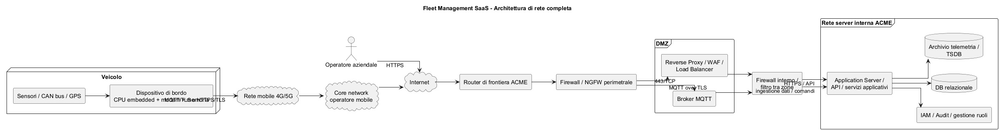

Motivazione delle principali scelte:

1. Piattaforma SaaS centralizzata
   Consente aggiornamenti centralizzati, riduzione dei costi per i clienti, gestione uniforme della sicurezza, backup centralizzati e maggiore controllo operativo.

2. Architettura a componenti separati
   Il traffico web degli operatori è diverso dal traffico macchina-macchina dei dispositivi. Separare questi flussi rende il sistema più robusto e scalabile.

3. Database relazionale + archivio telemetria
   I dati gestionali, come utenti, ruoli, aziende, mezzi e configurazioni, si adattano bene a un DB relazionale. La telemetria è invece un insieme di dati temporali ad alto volume, per cui conviene mantenerla separata dai dati gestionali.

4. Broker real-time
   È utile per gestire in modo efficiente la comunicazione asincrona tra piattaforma e dispositivi.

---

# 2. Funzionalità tecnologiche dei dispositivi a bordo degli automezzi

Il dispositivo di bordo deve svolgere sia funzioni di acquisizione dati sia funzioni di comunicazione sicura.

Funzioni hardware principali:

* ricevitore GPS/GNSS;
* modem 4G/5G;
* microcontrollore o unità embedded;
* memoria locale per buffering;
* alimentazione dal veicolo;
* eventuale interfaccia CAN bus;
* eventuale accelerometro;
* eventuale microfono/altoparlante per messaggi vocali.

Funzioni software principali:

* acquisire posizione, velocità, direzione, timestamp;
* rilevare eventi anomali;
* memorizzare temporaneamente dati in assenza di rete;
* inviare telemetria al centro;
* ricevere comandi e messaggi;
* autenticarsi verso il server;
* gestire aggiornamenti e configurazioni;
* verificare integrità del firmware.

Schema testuale del dispositivo:

```
[GPS / GNSS] --------\
                      \
[Sensori / CAN] ------> [Modulo acquisizione dati] --> [Logica embedded]
                                                       |         |
                                                       |         +--> [Memoria locale / buffer]
                                                       |
                                                       +--> [Modulo sicurezza / credenziali]
                                                       |
                                                       +--> [Modem 4G/5G] --> [Rete mobile] --> [Server ACME]
```

Versione PlantUML:

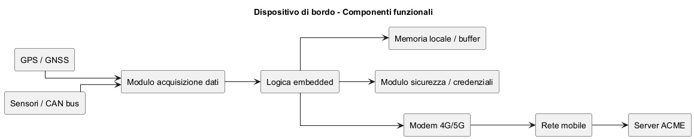

Comportamento operativo tipico:

* il dispositivo legge periodicamente posizione e stato;
* prepara un messaggio con timestamp;
* lo invia al centro tramite canale sicuro;
* se la rete non è disponibile, salva i dati in memoria locale;
* quando la connettività torna disponibile, reinvia i dati arretrati;
* riceve eventuali comandi dal centro.

---

# 3. Protocolli di comunicazione da adottare per garantire la sicurezza delle informazioni trasmesse, con descrizione delle tecnologie

Le comunicazioni da proteggere sono due:

* comunicazioni operatore-piattaforma;
* comunicazioni dispositivo-piattaforma.

## 3.1 Comunicazione operatore-piattaforma

Protocollo consigliato:

* HTTPS, cioè HTTP su TLS.

Motivazioni:

* confidenzialità: i dati sono cifrati;
* integrità: si rilevano alterazioni;
* autenticazione del server: certificato X.509;
* protezione delle sessioni e delle credenziali.

Tecnologie coinvolte:

* TLS 1.2 o 1.3;
* certificati digitali X.509;
* cookie di sessione protetti;
* eventuale MFA;
* password memorizzate come hash con salt.

## 3.2 Comunicazione dispositivo-piattaforma

Soluzioni realistiche:

* MQTT su TLS;
* oppure HTTPS con API REST su TLS.

Scelta più adatta qui: MQTT su TLS.

Perché:

* protocollo leggero;
* adatto a dispositivi embedded;
* adatto a reti mobili e connessioni intermittenti;
* supporta bene comunicazione bidirezionale;
* efficiente per telemetria real-time.

## 3.3 Sicurezza applicata ai dispositivi

Misure appropriate:

* autenticazione del broker/server tramite certificato;
* autenticazione del dispositivo con credenziali univoche o, meglio, con certificato client;
* cifratura del traffico con TLS;
* controllo di autorizzazione sui topic o endpoint;
* protezione contro replay, clonazione e manipolazione.

## 3.4 Tecnologie descritte

TLS
È il protocollo che crea un canale cifrato tra client e server. Fornisce:

* autenticazione del server;
* negoziazione sicura di chiavi;
* cifratura simmetrica del traffico;
* controllo di integrità.

Certificati digitali
Permettono di associare una chiave pubblica a una identità. Il client verifica che il certificato del server sia firmato da una CA fidata.

Hash password
Le password non devono essere memorizzate in chiaro ma sotto forma di hash con salt.

RBAC
Il Role Based Access Control consente di decidere cosa un utente può fare in base al ruolo assegnato.

Schema testuale dei protocolli:

```
Operatore <--- HTTPS/TLS ---> Portale ACME
Dispositivo <--- MQTT/TLS ---> Broker ACME
API interne <--- HTTPS/TLS ---> servizi applicativi
```

Versione PlantUML:


---

# SECONDA PARTE

---

## Quesito 1

Modello concettuale e logico della porzione di database necessaria alla gestione della riservatezza dei dati, autenticazioni e ruoli. Progetto delle pagine di accesso e codifica di una parte significativa.

Occorre gestire:

* più aziende clienti;
* più utenti per ciascuna azienda;
* ruoli diversi all’interno della stessa azienda;
* isolamento dei dati per tenant;
* autenticazione e autorizzazione.

Schema concettuale testuale:

```
Azienda
    |
    | 1:N
    |
  Utente --- N:M --- Ruolo --- N:M --- Permesso

Azienda
    |
    | 1:N
    |
  Veicolo --- 1:1 --- Dispositivo

Utente --- 1:N --- AuditAccesso
```

Versione PlantUML del modello concettuale:

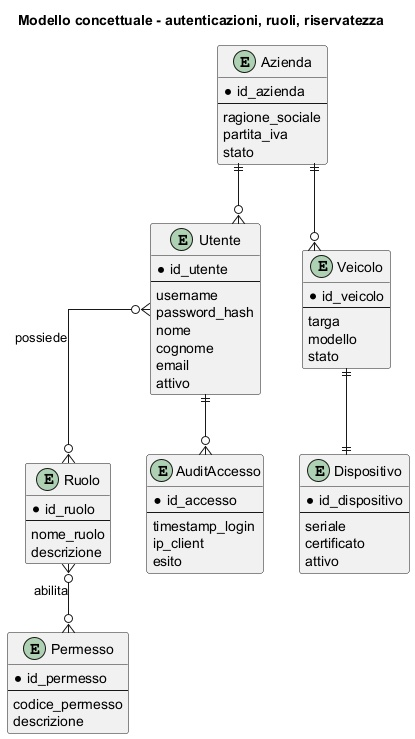

Modello logico relazionale:

```
AZIENDA(
    id_azienda PK,
    ragione_sociale,
    partita_iva,
    stato
)

UTENTE(
    id_utente PK,
    id_azienda FK -> AZIENDA.id_azienda,
    username UNIQUE,
    password_hash,
    nome,
    cognome,
    email,
    attivo
)

RUOLO(
    id_ruolo PK,
    nome_ruolo UNIQUE,
    descrizione
)

PERMESSO(
    id_permesso PK,
    codice_permesso UNIQUE,
    descrizione
)

UTENTE_RUOLO(
    id_utente FK -> UTENTE.id_utente,
    id_ruolo FK -> RUOLO.id_ruolo,
    PRIMARY KEY(id_utente, id_ruolo)
)

RUOLO_PERMESSO(
    id_ruolo FK -> RUOLO.id_ruolo,
    id_permesso FK -> PERMESSO.id_permesso,
    PRIMARY KEY(id_ruolo, id_permesso)
)

VEICOLO(
    id_veicolo PK,
    id_azienda FK -> AZIENDA.id_azienda,
    targa UNIQUE,
    modello,
    stato
)

DISPOSITIVO(
    id_dispositivo PK,
    id_veicolo FK -> VEICOLO.id_veicolo UNIQUE,
    seriale UNIQUE,
    certificato,
    attivo
)

AUDIT_ACCESSO(
    id_accesso PK,
    id_utente FK -> UTENTE.id_utente,
    timestamp_login,
    ip_client,
    esito
)
```

Versione PlantUML del modello logico:

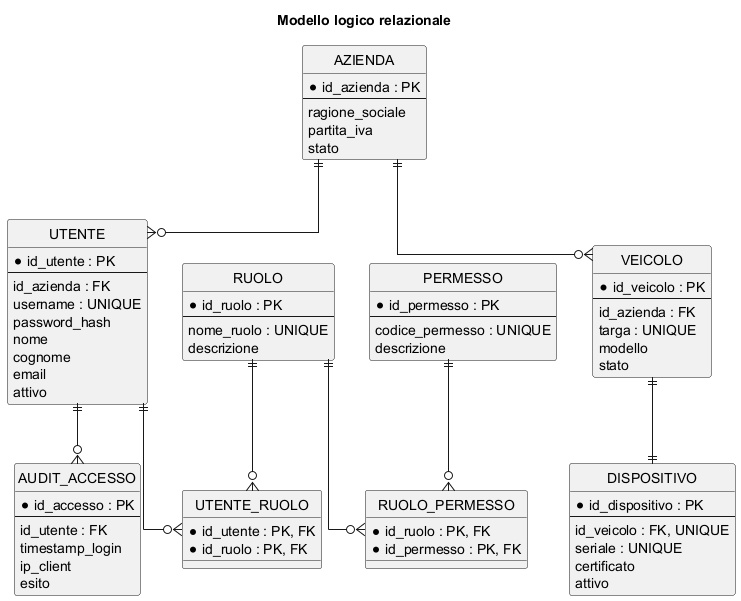

Pagine del sito minime:

* pagina login;
* pagina verifica accesso;
* dashboard;
* pagina accesso negato;
* logout.

Schema testuale del flusso:

```
[Login] --> [Verifica credenziali] --> [Caricamento ruoli e tenant]
                                           |
                                           +--> se valido: [Dashboard]
                                           |
                                           +--> se non valido: [Errore]
```

Versione PlantUML:


Esempio di codice significativo in Python Flask.

Pagina login HTML:

```
<!DOCTYPE html>
<html lang="it">
<head>
    <meta charset="UTF-8">
    <title>Login Fleet Management</title>
</head>
<body>
    <h1>Accesso area riservata</h1>
    <form method="post" action="/login">
        <label for="username">Username</label>
        <input type="text" id="username" name="username" required>

        <label for="password">Password</label>
        <input type="password" id="password" name="password" required>

        <button type="submit">Accedere</button>
    </form>
</body>
</html>
```

Parte significativa lato server:

```
from flask import Flask, request, session, redirect
import sqlite3
import hashlib

app = Flask(__name__)
app.secret_key = "chiave_segreta_di_esempio"

def hash_password(password: str) -> str:
    return hashlib.sha256(password.encode("utf-8")).hexdigest()

def get_db_connection():
    conn = sqlite3.connect("fleet.db")
    conn.row_factory = sqlite3.Row
    return conn

@app.route("/login", methods=["GET", "POST"])
def login():
    if request.method == "GET":
        return """
        <html><body>
        <h1>Login</h1>
        <form method="post">
            <input type="text" name="username" required>
            <input type="password" name="password" required>
            <button type="submit">Accedere</button>
        </form>
        </body></html>
        """

    username = request.form["username"]
    password = request.form["password"]

    conn = get_db_connection()
    user = conn.execute("""
        SELECT id_utente, id_azienda, username, password_hash, attivo
        FROM UTENTE
        WHERE username = ?
    """, (username,)).fetchone()

    if user is None:
        return "Credenziali non valide", 401

    if not user["attivo"]:
        return "Utente non attivo", 403

    if user["password_hash"] != hash_password(password):
        return "Credenziali non valide", 401

    ruoli = conn.execute("""
        SELECT r.nome_ruolo
        FROM RUOLO r
        JOIN UTENTE_RUOLO ur ON ur.id_ruolo = r.id_ruolo
        WHERE ur.id_utente = ?
    """, (user["id_utente"],)).fetchall()

    session["user_id"] = user["id_utente"]
    session["tenant_id"] = user["id_azienda"]
    session["ruoli"] = [r["nome_ruolo"] for r in ruoli]

    return redirect("/dashboard")
```

---

## Quesito 2

Descrizione di una soluzione di connessione client del dispositivo installato su un automezzo con il server del servizio centralizzato, con codifica delle parti principali.

La soluzione più adatta è una comunicazione device-to-cloud su rete mobile, con protocollo MQTT su TLS.

Motivazione:

* leggero;
* adatto a telemetria frequente;
* supporta publish/subscribe;
* adatto a connessioni instabili;
* permette anche ricezione di comandi.

Flusso testuale:

```
[Dispositivo]
    |
    |-- acquisire GPS e sensori
    |-- aprire connessione TLS
    |-- autenticarsi
    |-- pubblicare telemetria
    |-- sottoscriversi ai comandi
    |
[Broker MQTT ACME]
    |
[Servizi applicativi ACME]
```

Versione PlantUML:

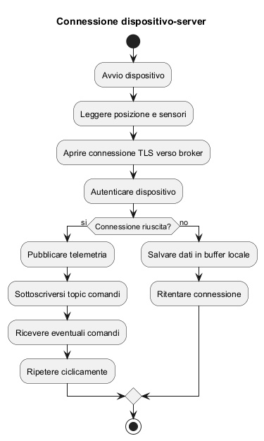

Esempio di topic:

```
fleet/acme_cliente_01/veicolo_456/telemetria
fleet/acme_cliente_01/veicolo_456/eventi
fleet/acme_cliente_01/veicolo_456/comandi
```

Esempio di payload:

```
{
    "device_id": "DEV-456",
    "timestamp": "2026-04-14T10:15:00Z",
    "lat": 41.9028,
    "lon": 12.4964,
    "speed_kmh": 68,
    "event": "normal"
}
```

Codice esemplificativo Python:

```
import json
import ssl
import time
from datetime import datetime, timezone
import paho.mqtt.client as mqtt

BROKER_HOST = "broker.acme.example"
BROKER_PORT = 8883
USERNAME = "device_456"
PASSWORD = "password_dispositivo"
TOPIC_TELEMETRIA = "fleet/acme_cliente_01/veicolo_456/telemetria"
TOPIC_COMANDI = "fleet/acme_cliente_01/veicolo_456/comandi"

def build_payload():
    return {
        "device_id": "DEV-456",
        "timestamp": datetime.now(timezone.utc).isoformat(),
        "lat": 41.9028,
        "lon": 12.4964,
        "speed_kmh": 68,
        "event": "normal"
    }

def on_connect(client, userdata, flags, rc):
    if rc == 0:
        print("Connesso")
        client.subscribe(TOPIC_COMANDI)
    else:
        print("Errore connessione", rc)

def on_message(client, userdata, msg):
    print("Comando ricevuto:", msg.payload.decode())

client = mqtt.Client()
client.username_pw_set(USERNAME, PASSWORD)
client.on_connect = on_connect
client.on_message = on_message

client.tls_set(cert_reqs=ssl.CERT_REQUIRED)
client.connect(BROKER_HOST, BROKER_PORT, 60)
client.loop_start()

try:
    while True:
        payload = json.dumps(build_payload())
        client.publish(TOPIC_TELEMETRIA, payload, qos=1)
        time.sleep(10)
except KeyboardInterrupt:
    client.loop_stop()
    client.disconnect()
```

Osservazione importante: in ambiente reale si preferirebbe, se possibile, autenticazione forte del dispositivo con certificato client e gestione del buffering locale in modo più strutturato.

---

## Quesito 3

Motivazioni che inducono alla realizzazione di una rete intranet in una organizzazione, principali servizi e relativi protocolli. Analisi di uno dei protocolli.

Una intranet è una rete privata aziendale che usa tecnologie Internet ma resta destinata all’uso interno dell’organizzazione.

Motivazioni principali:

* condivisione controllata di informazioni e documenti;
* accesso centralizzato ad applicazioni interne;
* miglior coordinamento tra uffici;
* riduzione della dispersione dei dati;
* maggiore controllo di sicurezza rispetto a servizi esposti pubblicamente;
* integrazione tra utenti, server, database, directory e sistemi gestionali.

Servizi tipici che una intranet deve offrire:

* autenticazione e directory utenti;
* file sharing;
* posta elettronica interna o integrata;
* portali e applicazioni web interne;
* risoluzione nomi;
* configurazione automatica host;
* stampa di rete;
* accesso a basi dati e servizi applicativi;
* sistemi di backup e logging.

Protocolli tipici:

* HTTP/HTTPS per portali e applicazioni web;
* DNS per risoluzione nomi;
* DHCP per assegnazione configurazione IP;
* LDAP o LDAPS per directory e autenticazione;
* SMTP, IMAP, POP3 per posta;
* SMB/CIFS o NFS per condivisione file;
* SSH per amministrazione sicura;
* RDP o VNC, se necessari, per accesso remoto controllato;
* SNMP per monitoraggio.

Schema testuale di una intranet:

```
[Client interni]
    | \
    |  \----> [DNS]
    |-----> [DHCP]
    |-----> [Portale intranet HTTPS]
    |-----> [File server SMB]
    |-----> [Directory LDAP/AD]
    |-----> [Mail server]
    |-----> [DB / applicazioni interne]
```

Versione PlantUML:

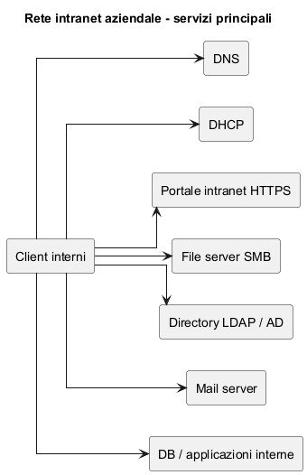

Analisi di un protocollo: LDAP

LDAP, Lightweight Directory Access Protocol, è usato per interrogare e gestire un servizio di directory. Una directory contiene informazioni organizzate gerarchicamente, ad esempio:

* utenti;
* gruppi;
* unità organizzative;
* attributi come email, login, ruoli, appartenenze.

Perché è importante in intranet:

* centralizza l’identità degli utenti;
* permette autenticazione unificata;
* facilita controllo accessi;
* riduce duplicazione delle credenziali nei vari servizi.

Funzionamento generale:

* il client si collega al server directory;
* esegue una bind operation, cioè una autenticazione;
* effettua query sugli oggetti;
* riceve attributi e informazioni di gruppo;
* le applicazioni interne usano tali dati per autorizzare l’accesso.

LDAP non cifrato non è adeguato per ambienti moderni. È preferibile usare:

* LDAPS, cioè LDAP su TLS;
* oppure LDAP con StartTLS.

Schema testuale dell’uso di LDAP:

```
[Utente] --> [Applicazione intranet]
                    |
                    +--> [LDAP / Active Directory]
                           |
                           +--> verifica credenziali
                           +--> restituisce gruppi/ruoli
```

Versione PlantUML:


---

## Quesito 4

Servizi informativi su infrastruttura interna oppure cloud: caratteristiche, punti di forza e debolezza.

Le aziende possono realizzare i propri servizi informativi secondo due modelli principali:

* infrastruttura interna on-premises;
* infrastruttura cloud.

### 4.1 Infrastruttura interna

Caratteristiche:
l’azienda acquista o gestisce direttamente server, storage, rete, sicurezza, backup e software nel proprio data center o nei propri locali.

Punti di forza:

* controllo diretto su infrastruttura e dati;
* maggiore personalizzazione;
* possibile integrazione stretta con sistemi legacy;
* in alcuni casi maggiore percezione di controllo normativo e operativo.

Punti di debolezza:

* investimenti iniziali elevati;
* tempi di attivazione più lunghi;
* necessità di personale specializzato;
* scalabilità meno elastica;
* costi di manutenzione, aggiornamento, ridondanza e backup a carico dell’azienda.

### 4.2 Infrastruttura cloud

Caratteristiche:
risorse erogate come servizio via rete da un provider. Possono essere IaaS, PaaS, SaaS.

Punti di forza:

* attivazione rapida;
* elevata elasticità;
* costi iniziali ridotti;
* aggiornamenti e manutenzione spesso semplificati;
* maggiore facilità di scalare in funzione del carico;
* disponibilità di servizi avanzati gestiti.

Punti di debolezza:

* minore controllo diretto sull’infrastruttura fisica;
* dipendenza dal provider;
* attenzione a localizzazione dei dati e compliance;
* rischio di lock-in tecnologico;
* necessità di governare bene sicurezza, identità, configurazioni e costi ricorrenti.

### 4.3 Confronto sintetico

Per una soluzione come quella ACME, il cloud è generalmente più coerente, perché:

* il servizio è SaaS per più clienti;
* il numero di dispositivi può crescere molto;
* servono disponibilità elevata e scalabilità;
* è utile centralizzare gestione, backup, monitoraggio e aggiornamenti.

Tuttavia, l’adozione del cloud non elimina i problemi di sicurezza: li sposta in parte verso una gestione condivisa tra provider e cliente.

Schema testuale di confronto:

```
On-premises:
    Azienda -> possiede e gestisce direttamente server, rete, storage, sicurezza

Cloud:
    Azienda -> usa risorse del provider -> paga a consumo / canone
```

Versione PlantUML:

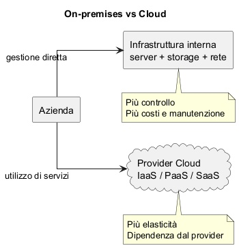

# Approfondimenti ad hoc

## Dati di telemetria

Per i dati di telemetria (posizione GPS, velocità, eventi con timestamp) la scelta del database dipende dalle loro caratteristiche:

* dati generati in modo continuo e ad alta frequenza;
* fortemente ordinati nel tempo;
* query tipiche su intervalli temporali;
* necessità di archiviazione storica e retention.

### Scelta tra RDBMS e NoSQL

Un RDBMS tradizionale (es. PostgreSQL, MySQL) può gestire la telemetria, ma non è la soluzione ottimale quando il volume cresce molto, perché:

* le tabelle diventano rapidamente molto grandi;
* le operazioni di inserimento continuo possono degradare le prestazioni;
* la gestione di retention e dati storici è meno naturale.

È invece molto adatto per:

* dati gestionali (aziende, utenti, veicoli, dispositivi, ruoli);
* relazioni e vincoli di integrità.

### Tipo di NoSQL più adatto

Per la telemetria, il tipo più adatto è:

* database time-series

perché progettato specificamente per:

* inserimenti rapidi di dati con timestamp;
* query temporali efficienti;
* gestione automatica di retention;
* aggregazioni su intervalli di tempo.

Altri tipi di NoSQL, come key-value o documentale generico, sono meno adatti perché non ottimizzati per analisi temporali.

### Conclusione

Per un sistema di Fleet Management come questo la soluzione più corretta e realistica è ibrida: la scelta migliore è un database time-series, eventualmente integrato con un RDBMS.

* RDBMS per:

  * utenti, aziende, ruoli;
  * veicoli e dispositivi;
  * configurazioni e sicurezza.

* Time-series DB per:

  * posizione GPS;
  * velocità;
  * eventi nel tempo.

Una soluzione molto equilibrata, anche in ambito professionale, è:

* PostgreSQL per la parte gestionale;
* estensione time-series, ad esempio TimescaleDB, cioè un modulo aggiuntivo di PostgreSQL che lo trasforma in un database ottimizzato per dati temporali, oppure un TSDB dedicato per la telemetria.
# PRIMA PARTE

Assunzioni:

* ogni veicolo appartiene a una sola azienda cliente;
* ogni veicolo ha un solo dispositivo di bordo principale;
* il dispositivo comunica tramite rete mobile 4G/5G;
* la piattaforma ACME è **SaaS** **multi-tenant**, cioè unica infrastruttura condivisa da più aziende, ma con isolamento logico dei dati;
* gli operatori aziendali accedono tramite browser web;
* i dispositivi inviano telemetria periodica e segnalazioni di evento, e possono ricevere comandi, percorsi, cartografia e messaggi.

---

# 1. Analisi della realtà di riferimento, modello grafico del sistema, componenti e interconnessioni, con motivazione delle scelte


La realtà di riferimento è quella di una piattaforma centralizzata di Fleet Management che deve permettere:

* monitoraggio continuo dei mezzi;
* scambio bidirezionale di informazioni tra centro e veicolo;
* accesso **separato** e sicuro per più aziende clienti;
* gestione di operatori con **ruoli** diversi;
* sicurezza delle comunicazioni e riservatezza dei dati.

Dal punto di vista architetturale, la soluzione più realistica è una piattaforma centralizzata composta da:

* front-end web;
* API applicative;
* modulo di ingestione dati dai dispositivi;
* broker MQTT 
* database relazionale per dati gestionali;
* archivio telemetria/eventi;
* modulo IAM per autenticazione, ruoli e controllo accessi.

**MQTT**: (Message Queuing Telemetry Transport) 
standard/protocollo di comunicazione 
Definisce un modello publish/subscribe in cui i client inviano (publish) e ricevono (subscribe) messaggi tramite un broker.

**broker MQTT** 
software (server) che implementa il protocollo MQTT, gestisce la distribuzione dei messaggi come prescritto da MQTT

Questa scelta è motivata da ragioni di:

* scalabilità: i dispositivi possono essere molti e inviare dati frequentemente;
* sicurezza: separazione dei componenti e controllo centralizzato;
* manutenibilità: aggiornare il servizio SaaS è più semplice che aggiornare installazioni distribuite presso ogni cliente;
* multitenancy: una sola piattaforma può servire molte aziende, mantenendo però separati i dati.


```
[Operatori aziendali]
        |
        | HTTPS
        v
[Internet]
        |
        v
[Router di frontiera ACME]
        |
        v
[Firewall / NGFW perimetrale]
        |
        v
[DMZ]
  |-------------------------------|
  |                               |
  v                               v
[Reverse Proxy / WAF /          [Broker MQTT esposto
 Load Balancer Web]              in modo controllato]
  |                               |
  | HTTPS                         | MQTT over TLS
  v                               v
[Firewall interno / filtro tra zone di sicurezza]
        |
        v
[Rete server interna ACME]
  |-------------------------------|-----------------------------|
  |                               |                             |
  v                               v                             v
[Application Server / API]   [DB relazionale]      [Archivio telemetria / TSDB]
        |
        |
        +------------------------------------------------------+
                                                               |
                                                               |
                                                [Servizi logici di gestione]
                                       autenticazione, ruoli, comandi, audit,
                                       gestione flotte, dashboard, notifiche

-------------------------------------------------------------------------------

[Sensori veicolo / CAN bus / GPS]
        |
        v
[Dispositivo di bordo]
(CPU embedded + modem 4G/5G + memoria locale)
        |
        | MQTT over TLS oppure HTTPS/TLS
        v
[Rete radio mobile 4G/5G]
        |
        v
[Core network operatore mobile]
        |
        v
[Internet pubblica]
        |
        v
[Router di frontiera ACME]
        |
        v
[Firewall / NGFW perimetrale]
        |
        v
[Broker MQTT in DMZ]
        |
        v
[Firewall interno]
        |
        v
[Application Server / servizi di ingestione]
        |
        +--> [DB relazionale]
        |
        +--> [Archivio telemetria / TSDB]
```


La piattaforma ACME viene raggiunta da due categorie di client diverse:

* gli **operatori umani**, che accedono al portale web tramite browser;
* i **dispositivi di bordo**, che inviano e ricevono dati tramite rete mobile.

Gli operatori entrano in HTTPS nel front-end web pubblicato in DMZ.
I dispositivi di bordo non raggiungono direttamente i server interni o i database, ma arrivano prima al broker MQTT pubblicato in modo controllato nella DMZ.

La DMZ espone solo i servizi necessari verso l’esterno, senza mettere i server interni direttamente su Internet.

Dietro la DMZ è presente un firewall interno che separa la zona esposta dalla rete server interna.
In questo modo:

* il traffico Internet non raggiunge direttamente database e application server;
* il database resta solo nella rete interna;
* il broker MQTT e il reverse proxy sono gli unici punti pubblicati verso l’esterno;
* ogni flusso viene filtrato e controllato.

Il dispositivo di bordo usa:

* GPS e sensori per raccogliere i dati;
* modem 4G/5G per trasmetterli;
* memoria locale per buffering temporaneo se la rete è assente.

La parte interna ACME contiene:

* application server e API
* database relazionale per aziende, utenti, ruoli, mezzi, dispositivi, comandi
* archivio telemetria/time-series per posizione, velocità, eventi e cronologia


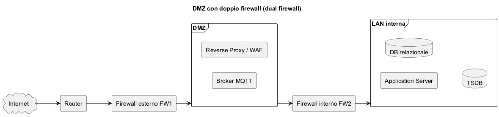

Altre considerazioni (sul diagramma grafico)
* i veicoli non accedono direttamente ai database;
* l’esposizione verso Internet è limitata alla DMZ;
* il firewall perimetrale protegge il confine esterno;
* il firewall interno separa i servizi esposti dai server interni;
* il broker MQTT è pubblicato in modo controllato;
* il database relazionale e l’archivio telemetria restano nella rete interna;
* l’accesso web degli operatori e il traffico macchina-macchina dei veicoli sono separati logicamente, pur condividendo il medesimo perimetro di sicurezza.


Motivazione delle principali scelte:

1. Piattaforma SaaS centralizzata
   Consente aggiornamenti centralizzati, riduzione dei costi per i clienti, gestione uniforme della sicurezza, backup centralizzati e maggiore controllo operativo.

2. Architettura a componenti separati
   Il traffico web degli operatori è diverso dal traffico macchina-macchina dei dispositivi. Separare questi flussi rende il sistema più robusto e scalabile.

3. Database relazionale + archivio telemetria
   I dati gestionali, come utenti, ruoli, aziende, mezzi e configurazioni, si adattano bene a un DB relazionale. La telemetria è invece voluminoso dato temporale; conviene tenerla logicamente separata.

4. Broker real-time
   È utile per gestire in modo efficiente la comunicazione asincrona tra piattaforma e dispositivi.

---

2. Funzionalità tecnologiche dei dispositivi a bordo degli automezzi

---

Il dispositivo di bordo deve svolgere sia funzioni di acquisizione dati sia funzioni di comunicazione sicura.

Funzioni hardware principali:

* ricevitore GPS/GNSS;
* modem 4G/5G;
* microcontrollore o unità embedded;
* memoria locale per buffering;
* alimentazione da veicolo;
* eventuale interfaccia CAN bus;
* eventuale accelerometro;
* eventuale microfono/altoparlante per messaggi vocali.

Funzioni software principali:

* acquisire posizione, velocità, direzione, timestamp;
* rilevare eventi anomali;
* memorizzare temporaneamente dati in assenza di rete;
* inviare telemetria al centro;
* ricevere comandi e messaggi;
* autenticarsi verso il server;
* gestire aggiornamenti e configurazioni;
* verificare integrità del firmware.

Schema testuale del dispositivo:

```
[GPS / GNSS] --------\
                      \
[Sensori / CAN] ------> [Modulo acquisizione dati] --> [Logica embedded]
                                                       |         |
                                                       |         +--> [Memoria locale / buffer]
                                                       |
                                                       +--> [Modulo sicurezza / credenziali]
                                                       |
                                                       +--> [Modem 4G/5G] --> [Rete mobile] --> [Server ACME]
```

Versione PlantUML:


Comportamento operativo tipico:

* il dispositivo legge periodicamente posizione e stato;
* prepara un messaggio con timestamp;
* lo invia al centro tramite canale sicuro;
* se la rete non è disponibile, salva i dati in memoria locale;
* quando la connettività torna disponibile, reinvia i dati arretrati;
* riceve eventuali comandi dal centro.

---

3. Protocolli di comunicazione da adottare per garantire la sicurezza
   delle informazioni trasmesse, con descrizione delle tecnologie

---

Le comunicazioni da proteggere sono due:

* comunicazioni operatore-piattaforma;
* comunicazioni dispositivo-piattaforma.

3.1 Comunicazione operatore-piattaforma

Protocollo consigliato:

* HTTPS, cioè HTTP su TLS.

Motivazioni:

* confidenzialità: i dati sono cifrati;
* integrità: si rilevano alterazioni;
* autenticazione del server: certificato X.509;
* protezione delle sessioni e delle credenziali.

Tecnologie coinvolte:

* TLS 1.2 o 1.3;
* certificati digitali X.509;
* cookie di sessione protetti;
* eventuale MFA;
* password memorizzate come hash con salt.

3.2 Comunicazione dispositivo-piattaforma

Soluzioni realistiche:

* MQTT su TLS;
* oppure HTTPS REST su TLS.

Scelta più adatta qui: MQTT su TLS.

Perché:

* protocollo leggero;
* adatto a dispositivi embedded;
* adatto a reti mobili e connessioni intermittenti;
* supporta bene comunicazione bidirezionale;
* efficiente per telemetria real-time.

3.3 Sicurezza applicata ai dispositivi

Misure appropriate:

* autenticazione del broker/server tramite certificato;
* autenticazione del dispositivo con credenziali univoche o meglio con certificato client;
* cifratura del traffico con TLS;
* controllo di autorizzazione sui topic o endpoint;
* protezione contro replay, clonazione e manipolazione.

3.4 Tecnologie descritte

TLS
È il protocollo che crea un canale cifrato tra client e server. Fornisce:

* autenticazione del server;
* negoziazione sicura di chiavi;
* cifratura simmetrica del traffico;
* controllo di integrità.

Certificati digitali
Permettono di associare una chiave pubblica a una identità. Il client verifica che il certificato del server sia firmato da una CA fidata.

Hash password
Le password non devono essere memorizzate in chiaro ma sotto forma di hash con salt.

RBAC
Il Role Based Access Control consente di decidere cosa un utente può fare in base al ruolo assegnato.

Schema testuale dei protocolli:

```
Operatore <--- HTTPS/TLS ---> Portale ACME
Dispositivo <--- MQTT/TLS ---> Broker ACME
API interne <--- HTTPS/TLS ---> servizi applicativi
```

Versione PlantUML:

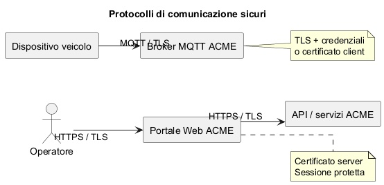
--- 

# SECONDA PARTE

---

### Quesito 1
Modello concettuale e logico della porzione di database necessaria
alla gestione della riservatezza dei dati, autenticazioni e ruoli.
Progetto delle pagine di accesso e codifica di una parte significativa.
-----------------------------------------------------------------------

Occorre gestire:

* più aziende clienti;
* più utenti per ciascuna azienda;
* ruoli diversi all’interno della stessa azienda;
* isolamento dei dati per tenant;
* autenticazione e autorizzazione.

Schema concettuale testuale:

```
Azienda
    |
    | 1:N
    |
  Utente --- N:M --- Ruolo --- N:M --- Permesso

Azienda
    |
    | 1:N
    |
  Veicolo --- 1:1 --- Dispositivo

Utente --- 1:N --- AuditAccesso
```

Versione PlantUML del modello concettuale:


Modello logico relazionale:

```
AZIENDA(
    id_azienda PK,
    ragione_sociale,
    partita_iva,
    stato
)

UTENTE(
    id_utente PK,
    id_azienda FK -> AZIENDA.id_azienda,
    username UNIQUE,
    password_hash,
    nome,
    cognome,
    email,
    attivo
)

RUOLO(
    id_ruolo PK,
    nome_ruolo UNIQUE,
    descrizione
)

PERMESSO(
    id_permesso PK,
    codice_permesso UNIQUE,
    descrizione
)

UTENTE_RUOLO(
    id_utente FK -> UTENTE.id_utente,
    id_ruolo FK -> RUOLO.id_ruolo,
    PRIMARY KEY(id_utente, id_ruolo)
)

RUOLO_PERMESSO(
    id_ruolo FK -> RUOLO.id_ruolo,
    id_permesso FK -> PERMESSO.id_permesso,
    PRIMARY KEY(id_ruolo, id_permesso)
)

VEICOLO(
    id_veicolo PK,
    id_azienda FK -> AZIENDA.id_azienda,
    targa UNIQUE,
    modello,
    stato
)

DISPOSITIVO(
    id_dispositivo PK,
    id_veicolo FK -> VEICOLO.id_veicolo UNIQUE,
    seriale UNIQUE,
    certificato,
    attivo
)

AUDIT_ACCESSO(
    id_accesso PK,
    id_utente FK -> UTENTE.id_utente,
    timestamp_login,
    ip_client,
    esito
)
```

Versione PlantUML del modello logico:


Pagine del sito minime:

* pagina login;
* pagina verifica accesso;
* dashboard;
* pagina accesso negato;
* logout.

Schema testuale del flusso:

```
[Login] --> [Verifica credenziali] --> [Caricamento ruoli e tenant]
                                           |
                                           +--> se valido: [Dashboard]
                                           |
                                           +--> se non valido: [Errore]
```

Versione PlantUML:

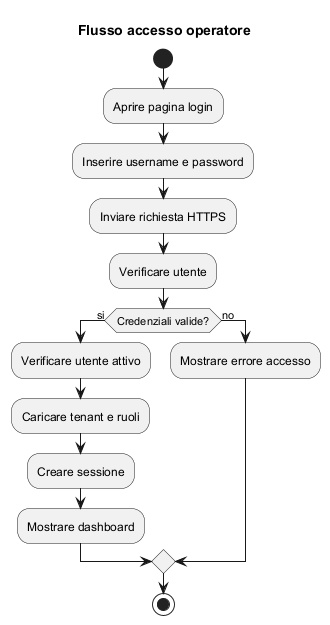

Esempio di codice significativo in Python Flask.

Pagina login HTML:

```
<!DOCTYPE html>
<html lang="it">
<head>
    <meta charset="UTF-8">
    <title>Login Fleet Management</title>
</head>
<body>
    <h1>Accesso area riservata</h1>
    <form method="post" action="/login">
        <label for="username">Username</label>
        <input type="text" id="username" name="username" required>

        <label for="password">Password</label>
        <input type="password" id="password" name="password" required>

        <button type="submit">Accedere</button>
    </form>
</body>
</html>
```

Parte significativa lato server:

```
from flask import Flask, request, session, redirect
import sqlite3
import hashlib

app = Flask(__name__)
app.secret_key = "chiave_segreta_di_esempio"

def hash_password(password: str) -> str:
    return hashlib.sha256(password.encode("utf-8")).hexdigest()

def get_db_connection():
    conn = sqlite3.connect("fleet.db")
    conn.row_factory = sqlite3.Row
    return conn

@app.route("/login", methods=["GET", "POST"])
def login():
    if request.method == "GET":
        return """
        <html><body>
        <h1>Login</h1>
        <form method="post">
            <input type="text" name="username" required>
            <input type="password" name="password" required>
            <button type="submit">Accedere</button>
        </form>
        </body></html>
        """

    username = request.form["username"]
    password = request.form["password"]

    conn = get_db_connection()
    user = conn.execute("""
        SELECT id_utente, id_azienda, username, password_hash, attivo
        FROM UTENTE
        WHERE username = ?
    """, (username,)).fetchone()

    if user is None:
        return "Credenziali non valide", 401

    if not user["attivo"]:
        return "Utente non attivo", 403

    if user["password_hash"] != hash_password(password):
        return "Credenziali non valide", 401

    ruoli = conn.execute("""
        SELECT r.nome_ruolo
        FROM RUOLO r
        JOIN UTENTE_RUOLO ur ON ur.id_ruolo = r.id_ruolo
        WHERE ur.id_utente = ?
    """, (user["id_utente"],)).fetchall()

    session["user_id"] = user["id_utente"]
    session["tenant_id"] = user["id_azienda"]
    session["ruoli"] = [r["nome_ruolo"] for r in ruoli]

    return redirect("/dashboard")
```

---

### Quesito 2
Descrizione di una soluzione di connessione client del dispositivo
installato su un automezzo con il server del servizio centralizzato,
con codifica delle parti principali.
------------------------------------

La soluzione più adatta è una comunicazione device-to-cloud su rete mobile, con protocollo MQTT su TLS.

Motivazione:

* leggero;
* adatto a telemetria frequente;
* supporta publish/subscribe;
* adatto a connessioni instabili;
* permette anche ricezione di comandi.

Flusso testuale:

```
[Dispositivo]
    |
    |-- acquisire GPS e sensori
    |-- aprire connessione TLS
    |-- autenticarsi
    |-- pubblicare telemetria
    |-- sottoscriversi ai comandi
    |
[Broker MQTT ACME]
    |
[Servizi applicativi ACME]
```

Versione PlantUML:


Esempio di topic:

```
fleet/acme_cliente_01/veicolo_456/telemetria
fleet/acme_cliente_01/veicolo_456/eventi
fleet/acme_cliente_01/veicolo_456/comandi
```

Esempio di payload:

```
{
    "device_id": "DEV-456",
    "timestamp": "2026-04-14T10:15:00Z",
    "lat": 41.9028,
    "lon": 12.4964,
    "speed_kmh": 68,
    "event": "normal"
}
```

Codice esemplificativo Python:

```
import json
import ssl
import time
from datetime import datetime, timezone
import paho.mqtt.client as mqtt

BROKER_HOST = "broker.acme.example"
BROKER_PORT = 8883
USERNAME = "device_456"
PASSWORD = "password_dispositivo"
TOPIC_TELEMETRIA = "fleet/acme_cliente_01/veicolo_456/telemetria"
TOPIC_COMANDI = "fleet/acme_cliente_01/veicolo_456/comandi"

def build_payload():
    return {
        "device_id": "DEV-456",
        "timestamp": datetime.now(timezone.utc).isoformat(),
        "lat": 41.9028,
        "lon": 12.4964,
        "speed_kmh": 68,
        "event": "normal"
    }

def on_connect(client, userdata, flags, rc):
    if rc == 0:
        print("Connesso")
        client.subscribe(TOPIC_COMANDI)
    else:
        print("Errore connessione", rc)

def on_message(client, userdata, msg):
    print("Comando ricevuto:", msg.payload.decode())

client = mqtt.Client()
client.username_pw_set(USERNAME, PASSWORD)
client.on_connect = on_connect
client.on_message = on_message

client.tls_set(cert_reqs=ssl.CERT_REQUIRED)
client.connect(BROKER_HOST, BROKER_PORT, 60)
client.loop_start()

try:
    while True:
        payload = json.dumps(build_payload())
        client.publish(TOPIC_TELEMETRIA, payload, qos=1)
        time.sleep(10)
except KeyboardInterrupt:
    client.loop_stop()
    client.disconnect()
```

Osservazione importante:
in ambiente reale si preferirebbe, se possibile, autenticazione forte del dispositivo con certificato client e gestione del buffering locale in modo più strutturato.

---

### Quesito 3  
Motivazioni che inducono alla realizzazione di una rete intranet in
una organizzazione, principali servizi e relativi protocolli.
Analisi di uno dei protocolli.
------------------------------

Una intranet è una rete privata aziendale che usa tecnologie Internet ma resta destinata all’uso interno dell’organizzazione.

Motivazioni principali:

* condivisione controllata di informazioni e documenti;
* accesso centralizzato ad applicazioni interne;
* miglior coordinamento tra uffici;
* riduzione della dispersione dei dati;
* maggiore controllo di sicurezza rispetto a servizi esposti pubblicamente;
* integrazione tra utenti, server, database, directory e sistemi gestionali.

Servizi tipici che una intranet deve offrire:

* autenticazione e directory utenti;
* file sharing;
* posta elettronica interna o integrata;
* portali e applicazioni web interne;
* risoluzione nomi;
* configurazione automatica host;
* stampa di rete;
* accesso a basi dati e servizi applicativi;
* sistemi di backup e logging.

Protocolli tipici:

* HTTP/HTTPS per portali e applicazioni web;
* DNS per risoluzione nomi;
* DHCP per assegnazione configurazione IP;
* LDAP o LDAPS per directory e autenticazione;
* SMTP, IMAP, POP3 per posta;
* SMB/CIFS o NFS per condivisione file;
* SSH per amministrazione sicura;
* RDP o VNC, se necessari, per accesso remoto controllato;
* SNMP per monitoraggio.

Schema testuale di una intranet:

```
[Client interni]
    | \
    |  \----> [DNS]
    |-----> [DHCP]
    |-----> [Portale intranet HTTPS]
    |-----> [File server SMB]
    |-----> [Directory LDAP/AD]
    |-----> [Mail server]
    |-----> [DB / applicazioni interne]
```

Versione PlantUML:


Analisi di un protocollo: LDAP

LDAP, Lightweight Directory Access Protocol, è usato per interrogare e gestire un servizio di directory.
Una directory contiene informazioni organizzate gerarchicamente, ad esempio:

* utenti;
* gruppi;
* unità organizzative;
* attributi come email, login, ruoli, appartenenze.

Perché è importante in intranet:

* centralizza l’identità degli utenti;
* permette autenticazione unificata;
* facilita controllo accessi;
* riduce duplicazione delle credenziali nei vari servizi.

Funzionamento generale:

* il client si collega al server directory;
* esegue una bind operation, cioè una autenticazione;
* effettua query sugli oggetti;
* riceve attributi e informazioni di gruppo;
* le applicazioni interne usano tali dati per autorizzare l’accesso.

LDAP non cifrato non è adeguato per ambienti moderni.
È preferibile usare:

* LDAPS, cioè LDAP su TLS;
* oppure LDAP con StartTLS.

Schema testuale dell’uso di LDAP:

```
[Utente] --> [Applicazione intranet]
                    |
                    +--> [LDAP / Active Directory]
                           |
                           +--> verifica credenziali
                           +--> restituisce gruppi/ruoli
```

Versione PlantUML:

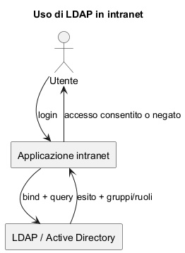

---

### Quesito 4
Servizi informativi su infrastruttura interna oppure cloud:
caratteristiche, punti di forza e debolezza

Le aziende possono realizzare i propri servizi informativi secondo due modelli principali:

* infrastruttura interna on-premises;
* infrastruttura cloud.

4.1 Infrastruttura interna

Caratteristiche:
l’azienda acquista o gestisce direttamente server, storage, rete, sicurezza, backup e software nel proprio data center o nei propri locali.

Punti di forza:

* controllo diretto su infrastruttura e dati;
* maggiore personalizzazione;
* possibile integrazione stretta con sistemi legacy;
* in alcuni casi maggiore percezione di controllo normativo e operativo.

Punti di debolezza:

* investimenti iniziali elevati;
* tempi di attivazione più lunghi;
* necessità di personale specializzato;
* scalabilità meno elastica;
* costi di manutenzione, aggiornamento, ridondanza e backup a carico dell’azienda.

4.2 Infrastruttura cloud

Caratteristiche:
risorse erogate come servizio via rete da un provider. Possono essere IaaS, PaaS, SaaS.

Punti di forza:

* attivazione rapida;
* elevata elasticità;
* costi iniziali ridotti;
* aggiornamenti e manutenzione spesso semplificati;
* maggiore facilità di scalare in funzione del carico;
* disponibilità di servizi avanzati gestiti.

Punti di debolezza:

* minore controllo diretto sull’infrastruttura fisica;
* dipendenza dal provider;
* attenzione a localizzazione dei dati e compliance;
* rischio di lock-in tecnologico;
* necessità di governare bene sicurezza, identità, configurazioni e costi ricorrenti.

4.3 Confronto sintetico

Per una soluzione come quella ACME, il cloud è generalmente più coerente, perché:

* il servizio è SaaS per più clienti;
* il numero di dispositivi può crescere molto;
* servono disponibilità elevata e scalabilità;
* è utile centralizzare gestione, backup, monitoraggio e aggiornamenti.

Tuttavia, l’adozione del cloud non elimina i problemi di sicurezza: li sposta in parte verso una gestione condivisa tra provider e cliente.

Schema testuale di confronto:

```
On-premises:
    Azienda -> possiede e gestisce direttamente server, rete, storage, sicurezza

Cloud:
    Azienda -> usa risorse del provider -> paga a consumo / canone
```

Versione PlantUML:


# Approfondimenti ad hoc

## Dati Telemetria
Per i **dati di telemetria** (posizione GPS, velocità, eventi con timestamp) la scelta del database dipende dalle loro caratteristiche:

* dati generati **in modo continuo e ad alta frequenza**
* fortemente **ordinati nel tempo**
* query tipiche su **intervalli temporali**
* necessità di **archiviazione storica e retention**

#### Scelta tra RDBMS e NoSQL

Un **RDBMS tradizionale** (es. PostgreSQL, MySQL) può gestire la telemetria, ma non è la soluzione ottimale quando il volume cresce molto, perché:

* le tabelle diventano rapidamente molto grandi
* le operazioni di inserimento continuo possono degradare le prestazioni
* la gestione di retention e dati storici è meno naturale

È invece molto adatto per:

* dati gestionali (aziende, utenti, veicoli, dispositivi, ruoli)
* relazioni e vincoli di integrità

#### Tipo di NoSQL più adatto

Per la telemetria, il tipo più adatto è:

* **database time-series**

perché progettato specificamente per:

* inserimenti rapidi di dati con timestamp
* query temporali efficienti
* gestione automatica di retention
* aggregazioni su intervalli di tempo

Altri tipi di NoSQL (key-value, documentale generico) sono meno adatti perché non ottimizzati per analisi temporali.

#### COnclusione

Per un sistema di Fleet Management come questo la soluzione più corretta e realistica è **ibrida**:
la scelta migliore è un **database time-series (eventualmente integrato con un RDBMS)**

* **RDBMS** per:

  * utenti, aziende, ruoli
  * veicoli e dispositivi
  * configurazioni e sicurezza

* **Time-series DB** per:

  * posizione GPS
  * velocità
  * eventi nel tempo


Una soluzione molto equilibrata, anche in ambito professionale, è:

* PostgreSQL per la parte gestionale
* estensione time-series (es. TimescaleDB, modulo aggiuntivo di PostgreSQL che lo trasforma in un database ottimizzato per dati temporali) oppure un TSDB dedicato per la telemetria
