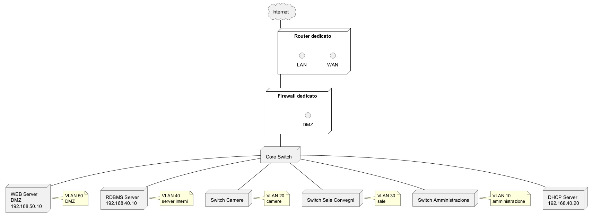

rete con  **la stessa logica architetturale precedente**, ma introducendo due variazioni:  
• il **router è un host dedicato che svolge solo routing**  
• il **firewall è un host dedicato che svolge solo funzioni di firewall**  

Non esistono quindi dispositivi che combinano routing e firewall nello stesso apparato.

La topologia resta una **architettura a tre zone classica**:

Internet
WAN
DMZ
LAN interne segmentate con VLAN

---

# 1. Architettura logica generale

Flusso della rete:

Internet
→ router
→ firewall
→ switch core
→ VLAN interne e DMZ

Schema logico semplificato

Internet
│
Router
│
Firewall
│
Core Switch (L3 o L2 + routing sul router)
│
VLAN interne + DMZ

Il firewall è quindi **tra router e rete interna**, come normalmente avviene nelle architetture di sicurezza.

---

# 2. Componenti fisici della rete

Dispositivi presenti:

1 router dedicato
1 firewall dedicato
1 core switch
switch di accesso per camere e sale

Server presenti:

WEB server (DMZ)
RDBMS server (LAN protetta)

---

# 3. VLAN e reti IP

Per mantenere chiarezza progettuale ogni VLAN ha una subnet.

VLAN 10
amministrazione hotel
192.168.10.0/24

VLAN 20
rete camere (client ospiti)
192.168.20.0/24

VLAN 30
sale convegni
192.168.30.0/24

VLAN 40
server interni
192.168.40.0/24

VLAN 50
DMZ
192.168.50.0/24

---

# 4. Router dedicato

Il router svolge esclusivamente funzioni di routing tra:

Internet
rete firewall esterna

Interfacce:

WAN

IP pubblico fornito dall’ISP

LAN verso firewall

10.0.0.1/30

Non svolge:

NAT applicativo
filtraggio applicativo
policy di sicurezza

Queste funzioni sono demandate al firewall.

---

# 5. Firewall dedicato

Il firewall è installato su un host separato (appliance o server dedicato).

Possiede tre interfacce:

WAN verso router
LAN verso rete interna
DMZ verso rete server pubblici

Configurazione IP esempio:

WAN
10.0.0.2/30

LAN
192.168.1.1/24

DMZ
192.168.50.1/24

Funzioni del firewall:

stateful packet inspection
NAT
port forwarding verso WEB server
controllo traffico tra VLAN interne e DMZ

---

# 6. Core switch

Il core switch collega:

firewall
switch accesso
server

Supporta:

802.1Q trunking
VLAN

La connessione tra firewall e core switch è **trunk 802.1Q** per trasportare tutte le VLAN interne.

---

# 7. Switch di accesso

Gli switch di accesso servono:

camere hotel
sale convegni
uffici amministrativi

Le porte verso gli host sono **access ports** associate alla VLAN corretta.

Esempio:

porte camere → VLAN 20
porte sale → VLAN 30
porte amministrazione → VLAN 10

---

# 8. Server

## WEB server

Posizione

DMZ

Indirizzo

192.168.50.10

Accessibile da Internet tramite NAT sul firewall.

Servizi esposti:

HTTP
HTTPS

---

## RDBMS server

Posizione

VLAN server interni

192.168.40.10

Accessibile solo dal WEB server.

Regola firewall:

consentire

WEB server → RDBMS
porta database (es. 3306 o 5432)

Bloccare qualsiasi altro accesso.

---

# 9. DHCP

Il DHCP è centralizzato.

Server DHCP nella VLAN server.

192.168.40.20

Scope configurati:

VLAN 10
VLAN 20
VLAN 30

Il relay DHCP è configurato sul firewall o sul router interno.

---

# 10. Gateway delle VLAN

Il gateway delle reti interne è configurato sul firewall.

Gateway:

VLAN 10 → 192.168.10.1
VLAN 20 → 192.168.20.1
VLAN 30 → 192.168.30.1
VLAN 40 → 192.168.40.1
VLAN 50 → 192.168.50.1

Il firewall effettua quindi **inter-VLAN routing controllato**.

---

# 11. Regole principali del firewall

Accesso Internet

LAN interne → Internet consentito

Accesso pubblico

Internet → WEB server consentito solo su

80
443

Protezione database

solo

WEB server → RDBMS

porta DB

vietato qualsiasi altro traffico verso il DB.

---

# 12. Sequenza di accesso ad un servizio web

Cliente Internet visita sito hotel.

Passaggi:

1 richiesta arriva al router
2 router inoltra al firewall
3 firewall applica NAT
4 traffico inviato al WEB server in DMZ
5 WEB server interroga RDBMS interno
6 risposta torna al client

Il database non è mai esposto su Internet.

---

# 13. Diagramma PlantUML

Diagramma della rete con router e firewall separati.

---

# 14. Vantaggi della separazione router/firewall

Questa scelta è comune nelle architetture professionali perché:

consente maggiore sicurezza
riduce il rischio di compromissione
permette scalabilità
separa chiaramente funzioni di routing e sicurezza

---

## Alcuni riferimenti

Cisco – Network segmentation and VLAN design
[https://www.cisco.com/c/en/us/products/switches/what-is-a-vlan.html](https://www.cisco.com/c/en/us/products/switches/what-is-a-vlan.html)

Cisco – Inter-VLAN routing
[https://www.cisco.com/c/en/us/support/docs/lan-switching/vlan/10023-3.html](https://www.cisco.com/c/en/us/support/docs/lan-switching/vlan/10023-3.html)

NIST – Network segmentation security
[https://nvlpubs.nist.gov/nistpubs/SpecialPublications/NIST.SP.800-41r1.pdf](https://nvlpubs.nist.gov/nistpubs/SpecialPublications/NIST.SP.800-41r1.pdf)

---

Se si desidera, si può anche produrre **una seconda versione del diagramma PlantUML molto più leggibile per gli studenti**, con colori per WAN, DMZ e LAN e con indicazione esplicita delle tratte trunk 802.1Q.
