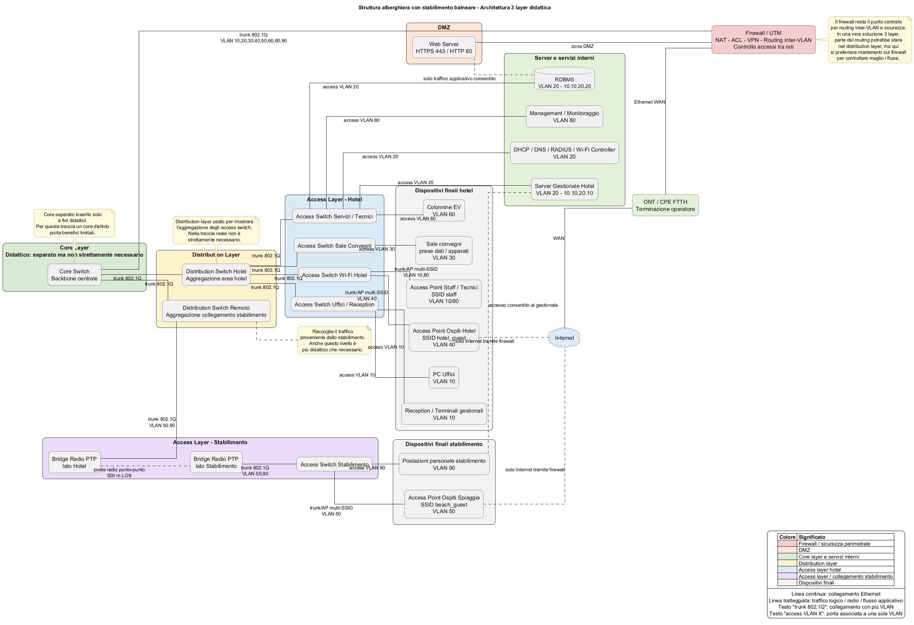

Si propone di seguito uno svolgimento completo della traccia utilizzando **una architettura a tre livelli (3-layer architecture)**.
È importante chiarire fin dall’inizio che **questa scelta non è la più ottimale per il problema**, ma viene adottata **esclusivamente per finalità didattiche**, per mostrare in modo esplicito il ruolo dei tre livelli classici delle reti enterprise: access layer, distribution layer e core layer.

In una soluzione reale, considerata la dimensione relativamente contenuta della struttura alberghiera e il numero limitato di segmenti di rete, sarebbe più appropriata una **architettura a due livelli (access + core/distribution)**. L’introduzione di un distribution layer separato non è strettamente necessaria e introduce complessità aggiuntiva senza portare benefici proporzionati.

La soluzione che segue è quindi volutamente più articolata del necessario per consentire di analizzare e comprendere meglio la struttura gerarchica delle reti aziendali.

---

# Soluzione

# 1. Impostazione generale del progetto

## 1.1 Architettura di rete adottata

La rete viene progettata utilizzando una **architettura gerarchica a tre livelli** composta da:

access layer
distribution layer
core layer

Questa architettura è tipica delle **reti campus enterprise**, dove la presenza di numerosi edifici, centinaia o migliaia di dispositivi e traffico elevato rende necessario separare chiaramente le funzioni dei vari livelli.

Nel caso della struttura alberghiera descritta nella traccia, tale architettura non rappresenta la scelta più efficiente. La rete non ha dimensioni tali da richiedere un livello di aggregazione separato tra accesso e dorsale. Una soluzione a due livelli sarebbe più semplice, meno costosa e più facile da amministrare.

L’architettura a tre livelli viene quindi adottata **solo per rendere esplicita la struttura gerarchica della rete** e permettere di analizzare con chiarezza il ruolo dei diversi livelli.

---

# 2. Ruolo dei tre livelli della rete

## 2.1 Access layer

L’access layer è il livello più vicino agli utenti e ai dispositivi finali.

Gli switch di accesso collegano direttamente:

PC degli uffici amministrativi
postazioni della reception
terminali del personale
stampanti di rete
access point Wi-fi
terminali di servizio
dispositivi tecnici e infrastrutturali

Ogni porta degli switch di accesso viene configurata in una VLAN specifica, in modo da separare logicamente i diversi tipi di traffico.

L’access layer non svolge funzioni di routing. Il suo compito principale è fornire connettività ai dispositivi finali e trasportare il traffico verso il livello superiore.

---

## 2.2 Distribution layer

Il distribution layer raccoglie il traffico proveniente dagli switch di accesso.

In una architettura enterprise tipica questo livello svolge diverse funzioni:

aggregazione degli access switch
routing inter-VLAN
applicazione di policy e filtri
gestione delle liste di controllo accessi
sintesi delle rotte verso il core

Nel caso della rete descritta nella traccia, però, **questo livello non è strettamente necessario**.

La struttura non presenta un numero elevato di switch di accesso né un traffico tale da richiedere un livello di aggregazione separato. Inoltre, per motivi di sicurezza, il routing tra le VLAN viene affidato al firewall/UTM.

Questo significa che il distribution layer svolge principalmente una funzione di **aggregazione dei collegamenti**, rendendo evidente la struttura gerarchica della rete ma senza essere realmente indispensabile.

---

## 2.3 Core layer

Il core layer rappresenta la dorsale centrale della rete.

Il suo compito è:

trasportare il traffico tra le varie aree della rete
garantire elevate prestazioni
fornire un punto centrale di interconnessione tra i diversi blocchi della rete

In reti campus molto grandi il core deve essere progettato per fornire throughput elevato e ridondanza.

Nel caso di questa rete, la presenza di un core separato è utile soprattutto a scopo didattico. In una rete reale di queste dimensioni il core e il distribution layer potrebbero essere unificati in un unico livello.

---

# 3. Collegamento a Internet

La struttura è collegata a Internet tramite una connessione **FTTH (Fiber To The Home)**.

Il collegamento segue la sequenza:

Internet
ONT/CPE dell’operatore
firewall / UTM
core switch

L’ONT (Optical Network Terminal) converte il segnale ottico della rete GPON dell’operatore in interfaccia Ethernet.

Il firewall/UTM rappresenta il vero punto di frontiera della rete e svolge diverse funzioni fondamentali:

NAT verso Internet
filtraggio del traffico
terminazione VPN
routing tra le VLAN interne
protezione della DMZ
monitoraggio e logging della rete

Il firewall costituisce quindi il principale elemento di sicurezza dell’infrastruttura.

---

# 4. Segmentazione della rete tramite VLAN

Per migliorare sicurezza e organizzazione della rete si utilizza una segmentazione logica basata su VLAN.

Ogni VLAN rappresenta una rete logica separata.

VLAN 10 – UFFICI
VLAN 20 – SERVIZI INTERNI
VLAN 30 – SALE CONVEGNI
VLAN 40 – OSPITI HOTEL
VLAN 50 – OSPITI SPIAGGIA
VLAN 60 – COLONNINE DI RICARICA
VLAN 70 – DMZ
VLAN 80 – MANAGEMENT
VLAN 90 – STAFF STABILIMENTO

La separazione in VLAN permette di isolare il traffico tra le diverse categorie di utenti e di applicare regole di sicurezza specifiche.

---

# 5. Piano di indirizzamento IP

Si utilizza uno spazio di indirizzamento privato.

VLAN 10 UFFICI
rete 10.10.10.0/24

VLAN 20 SERVIZI
rete 10.10.20.0/24

VLAN 30 CONVEGNI
rete 10.10.30.0/24

VLAN 40 OSPITI HOTEL
rete 10.10.40.0/24

VLAN 50 OSPITI SPIAGGIA
rete 10.10.50.0/24

VLAN 60 COLONNINE EV
rete 10.10.60.0/24

VLAN 70 DMZ
rete 10.10.70.0/24

VLAN 80 MANAGEMENT
rete 10.10.80.0/24

VLAN 90 STAFF STABILIMENTO
rete 10.10.90.0/24

Questo schema mantiene una struttura semplice e facilmente leggibile.

---

# 6. Routing tra le VLAN

Il routing tra le VLAN non viene affidato agli switch ma al firewall.

Questo consente di applicare controlli di sicurezza più precisi tra le diverse reti.

Il firewall diventa quindi il gateway delle varie VLAN.

Esempio:

10.10.10.1 gateway VLAN uffici
10.10.20.1 gateway VLAN servizi
10.10.40.1 gateway rete ospiti

Questo approccio migliora il controllo dei flussi tra reti con diverso livello di fiducia.

---

# 7. Collegamento dello stabilimento balneare

Lo stabilimento balneare si trova a circa **500 metri dall’hotel** ed è visibile dalla terrazza della struttura.

Per collegare le due strutture si utilizza un **ponte radio punto-punto**.

Il collegamento consiste in:

bridge radio lato hotel
bridge radio lato stabilimento

Il collegamento trasporta più VLAN tramite trunk 802.1Q.

In particolare:

VLAN 50 ospiti spiaggia
VLAN 90 personale stabilimento

Il personale dello stabilimento può accedere al software gestionale dell’hotel, mentre gli ospiti possono utilizzare la rete Wi-Fi per accedere a Internet.

---

# 8. Servizi di rete

## DHCP

Il servizio DHCP assegna automaticamente gli indirizzi IP ai dispositivi delle varie VLAN.

Può essere collocato nella VLAN servizi.

Il firewall inoltra le richieste DHCP delle varie VLAN tramite relay.

---

## Wi-Fi

Gli access point dell’hotel e dello stabilimento forniscono connettività wireless agli ospiti.

Gli SSID sono separati per:

rete ospiti hotel
rete ospiti spiaggia
rete staff

Ogni SSID viene associato alla VLAN corrispondente.

---

# 9. DMZ

La DMZ ospita i servizi accessibili da Internet.

Nella DMZ si colloca il Web server dell’hotel.

Il database rimane invece nella rete interna protetta.

Le regole di sicurezza sono:

Internet può accedere al Web server solo su porte 80 e 443
Internet non può accedere al database
il Web server può accedere al database solo sulle porte applicative necessarie

Questa configurazione riduce il rischio che un attacco proveniente da Internet comprometta i sistemi interni.

---

# 10. Regole di sicurezza principali

Le politiche di sicurezza prevedono:

gli ospiti possono accedere solo a Internet
gli ospiti non possono accedere alla rete uffici
gli ospiti non possono accedere alla rete management
il personale autorizzato può accedere ai server interni
lo stabilimento può accedere al gestionale dell’hotel

Queste regole vengono implementate sul firewall.

---

# 11. Valutazione della soluzione

La soluzione proposta è tecnicamente valida e rispetta tutti i requisiti della traccia.

Tuttavia l’architettura a tre livelli risulta **più complessa del necessario**.

Le principali criticità sono:

maggiore numero di apparati
maggiore complessità di configurazione
costi più elevati
benefici limitati per una rete di dimensioni moderate

Una soluzione a due livelli avrebbe consentito di ottenere gli stessi risultati con una infrastruttura più semplice.

---

# 12. Conclusione

La rete è stata progettata utilizzando una architettura gerarchica a tre livelli composta da access layer, distribution layer e core layer.

Questa scelta è stata fatta a scopo didattico per mostrare chiaramente la struttura delle reti enterprise.

Dal punto di vista pratico, una architettura a due livelli sarebbe stata più adatta alle dimensioni della rete della struttura alberghiera.

La soluzione proposta garantisce comunque:

segmentazione della rete tramite VLAN
protezione tramite firewall e DMZ
collegamento sicuro dello stabilimento balneare
accesso controllato ai servizi interni
connettività Internet per ospiti e personale

ed è quindi pienamente funzionale e coerente con i requisiti della traccia.

---

# diagramma dettagliato

