## Reti locali (LAN) e loro evoluzione

---

### 1. Che cos'è una rete locale

Una rete locale (LAN – Local Area Network) è una rete di computer e dispositivi digitali collegati tra loro all'interno di un'area geografica limitata. L'obiettivo è permettere ai dispositivi di comunicare tra loro, condividere risorse e utilizzare servizi comuni.
Possiamo immaginare in modo semplificato che i computer della rete locale siano collegati tra loro direttamente, come se esistesse un collegamento tra ogni coppia di computer. (In realtà i dispositivi comunicano tramite vari dispositivi, ad esempio uno switch o un access point, ma l'effetto finale è che ogni  computer/dispositivo può raggiungere **direttamente** gli altri)

Esempi tipici sono un'abitazione, un laboratorio scolastico, un ufficio, un edificio aziendale o un campus universitario.

In una rete locale i dispositivi possono scambiarsi dati direttamente senza passare da Internet. Ad esempio in una scuola i computer del laboratorio possono accedere a una stampante condivisa oppure a un server interno che contiene materiali didattici.

Un esempio concreto di rete domestica comprende laptop, smartphone, smart TV e una stampante Wi-Fi collegati a un router domestico. I dispositivi comunicano tra loro tramite Wi-Fi oppure tramite cavo Ethernet. Il router gestisce la rete locale e fornisce anche l'accesso a Internet.

---

### 2. Il concetto di topologia di rete

La topologia di rete descrive la forma con cui i dispositivi sono collegati fisicamente o logicamente.

Nel corso della storia delle reti locali si sono succedute diverse topologie. Le più importanti, osservate in ordine cronologico di diffusione, sono:

1. topologia a bus  
2. topologia ad anello  
3. topologia a stella  
4. stella estesa con switch multipli  
5. LAN cablate integrate con Wi-Fi

---

### 3. La topologia a BUS (le prime Ethernet)

Le prime reti Ethernet, sviluppate negli anni settanta e diffuse negli anni ottanta, utilizzavano una topologia chiamata bus.

In questa configurazione tutti i computer erano collegati allo stesso cavo principale chiamato backbone. Questo cavo attraversava fisicamente la stanza o l'edificio e ogni computer si collegava direttamente ad esso.

Quando un computer trasmetteva un messaggio, il segnale percorreva l'intero cavo e raggiungeva tutti i dispositivi collegati. Ogni computer riceveva il segnale ma solo il destinatario effettivo elaborava il messaggio.

Il backbone era un cavo coassiale Ethernet. Esistevano due standard principali: 10Base5 (cavo coassiale spesso chiamato thicknet) e 10Base2 (cavo più sottile chiamato thinnet).

Esempio: si immagini un laboratorio con sei computer disposti lungo una parete. Un unico cavo coassiale passa dietro tutti i computer e ognuno di essi è collegato direttamente a quel cavo.

Lo schema concettuale può essere immaginato come una linea unica:

PC1 — PC2 — PC3 — PC4 — PC5 — PC6

Il cavo continua da un computer al successivo e rappresenta la dorsale della rete.

---

### 3.1 Collegamento fisico dei computer al backbone

Il collegamento dei PC al cavo backbone avveniva utilizzando tre componenti principali:

1. connettori BNC  
2. un T-connector  
3. terminatori alle estremità della rete  

Il T-connector è un piccolo connettore metallico a forma di T. La parte centrale si collega alla scheda di rete del computer mentre le due estremità collegano il tratto di cavo che arriva dal computer precedente e quello che prosegue verso il successivo.

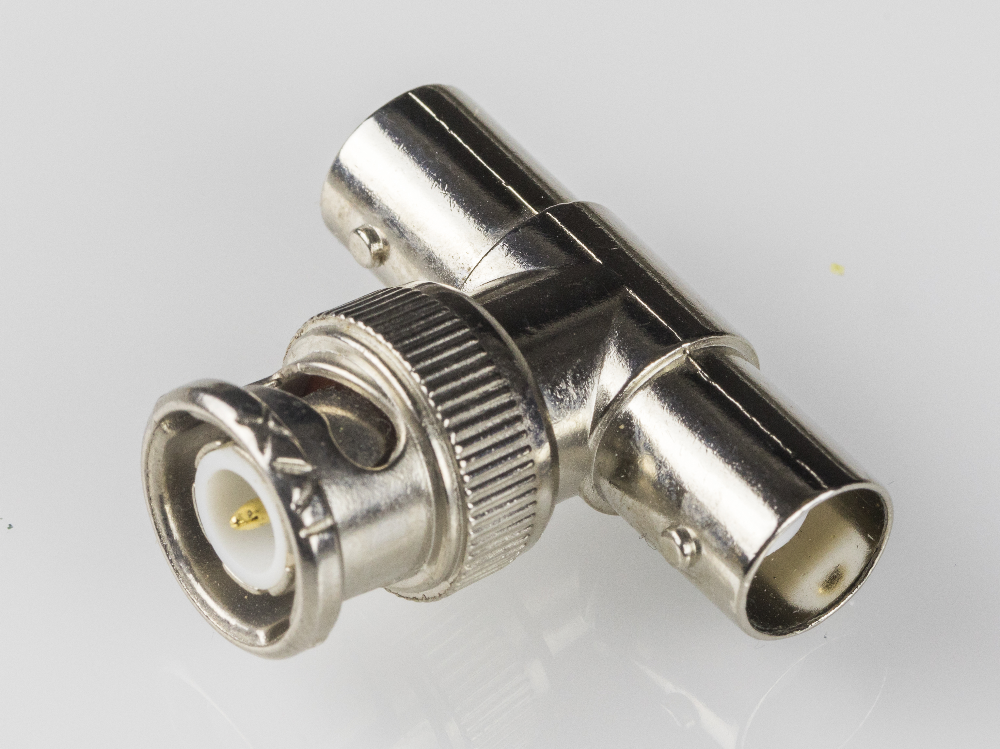

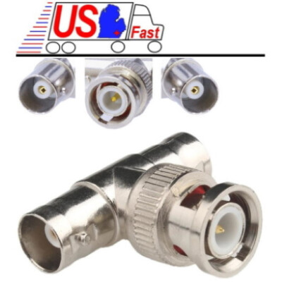

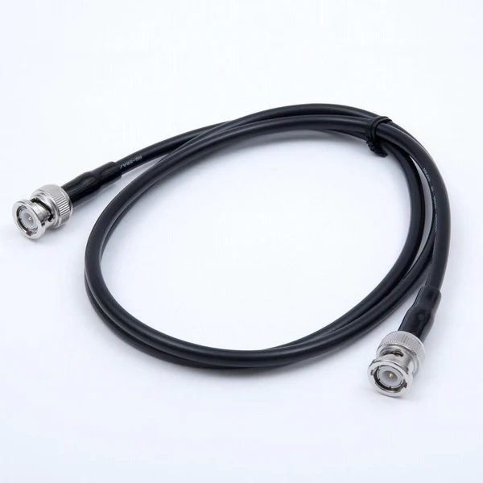

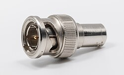

Il backbone era un cavo coassiale simile a quello utilizzato nelle antenne televisive, ma progettato per la trasmissione dati.

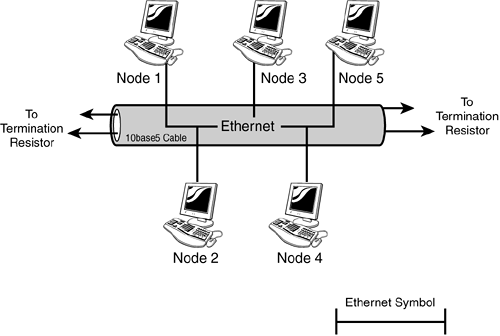

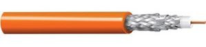

Alle due estremità del cavo dovevano essere installati terminatori da 50 ohm. Questi dispositivi servivano ad assorbire il segnale e impedire la riflessione elettrica lungo il cavo. Se un terminatore mancava oppure se un connettore veniva scollegato, l'intera rete smetteva di funzionare.

Questo tipo di rete era quindi molto fragile. Un singolo guasto fisico poteva bloccare tutti i computer collegati.

---

### 4. La topologia ad anello

Negli anni ottanta venne utilizzata anche la topologia ad anello. In questa configurazione i computer erano collegati in sequenza formando un circuito chiuso.

Il segnale percorreva l'anello passando da un computer al successivo. Ogni nodo riceveva il messaggio e lo inoltrava al nodo successivo.

Una tecnologia famosa basata su questo principio era IBM Token Ring. In queste reti un dispositivo poteva trasmettere solo quando riceveva un piccolo pacchetto speciale chiamato token.

Questa tecnica riduceva le collisioni ma introduceva altri problemi. Se un nodo o un cavo si guastava, l'intero anello poteva interrompersi e bloccare la rete.

---

### 5. La topologia a stella semplice (esiste la stella gerarchica/complessa)

È oggi la più comune nelle reti locali cablate. In una rete a stella tutti i dispositivi sono collegati a un dispositivo centrale: in passato un hub, nelle reti moderne uno switch.

Ogni computer ha un cavo dedicato che lo collega direttamente allo switch. Tutto il traffico passa attraverso questo dispositivo centrale.

Immaginare un laboratorio scolastico con venti computer. Ogni computer ha un cavo Ethernet che arriva allo switch installato in un armadio di rete.

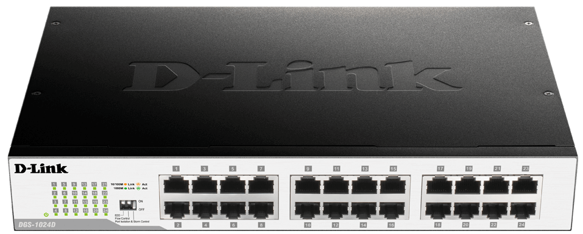

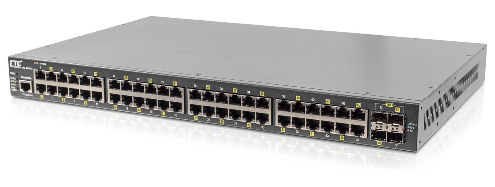

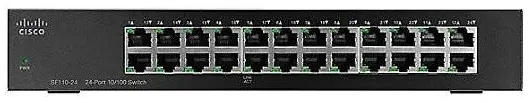

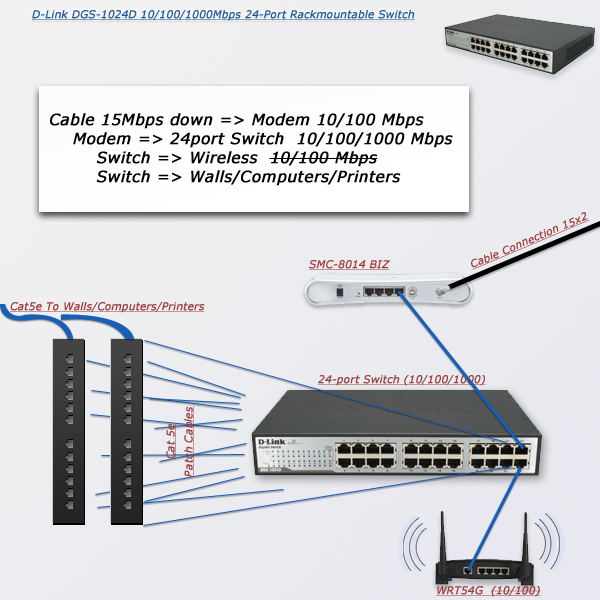

Il vantaggio principale di questa struttura è l'affidabilità. Se un cavo o un computer si guasta, solo quel dispositivo smette di funzionare mentre il resto della rete continua a operare.

---

#### 5.1 Il cavo da PC a switch

Le reti Ethernet moderne utilizzano cavi chiamati twisted pair, costituiti da coppie di fili intrecciati per ridurre le interferenze elettriche.

I tipi più diffusi sono Cat5e, Cat6 e Cat6a. Il connettore utilizzato è il connettore RJ45.

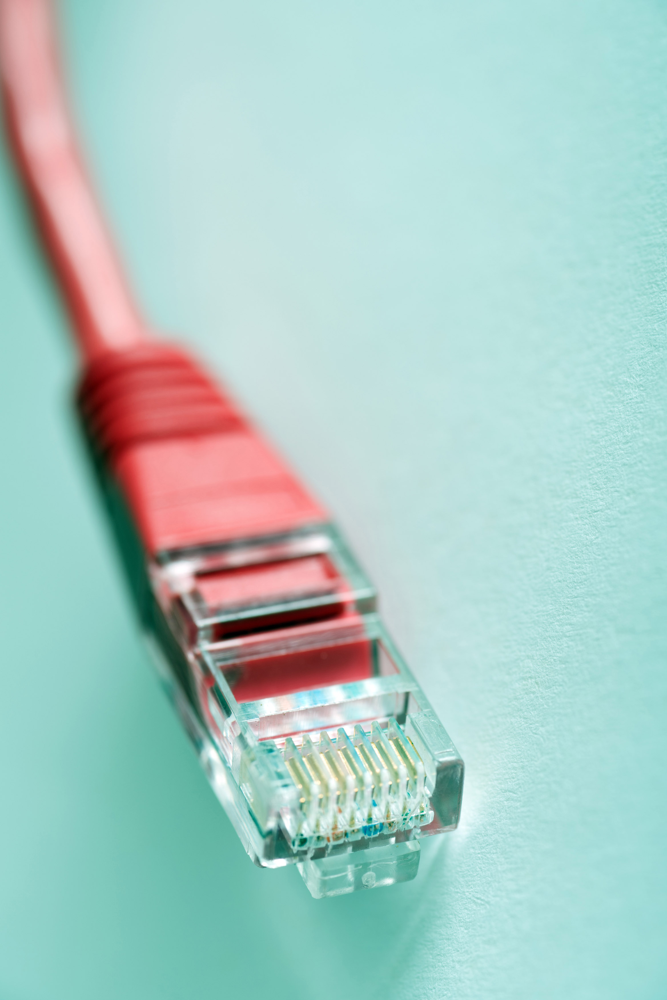

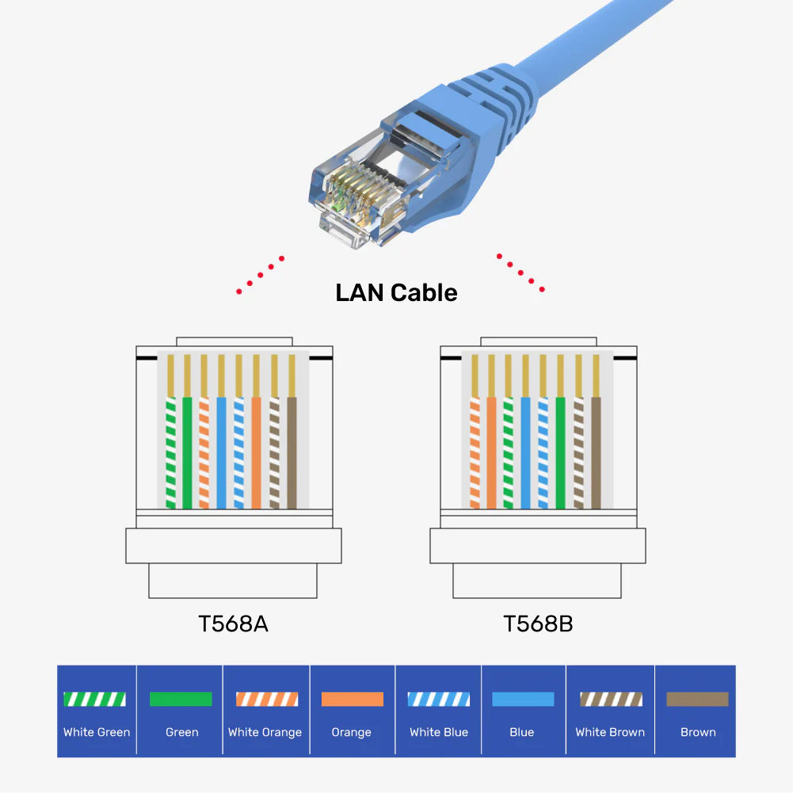

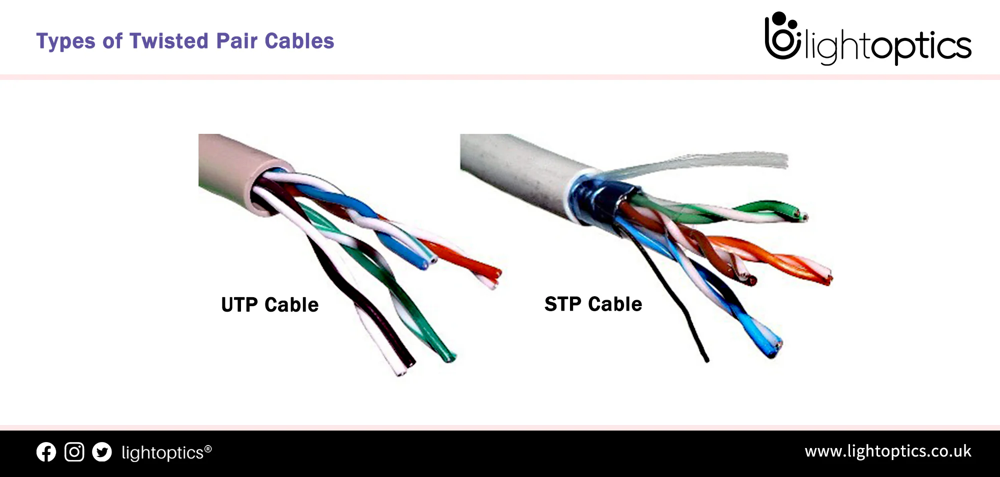

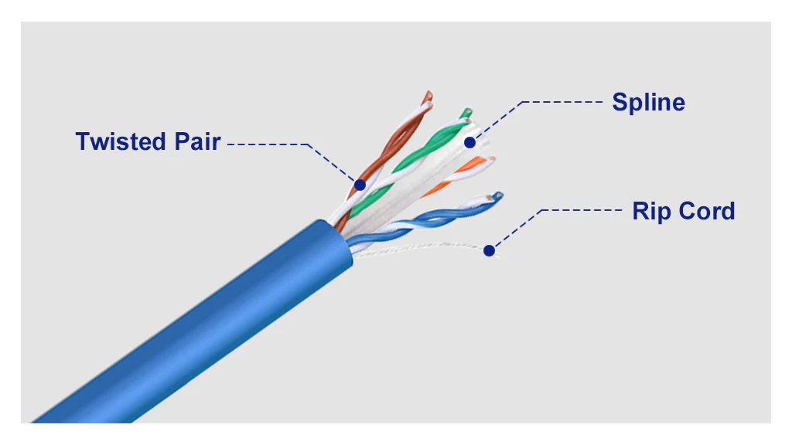

---

### 6. Stella estesa e reti LAN moderne

Quando un singolo switch non è sufficiente si utilizzano più switch collegati tra loro.

Ad esempio in un edificio con tre piani può esserci uno switch principale nella sala server e uno switch secondario per ogni piano. Gli switch dei piani sono collegati allo switch centrale tramite cavi di dorsale.

Questa struttura prende il nome di stella estesa ed è la configurazione più comune nelle reti aziendali e scolastiche.

Importante: ogni switch mantiene una tabella MAC (MAC address table) che associa:

MAC → porta dello switch

La tabella MAC viene popolata automaticamente osservando i frame in ingresso. Quando uno switch riceve un frame Ethernet, legge l'indirizzo MAC sorgente e memorizza nella tabella l'associazione tra quell'indirizzo MAC e la porta su cui il frame è arrivato. In questo modo lo switch impara su quale porta si trova ogni dispositivo della rete.

Le associazioni nella tabella MAC non sono permanenti: se un dispositivo non trasmette per un certo periodo di tempo, l'associazione viene rimossa automaticamente.

---

#### Esempio sul comportamento/percorso dei pacchetti

Immaginare la rete seguente con uno switch core centrale, due switch di accesso collegati al core e diversi PC collegati agli switch di accesso.

        Switch Core
        /        \
    Switch A   Switch B
    / | \      / | \
    PC1 PC2 PC3 PC4 PC5 PC6

Supponiamo che PC1 (su Switch A) invii un pacchetto a PC5 (su Switch B).

Il frame Ethernet parte da PC1 e arriva allo Switch A tramite il cavo Ethernet. Lo switch legge l'indirizzo MAC di destinazione contenuto nel frame.

Se lo switch conosce già la porta associata al MAC di PC5, sa dove inoltrare il frame.

Poiché PC5 non è collegato allo Switch A, lo switch inoltra il frame verso il link che porta allo switch core. Il percorso diventa:

PC1 → Switch A → Switch Core

Lo switch core consulta la propria tabella MAC e inoltra il frame verso la porta collegata allo Switch B:

PC1 → Switch A → Switch Core → Switch B

Switch B riceve il frame e lo inoltra sulla porta a cui è collegato PC5:

PC1 → Switch A → Switch Core → Switch B → PC5

In condizioni normali il frame è visibile solo sui collegamenti realmente attraversati:  
il cavo PC1-Switch A, il link Switch A-Core, il link Core-Switch B e il cavo Switch B-PC5.  
Non è visibile sui collegamenti verso PC2, PC3, PC4 o PC6.

Esistono due eccezioni principali.  

Se il frame è broadcast (MAC FF:FF:FF:FF:FF:FF) viene inoltrato su tutte le porte della VLAN e quindi è visibile su tutti i dispositivi della rete.

Se uno switch non conosce ancora l'indirizzo MAC di destinazione, cioè non lo trova nella propria MAC table, effettua un **flooding**:  
invia il frame su tutte le porte tranne quella da cui il frame è arrivato. Questo accade spesso nei primi istanti di comunicazione tra due host.

---

### 7. Differenza rispetto alle vecchie reti a bus

Nelle vecchie reti Ethernet a bus (coassiale) ogni pacchetto attraversava fisicamente tutta la rete e tutti i computer vedevano tutto il traffico.

Nelle LAN moderne con switch il traffico è instradato selettivamente e solo i segmenti coinvolti vedono il frame. Questo è uno dei motivi principali per cui le reti switchate sono molto più efficienti e sicure.

---

### 7. LAN wireless (Wi-Fi)

Le reti locali moderne combinano spesso rete cablata e rete wireless.

Gli access point Wi-Fi sono collegati allo switch tramite Ethernet e permettono ai dispositivi mobili di connettersi via radio.

Un esempio tipico è una rete domestica dove il router Wi-Fi collega smartphone, tablet, laptop e smart TV alla rete locale.

---

### 8. Evoluzione delle topologie LAN

L'evoluzione delle reti locali può essere riassunta nel seguente ordine cronologico:

1. topologia a bus con cavo coassiale  
2. topologia ad anello (Token Ring)  
3. topologia a stella con hub  
4. topologia a stella con switch  
5. LAN cablate integrate con Wi-Fi  

Questa evoluzione è stata guidata principalmente da tre fattori: maggiore affidabilità, maggiore velocità e maggiore facilità di gestione.

---

## Alcuni riferimenti

Ethernet history  
https://www.computerhistory.org/revolution/networking/19/385

IEEE Ethernet standards  
https://www.ieee802.org/3/

10BASE2 Ethernet  
https://en.wikipedia.org/wiki/10BASE2

Network topologies overview  
https://www.cloudflare.com/learning/network-layer/what-is-a-network-topology/  
