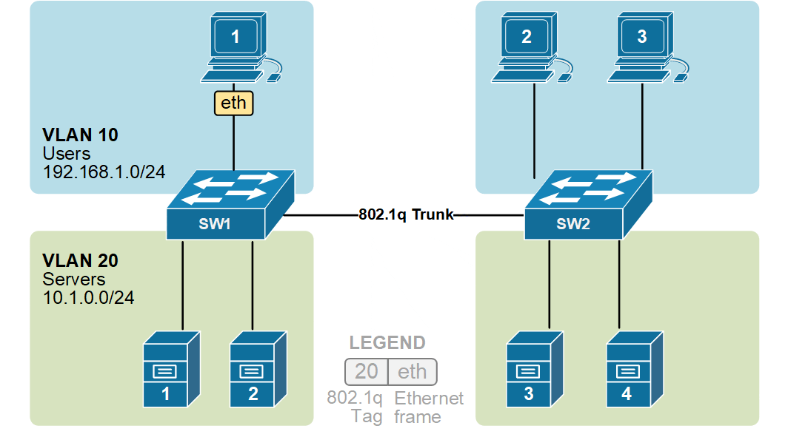
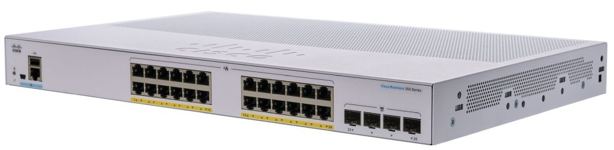
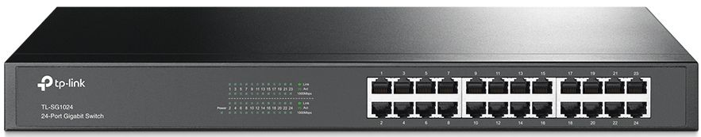
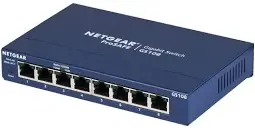

---

marp: false
theme: portrait

<link rel="stylesheet" href="./themes/portrait.css">

--- 


## VLAN – Concetti essenziali


# 1. Che cos’è una VLAN

Una **VLAN (Virtual LAN)** è una suddivisione di una rete fisica a **livello 2 (Data Link)**.

Permette di creare più reti **separate** utilizzando lo stesso switch fisico.

Esempio:

* VLAN 10 → Ufficio amministrazione
* VLAN 20 → Reparto tecnico
* VLAN 30 → Wi-Fi ospiti

Anche se tutti i dispositivi sono collegati allo stesso switch, **non possono comunicare tra VLAN diverse senza routing**.

<br/>
Per chiarire il livello a cui operano le VLAN:

* una VLAN **separa il traffico Ethernet**
* il **routing collega reti IP**
* VLAN e reti IP operano **a livelli diversi**

VLAN → livello 2  
IP network → livello 3  

Una VLAN **non definisce necessariamente una rete IP**, anche se nella pratica spesso si configurano in modo che coincidano.

---

# 2. Concetti principali

### Access Port

La normale porta assegnata a **una sola VLAN**.  
Usata per collegare: PC, stampanti, server Etc.

Il dispositivo collegato non "vede" il tagging VLAN.

---

### Trunk Port

Porta configurata per **trasportare traffico di più VLAN sullo stesso collegamento fisico**.

Usata tipicamente tra:

* switch
* switch e router
* switch e firewall
* switch e hypervisor
* switch e access point

Le VLAN vengono identificate tramite **tag IEEE 802.1Q** inserito nei frame Ethernet.  
Il tag contiene, oltre ad altre informazioni, il VLAN ID, il numero identificativo della VLAN.  
Il range utilizzabile: è 1 – 4094 questo perchè Il campo è lungo **12 bit** (valori 0-4095), ma 0 e 4095 sono riservati quindi non sono utilizzabili come VLAN normali.  



<br/>
imagine: tag inserito nel frame ethernet nella tratta di trunk  
<br/><br/>

Normalmente i frame sono **taggati**, mentre la **native VLAN** può essere trasmessa senza tag.  
_La **native VLAN** è la VLAN associata al traffico **non taggato** su una trunk port._


---

### Separazione logica

I dispositivi in VLAN diverse:  

* non vedono i broadcast reciproci
* non comunicano direttamente ma richiedono **routing di livello 3** per comunicare fra loro.  

Questo vale anche nel caso, frequente, in cui sono connessi ad uno stesso switch su cui sono state considerate le VLAN a cui i dispositivi appartengono.  

---

# 3. Benefici rispetto a una rete senza VLAN

In una rete senza VLAN (rete piatta):  

* esiste **un solo dominio di broadcast**
* non c’è segmentazione
* il traffico di broadcast cresce con il numero di host
* la sicurezza è più difficile da gestire

Benefici conseguibili con le VLAN:  
- Riduzione dei broadcast  
dato che ogni VLAN costituisce un **dominio di broadcast separato**.  
- Organizzazione della rete  
La strutturazione della rete, anche tramite VLAN, può riflettere la struttura organizzativa.  
- Flessibilità:  
Spostare un utente richiede solo cambiare la VLAN sulla porta dello switch.  
- Controllo del traffico:  
Il traffico tra VLAN deve passare da un dispositivo Layer 3 che può applicare:  
  * firewall e ACL  
  * QoS

---

### VLAN distribuite su più switch

#### Quanto è frequente questa situazione

In una rete reale è molto comune che dispositivi appartenenti alla stessa VLAN siano collegati a **switch diversi**.  
Questo accade perché nelle reti aziendali, scolastiche o alberghiere gli switch sono normalmente distribuiti in vari punti dell’edificio o del campus:  

* uno switch per piano
* uno switch per area (laboratori, uffici, reception, sale conferenze)
* uno switch di core o distribuzione che collega gli altri switch

In questi contesti può essere necessario che dispositivi collocati fisicamente in luoghi diversi facciano parte **della stessa rete logica**.

Esempi tipici:

* PC degli amministrativi distribuiti su più piani ma appartenenti alla stessa rete aziendale
* telefoni VoIP collegati a switch diversi ma appartenenti alla stessa VLAN voce
* access point Wi-Fi che devono appartenere alla stessa VLAN di gestione
* stampanti di reparto distribuite su vari uffici ma nella stessa subnet

In tutti questi casi la VLAN non è limitata a uno switch ma **si estende attraverso più switch della rete**.


Uno switch Ethernet tradizionale non trasmette informazioni sulla VLAN nei frame Ethernet. Se due switch fossero collegati con una porta normale (access port), il secondo switch non saprebbe **a quale VLAN appartiene il traffico ricevuto**, Il collegamento tra switch che deve trasportare più VLAN viene configurato come **trunk** secondo lo standard **IEEE 802.1Q**, che prevede l'inserimento nel frame Ethernet un campo chiamato **VLAN tag** che contiene:

* identificatore della VLAN (VLAN ID)
* informazioni di priorità


Quando PC1 invia un frame:

1. lo switch A identifica che il frame appartiene alla VLAN 10
2. sul trunk inserisce il **tag VLAN 10**
3. lo switch B riceve il frame
4. legge il tag VLAN 10
5. inoltra il frame verso le porte appartenenti alla VLAN 10

Per i due PC sembra quindi di trovarsi **nella stessa rete locale**, anche se sono collegati a switch diversi.


---

#### Configurazione tipica

Esempio di configurazione.

```
enable                         ! entra nella modalità privilegiata dello switch
configure terminal             ! entra nella modalità di configurazione globale

vlan 10                        ! crea la VLAN con identificatore 10
name amministrazione           ! assegna un nome descrittivo alla VLAN
exit                           ! torna alla modalità di configurazione globale

interface gig0/10              ! seleziona la porta fisica GigabitEthernet 0/10
switchport mode access         ! imposta la porta come access port (una sola VLAN)
switchport access vlan 10      ! assegna la porta alla VLAN 10
no shutdown                    ! abilita la porta se fosse amministrativamente disattivata
exit                           ! torna alla configurazione globale
```

Configurazione del collegamento tra due switch.

```
interface gig0/1               ! seleziona la porta che collega i due switch
switchport mode trunk          ! imposta la porta come trunk (trasporto di più VLAN)
switchport trunk allowed vlan 10,20,30   ! consente il passaggio delle VLAN 10, 20 e 30 sul trunk
no shutdown                    ! abilita la porta
```

Interpretazione operativa:

porta `gig0/10` → collega un PC e appartiene alla VLAN 10  
porta `gig0/1` → collega un altro switch e trasporta più VLAN tramite trunk 802.1Q  

Quando un frame proveniente dal PC entra nello switch:

* lo switch sa che la porta appartiene alla VLAN 10
* se il frame deve attraversare il trunk, lo switch inserisce il **tag VLAN 10**
* lo switch remoto legge il tag e inoltra il traffico alle porte della VLAN 10.

In questo modo dispositivi collegati a switch diversi possono comportarsi come se fossero nella **stessa rete locale**.

---

#### Vantaggi delle VLAN distribuite

Questa architettura permette di:
- separare logicamente le reti indipendentemente dalla posizione fisica  
- semplificare la gestione delle reti aziendali  
- mantenere la stessa subnet IP per dispositivi distribuiti nell’edificio  
- ridurre la necessità di routing interno  

---

#### Possibili problemi e limiti

Sebbene molto utilizzata, una VLAN distribuita su molti switch può introdurre alcune criticità.

**1. Dominio di broadcast esteso**

Una VLAN è un **broadcast domain**. Se la VLAN è distribuita su molti switch, i broadcast (ARP, DHCP, ecc.) attraversano tutta la rete. Questo può causare:

* traffico inutile
* riduzione delle prestazioni
* maggiore probabilità di tempeste di broadcast.

Per questo motivo nelle reti grandi si tende a **limitare l’estensione delle VLAN**.

---

**2. Maggiore complessità di configurazione**

Tutti gli switch coinvolti devono avere:

* la VLAN configurata
* trunk correttamente configurati
* eventuali VLAN consentite sul trunk

Un errore di configurazione può causare:

* perdita di connettività
* traffico che finisce nella VLAN sbagliata.

---

**3. Problemi di sicurezza**

Se un trunk è configurato in modo errato possono verificarsi problemi di sicurezza, ad esempio:

* VLAN hopping  
* accesso non autorizzato a reti interne.  

Per questo motivo spesso si applicano politiche come:

* limitare le VLAN consentite sul trunk  
* disabilitare trunk automatici.  

---

**4. Architetture moderne preferiscono VLAN locali**

In molte reti moderne si tende a progettare VLAN **più piccole e locali**, associate a specifiche aree della rete.

Il traffico tra VLAN viene poi gestito tramite **routing Layer 3** su switch di distribuzione o core.

Questo modello:

* riduce i domini di broadcast
* migliora la scalabilità
* semplifica il troubleshooting.

---   

# 4. VLAN e subnet IP

VLAN e subnet operano a livelli diversi.
- VLAN → separazione **Layer 2**  
- Subnet → separazione **Layer 3**  

Nella progettazione reale si segue quasi sempre la regola:
<div style="text-align: center;font-weight: bold">una VLAN ↔ una subnet IP</div>

ma **non** è un vincolo tecnico.

A scopo puramente didattico esaminiamo alcuni casi in cui non vi è mapping 1:1

---

## 4.1 Caso inusuale: Più subnet IP nella stessa VLAN

È possibile avere host appartenenti a subnet diverse **nella stessa VLAN**.

Esempio:

PC1 → 192.168.1.10  
PC2 → 192.168.1.20  
PC3 → 192.168.2.10  
PC4 → 192.168.2.20  

Gli host condividono lo stesso dominio Layer 2. Lo switch inoltra i frame Ethernet normalmente. La separazione è solo a livello IP.

Poiché gli host appartengono a subnet diverse (192.168.1.0/24 e 192.168.2.0/24), la comunicazione tra le due reti richiede un router.  
Il router deve avere un indirizzo IP per ogni subnet.

Molti router permettono di configurare **più indirizzi IP sulla stessa interfaccia** (secondary IP address o multiple addresses per interface).

Esempio:

router interface  
192.168.1.1/24  
192.168.2.1/24  

In questo modo basta collegare una sola porta dello switch al router.

---

## 4.2 Caso inusuale: Più VLAN con la stessa subnet IP

È tecnicamente possibile configurare VLAN diverse che appartengono alla **stessa subnet IP**, ma è una configurazione **anomala e generalmente sconsigliata**.

Esempio:

VLAN 10
PC1 → 192.168.1.10/24

VLAN 20
PC2 → 192.168.1.20/24

I due host appartengono alla **stessa subnet IP (192.168.1.0/24)** ma sono in **domini Layer 2 separati**.

Questo crea problemi perché il protocollo IP presuppone che host della stessa subnet possano comunicare direttamente a livello 2.

Processo:

- PC1 vuole comunicare con 192.168.1.20  
- PC1 vede che l’indirizzo è nella stessa subnet  
- PC1 invia una richiesta **ARP broadcast**

Il problema è che il broadcast ARP rimane **limitato alla VLAN** quindi:

* la richiesta ARP resta nella VLAN 10
* PC2 non la riceve
* PC1 non ottiene il MAC address di PC2 quindi la comunicazione non può avvenire.  

Il router normalmente **non interviene**, perché l’host ritiene che la destinazione sia nella stessa subnet.

Esistono tecniche che possono far funzionare questa configurazione, ma:

* complicano molto la rete
* rendono difficile il troubleshooting
* violano il modello di progettazione standard

---


# 5. Inter-VLAN routing

Per permettere la comunicazione tra VLAN serve **routing Layer 3** Questo processo si chiama **inter-VLAN routing**, può essere implementato con tre modalità principali:  

* router con più interfacce
* router-on-a-stick
* switch Layer 3

---

## 5.1 Router con più interfacce fisiche

Ogni VLAN è collegata a una porta diversa del router.

Esempio:

VLAN 10 → switch → porta router → 192.168.10.1  
VLAN 20 → switch → porta router → 192.168.20.1  

Il router inoltra i pacchetti tra le reti.

Soluzione semplice ma poco scalabile.

---

## 5.2 Router-on-a-stick

Si utilizza **un solo collegamento fisico tra switch e router**, configurato come **trunk 802.1Q**. Su questo collegamento passano tutte le VLAN.  
Il router crea **subinterfacce VLAN**.

Esempio:  
eth0.10 → VLAN 10 → 192.168.10.1  
eth0.20 → VLAN 20 → 192.168.20.1  

### Esempio di comunicazione

PC1 (192.168.10.10) vuole parlare con PC3 (192.168.20.10).  
PC1 invia il traffico al gateway 192.168.10.1.  
Lo switch inoltra il frame sulla porta trunk con tag VLAN 10.  
Il router riceve il frame, lo consegna alla subinterfaccia eth0.10.  
Il router esamina il pacchetto IP e determina che la destinazione è nella rete 192.168.20.0.  
Il router crea un nuovo frame Ethernet con **tag VLAN 20** e lo invia allo switch.  
Lo switch inoltra il frame solo alle porte della VLAN 20.  
PC3 lo riceve.  

---

## 5.3 Switch Layer 3

Molti switch moderni possono fare **routing direttamente**.

Lo switch crea **SVI (Switched Virtual Interface)**.

Esempio:  
interface vlan 10 → 192.168.10.1  
interface vlan 20 → 192.168.20.1  

Queste interfacce:

- appartengono a subnet diverse  
- partecipano alla routing table  
- inoltrano pacchetti IP  

Il processo è lo stesso di un router:
1 ricezione del frame Ethernet
2 estrazione del pacchetto IP
3 consultazione della routing table
4 inoltro

La differenza è che lo switch lo fa **in hardware ASIC**, quindi molto velocemente.

---

# 6. Dispositivi coinvolti

## Switch gestito (Managed Switch)

Permette configurazioni di rete avanzate.

Funzioni tipiche:

* VLAN
* trunk 802.1Q
* Spanning Tree
* QoS
* port security
* monitoraggio
* link aggregation

Gestione tramite:

* interfaccia web
* console seriale
* SSH
* SNMP


<br/>
https://www.cisco.com/c/en/us/products/switches/business-350-series-managed-switches/index.html  

---

## Switch non gestito

Dispositivo molto semplice.

Caratteristiche:

* nessuna configurazione
* nessuna interfaccia di gestione
* tutte le porte nello stesso dominio L2
* nessun supporto VLAN

In un certo senso funziona come **bridge Ethernet automatico**.


#### Esempio

##### TP-Link TL-SG1024 – 24-Port Gigabit Rackmount Switch  

<br/>
https://www.tp-link.com/it/business-networking/unmanaged-switch/tl-sg1024/

Switch unmanaged da 24 porte, tipologia di switch molto usata perché:
- consentono di collegare molti dispositivi con un solo apparato
- possono essere installati negli armadi rack di rete
- non richiedono configurazione o manutenzione
- hanno costo relativamente basso.
Tipico utilizzo: router/firewall → switch unmanaged da rack → PC, stampanti, access point.

##### NETGEAR GS108 

<br/>

switch unmanaged Gigabit a 8 porte molto comune in uffici, piccole infrastrutture di rete e laboratori.

---

## Router

Può effettuare **routing tra VLAN**.

Esempio tipico:

router-on-a-stick.

---

## Firewall

Controlla il traffico tra VLAN.

Permette applicazione di:

* policy di sicurezza
* filtraggio traffico
* segmentazione.

---

## Access Point

Può mappare **SSID diversi su VLAN diverse**.

Esempio:  
SSID aziendale → VLAN 10  
SSID guest → VLAN 30  

---

# 7. Quando usare VLAN

Le VLAN sono consigliabili quando:

* più di 20-30 dispositivi
* presenza di reparti diversi
* server interni
* Wi-Fi ospiti
* VoIP
* esigenze di sicurezza
* controllo del traffico

Non sono generalmente necessarie in reti domestiche molto piccole.

---

# 8. Esempi tipici nei test di informatica

## Caso 1 — Piccola azienda

Richiesta:

* amministrazione
* tecnici
* Wi-Fi ospiti

Soluzione:

VLAN 10 → 192.168.10.0/24
VLAN 20 → 192.168.20.0/24
VLAN 30 → 192.168.30.0/24

Domande tipiche:

* configurare porte access
* identificare trunk
* motivare isolamento guest

---

## Caso 2 — Azienda con server

Richiesta:

* PC utenti
* database
* web server

Soluzione:

VLAN 10 → LAN utenti
VLAN 20 → server interni
VLAN 30 → DMZ

Esempio policy firewall:

VLAN 10 → può accedere al DB
VLAN 30 → non può accedere alla LAN

---

## Caso 3 — Ufficio su due piani

Switch piano 1
Switch piano 2

Collegamento **trunk tra switch**.

Le VLAN possono estendersi su più switch tramite trunk.

Domande tipiche:

* differenza access/trunk
* funzione di 802.1Q
* comportamento di una porta trunk con PC collegato

---

# Conclusione

Le VLAN permettono:

* segmentazione logica della rete
* riduzione dei broadcast
* isolamento del traffico
* flessibilità organizzativa
* controllo del traffico tramite dispositivi Layer 3

Nei test di informatica vengono richiesti spesso:

* definizione di VLAN
* differenza access/trunk
* relazione VLAN ↔ subnet
* motivazione della segmentazione
* progettazione logica della rete.
