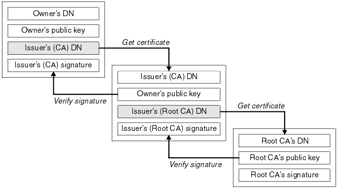
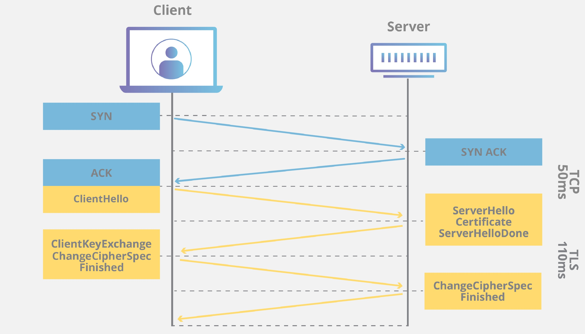

## Certificato digitale – concetto generale



&nbsp;
<br/>
<br/>


&nbsp;<br/>


&nbsp;
<br/>

---

## 1. Definizione

Un **certificato digitale** è un documento elettronico standardizzato (formato **X.509**) che:

* associa una **chiave pubblica** a un’identità
* è firmato digitalmente da un’autorità fidata (Certification Authority, CA)
* consente autenticazione, cifratura e verifica di integrità

È un elemento centrale della **PKI (Public Key Infrastructure)**.

In termini semplici:
è una carta d’identità crittografica che collega una chiave pubblica a un soggetto (persona, server, organizzazione).

---

## 2. Struttura di un certificato X.509

Un singolo certificato contiene:

* Version
* Serial Number
* Signature Algorithm
* Issuer (chi lo ha firmato)
* Validity (Not Before / Not After)
* Subject (identità)
* Subject Alternative Name (SAN)
* Subject Public Key
* Extensions (Key Usage, Extended Key Usage, ecc.)
* Digital Signature della CA

### Diagramma logico semplificato

```
+--------------------------------------------------+
|                 X.509 Certificate                |
+--------------------------------------------------+
| Version                                          |
| Serial Number                                    |
| Signature Algorithm                              |
+--------------------------------------------------+
| Issuer (CA che firma)                            |
+--------------------------------------------------+
| Validity                                         |
+--------------------------------------------------+
| Subject (es. www.example.com)                    |
+--------------------------------------------------+
| Public Key                                       |
+--------------------------------------------------+
| Extensions (SAN, Key Usage, ecc.)                |
+--------------------------------------------------+
| Firma digitale dell'Issuer                       |
+--------------------------------------------------+
```

Importante:
la **catena di fiducia non è contenuta dentro questo certificato**.
Il certificato contiene solo l’identità dell’Issuer e la sua firma.

---

## 3. Catena di fiducia (Trust Chain)

Un browser non si fida direttamente del certificato del server.

La fiducia si basa su una **catena di certificati separati**:

```
Root CA  (già presente nel sistema)
    ↓ firma
Intermediate CA
    ↓ firma
Server Certificate
```

Il certificato del server:

* è firmato da una CA intermedia
* non contiene l’intera catena
* contiene solo il riferimento all’Issuer

Il browser ricostruisce la catena:

1. Verifica che il certificato del server sia firmato dall’intermedia.
2. Verifica che l’intermedia sia firmata dalla Root.
3. Controlla che la Root sia nel trust store locale.

Se la catena è valida → certificato accettato.

Un certificato self-signed non ha catena pubblica.

---

## 4. Tipologie e casi d’uso

### a) Certificati per Web server (HTTPS)

* autenticare un dominio
* abilitare TLS
* proteggere traffico HTTP

---

### b) Certificati client

* autenticazione utenti
* VPN
* accesso a reti aziendali

---

### c) Certificati di firma digitale

* firma documenti
* firma email (S/MIME)
* code signing

---

## 5. Uso del certificato in SSL/TLS

SSL (obsoleto) e TLS (attuale) utilizzano il certificato per:

1. Autenticare il server.
2. Permettere lo scambio sicuro della chiave di sessione.
3. Abilitare cifratura simmetrica.

Sequenza semplificata:

```
ClientHello
ServerHello
Invio certificato
Verifica firma e catena
Scambio chiave
Comunicazione cifrata
```

Il certificato contiene solo la chiave pubblica.
La chiave privata rimane segreta nel server.

---

## 6. LAB – Creazione di un certificato self-signed

Requisito: OpenSSL installato.

### Installazione in Windows

I comandi funzionano anche in Windows se:

* OpenSSL è installato
* la directory bin è nel PATH

Possibili ambienti:

* OpenSSL per Windows
* Git Bash
* WSL
* MSYS2

---

### Generare chiave privata

```
openssl genrsa -out server.key 2048
```

File generato:

* server.key → chiave privata

---

### Creare certificato self-signed

```
openssl req -new -x509 -key server.key -out server.crt -days 365
```

File generato:

* server.crt → certificato

---

### Verifica contenuto

```
openssl x509 -in server.crt -text -noout
```

---

## 7. Codice sorgente di un certificato X.509 (formato PEM)

Un certificato è codificato in ASN.1 e serializzato in DER o PEM.

Esempio minimale PEM:

```
-----BEGIN CERTIFICATE-----
MIIDXTCCAkWgAwIBAgIJANUEexample123MA0GCSqGSIb3DQEBCwUAMEUxCzAJBgNV
BAYTAklUMQ8wDQYDVQQIDAZMYXppbzEPMA0GA1UEBwwGUm9tYTEPMA0GA1UEAwwG
bG9jYWxob3N0MB4XDTI2MDIxNDEwMDAwMFoXDTI3MDIxNDEwMDAwMFowRTELMAkG
A1UEBhMCSVQxDzANBgNVBAgMBkxhemlvMQ8wDQYDVQQHDAZSb21hMQ8wDQYDVQQD
DAZsb2NhbGhvc3QwggEiMA0GCSqGSIb3DQEBAQUAA4IBDwAwggEKAoIBAQCexample
QWERTY1234567890abcdefghijkExampleKeyData
-----END CERTIFICATE-----
```

È una rappresentazione Base64 del certificato binario DER.

---

## 8. Installazione su Web server

### File coinvolti

Self-signed:

* server.key
* server.crt

Certificato CA reale:

* server.key
* server.crt
* intermediate.crt
* oppure fullchain.pem (server + intermedi)

La Root CA non viene inviata: è già nel browser.

---

### Configurazione Apache

Configurazione minima:

```
SSLEngine on
SSLCertificateFile "C:/percorso/server.crt"
SSLCertificateKeyFile "C:/percorso/server.key"
```

Configurazione con CA intermedia:

```
SSLEngine on
SSLCertificateFile "C:/percorso/server.crt"
SSLCertificateKeyFile "C:/percorso/server.key"
SSLCertificateChainFile "C:/percorso/intermediate.crt"
```

Configurazione moderna consigliata:

```
SSLEngine on
SSLCertificateFile "C:/percorso/fullchain.pem"
SSLCertificateKeyFile "C:/percorso/server.key"
```

Riavviare Apache dopo la modifica.

---

## 9. Differenze tra certificato self-signed e certificato CA

| Caratteristica      | Self-signed         | CA pubblica   |
| ------------------- | ------------------- | ------------- |
| Firma               | Autonoma            | Firmato da CA |
| Catena di fiducia   | Assente             | Presente      |
| Fiducia browser     | Avviso di sicurezza | Accettato     |
| Identità verificata | No                  | Sì            |
| Uso produzione      | No                  | Sì            |

Limiti del certificato creato nel LAB:

* genera warning nel browser
* non garantisce identità verificata
* non ha fiducia globale

È adatto solo per:

* laboratorio
* test locali
* ambienti didattici

---

## esaminare un certificato

Sì. È assolutamente possibile scaricare il certificato pubblico di un web server per esaminarlo a fini didattici.
Il certificato TLS del server è pubblico per definizione: viene inviato dal server durante il TLS handshake.

Non è necessario alcun permesso speciale.

---

### 1. Modalità semplici per scaricare un certificato

#### Metodo 1 – Browser (Chrome / Edge / Firefox)

Procedura tipica:

1. Aprire un sito HTTPS (es. [https://www.google.com](https://www.google.com)).
2. Cliccare sull’icona del lucchetto nella barra degli indirizzi.
3. Visualizzare certificato.
4. Esportare il certificato in formato .crt o .pem.

Si ottiene il certificato del server oppure l’intera catena (server + intermediate).

---

#### Metodo 2 – OpenSSL (più didattico)

Da terminale:

```
openssl s_client -connect www.google.com:443 -showcerts
```

Questo comando:

* apre una connessione TLS
* stampa tutti i certificati della catena
* mostra handshake e parametri crittografici

Per salvare solo il certificato server:

```
openssl s_client -connect www.google.com:443 -showcerts </dev/null 2>/dev/null | openssl x509 -outform PEM > server.pem
```

Questo è il metodo migliore a fini didattici perché permette di:

* analizzare Subject
* Issuer
* validità
* SAN (Subject Alternative Name)
* algoritmo di firma
* chiave pubblica
* estensioni

---

#### Metodo 3 – Siti di analisi TLS (molto utili didatticamente)

Un riferimento eccellente è:

SSL Labs – SSL Server Test
[https://www.ssllabs.com/ssltest/](https://www.ssllabs.com/ssltest/)

Permette di:

* analizzare qualsiasi dominio
* vedere la catena completa
* controllare versioni TLS abilitate
* verificare cipher suite
* analizzare configurazioni errate

È uno strumento didatticamente molto utile.

---

### 2. Certificati consigliabili per uso didattico

Conviene scegliere siti con caratteristiche diverse.

#### 1) [www.google.com](http://www.google.com)

Ottimo per:

* vedere certificati con SAN multipli
* osservare catene complesse
* analizzare firme moderne (RSA/ECDSA)

---

#### 2) badssl.com

[https://badssl.com/](https://badssl.com/)

Questo sito è specificamente progettato per test didattici su TLS.

Offre:

* certificati scaduti
* self-signed
* SHA1
* hostname errato
* chain incomplete
* TLS vecchie versioni

È probabilmente il migliore in assoluto per laboratorio.

---

#### 3) un sito con certificato Let's Encrypt

Esempio:

[https://letsencrypt.org/](https://letsencrypt.org/)

Utile per mostrare:

* certificati DV (Domain Validation)
* catena Let's Encrypt
* ACME ecosystem

---

### 3. Cosa analizzare didatticamente nel certificato

Durante l’analisi è utile osservare:

* Versione X.509
* Subject (CN)
* SAN (Subject Alternative Names)
* Issuer
* Validità (Not Before / Not After)
* Key Usage
* Extended Key Usage
* Signature Algorithm
* Public Key Algorithm (RSA o ECDSA)
* Lunghezza chiave (es. 2048 bit)

Utile collegare tutto al TLS handshake illustrato in precedenza.

---

### 4. Collegamento con HTTPS e TLS

Durante il TLS handshake:

```
Server → Client : Certificate
```

Il certificato viene inviato in chiaro (non cifrato), ma l’integrità è garantita dal protocollo TLS.

Il client:

* verifica la firma
* controlla la catena di fiducia
* verifica che il dominio richiesto sia presente nel SAN

Solo dopo procede con la generazione delle chiavi di sessione.

---

### 5. Conclusione

Sì, è sempre possibile scaricare e analizzare il certificato di un web server HTTPS.

Per uso didattico si consiglia:

* badssl.com per casi di errore e test
* google.com per esempi reali complessi
* un dominio con Let's Encrypt per catene semplici e moderne
* SSL Labs per analisi approfondita della configurazione TLS


<hr/>

## Conclusione

Un certificato digitale:

* lega una chiave pubblica a un’identità
* è firmato da una CA
* si basa su una catena di fiducia esterna
* è essenziale per TLS/HTTPS

Un certificato self-signed dimostra il meccanismo tecnico,
ma solo un certificato firmato da una CA consente utilizzo sicuro e riconosciuto in produzione.
