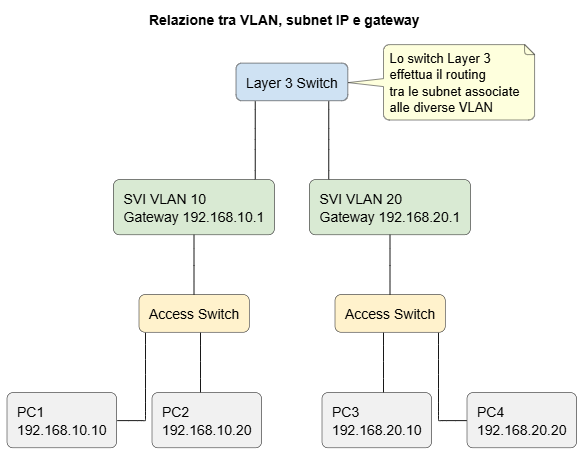
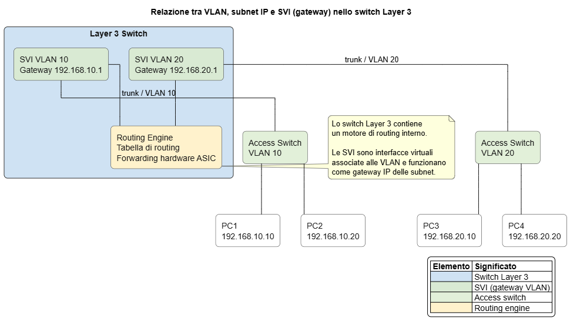
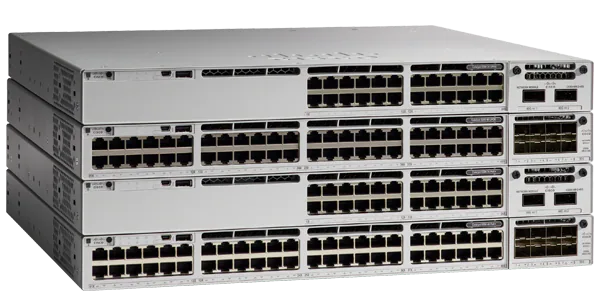
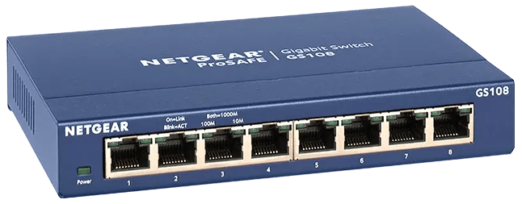
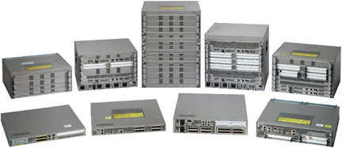
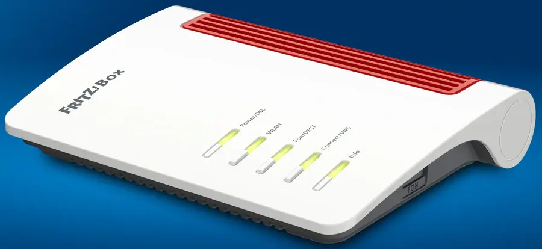

## DISPOSITIVI DI RETE COMUNI IN UNA LAN AZIENDALE

In una rete aziendale moderna esistono molti tipi di apparati di rete, ma tre categorie svolgono il ruolo più importante nell’architettura della rete:

* **Switch** → distribuzione del traffico all’interno della LAN
* **Router / Edge Gateway** → collegamento tra la LAN e altre reti (Internet o WAN)
* **Firewall / NGFW** → protezione della rete e applicazione delle politiche di sicurezza

Questi dispositivi svolgono funzioni diverse ma complementari e spesso sono installati nello stesso armadio di rete.

---

# 1. SWITCH DI RETE (Layer 2 / Layer 3)

## Ruolo nella rete aziendale

Lo **switch** è il dispositivo **principale** della rete locale (LAN).
Il suo compito è collegare tra loro i dispositivi interni della rete:

* **altri switch**  
* computer  
* server  
* stampanti  
* telefoni VoIP  
* access point Wi-Fi  

Lo switch opera normalmente al **livello 2 del modello OSI (Data Link)**, inoltrando i frame Ethernet in base agli **indirizzi MAC**.

Negli switch **Layer 3** sono presenti anche funzionalità di **routing IP**, spesso utilizzate per il **routing tra VLAN (inter-VLAN routing)**.

---

## Tipologie più comuni

### Switch unmanaged

Caratteristiche principali:

* nessuna configurazione
* nessun supporto VLAN
* nessun controllo QoS
* installazione plug-and-play

Utilizzati principalmente in:

* piccoli uffici
* reti temporanee
* espansioni molto semplici della rete

Opera principalmente a livello 2 del modello OSI, quindi inoltra i frame in base agli indirizzi MAC e non effettua routing IP tra VLAN diverse.

---

### Switch Layer 3

Oltre alle funzionalità di livello 2 offre anche:

* routing IP
* routing inter-VLAN
* ACL di base
* routing statico

Internamente usa delle **SVI (Switched Virtual Interface)**, cioè interfacce virtuali associate alle VLAN che funzionano come gateway IP delle relative subnet.

 {width = 40%}  

Le SVI vengono spesso rappresentate esternamente nei diagrammi, ma in realtà sono interne allo switch: sono interfacce logiche cioè non sono porte fisiche, ma configurazioni software associate alle VLAN e utilizzate come gateway IP delle subnet.
  

 {width = 60%}  
   
Esempio didattico di switch che fa routing fra 3 VLAN

Lo switch Layer 3 effettua quindi **routing tra subnet appartenenti a VLAN diverse**, inoltrando i pacchetti tra le SVI tramite la propria tabella di routing, spesso con forwarding hardware ad alte prestazioni.

Nelle architetture aziendali viene spesso utilizzato come:

* **distribution switch**
* **core switch**

In ambito professionale il numero di porte **più diffuso è 48**, seguito da **24**.

Questo dipende soprattutto dalla progettazione degli **armadi di rete (rack)** negli edifici e dal fatto che si cerca di concentrare molti collegamenti su pochi apparati.

Una formulazione concisa e realistica può essere questa.

---

## Numero di porte e caratteristiche tipiche

###### Numero porte comuni:

* **48 porte** (più diffuso nelle reti aziendali)
* **24 porte** (molto comune in uffici e piani con meno postazioni)
* 16 porte
* 8 porte (più frequente in piccoli uffici o laboratori)

Gli switch a **48 porte** sono molto usati perché permettono di collegare molti dispositivi con un solo apparato rack e di ridurre il numero di switch necessari nell’armadio di rete.

###### Velocità più diffuse:

* **1 Gbps** → standard aziendale
* **2.5 Gbps** → sempre più diffuso negli access switch
* **10 Gbps** → spesso usato per uplink

###### Uplink tipici:

* SFP (1G)
* SFP+ (10G)
* nei modelli enterprise anche 25G  

_**SFP (Small Form-factor Pluggable)** è un modulo transceiver di rete **rimovibile** che si inserisce nelle porte degli switch o router per realizzare collegamenti in **fibra ottica o rame**, tipicamente fino a **1 Gbit/s**._

###### Supporto PoE:

* **PoE (802.3af)**
* **PoE+ (802.3at)**
* **PoE++** nei modelli più recenti

Ecco una versione **più esplicativa ma ancora sintetica**, con una breve frase per ogni funzionalità.

---

## Funzionalità principali degli switch aziendali

* **VLAN 802.1Q** 
  Permette di segmentare la rete creando più reti logiche separate sulla stessa infrastruttura fisica.

* **QoS (Quality of Service)** 
  Consente di dare priorità a determinati tipi di traffico, ad esempio VoIP o video.

* **Link Aggregation (LACP)** 
  Permette di combinare più collegamenti fisici tra dispositivi in un unico collegamento logico più veloce e ridondante.

* **Spanning Tree (RSTP / MSTP)** 
  Previene i loop di rete disabilitando automaticamente collegamenti ridondanti non necessari.

* **Monitoring SNMP** 
  Permette di monitorare lo stato dello switch e delle porte tramite sistemi di gestione della rete.

* **ACL (Access Control List)** 
  Consente di applicare regole di filtraggio del traffico per controllare quali comunicazioni sono permesse.

* **Gestione locale o cloud** 
  Lo switch può essere configurato tramite interfaccia web, CLI oppure tramite piattaforme di gestione centralizzata.

Ecco la stessa sezione con **una breve frase esplicativa per ogni punto**, mantenendo la sintesi.

---

## Altre caratteristiche tecniche rilevanti

Quando si valutano switch professionali si considerano anche:

* **Switching capacity (Gbps)**
  Quantità massima di traffico che lo switch può gestire complessivamente su tutte le porte.

* **Forwarding rate**
  Numero massimo di pacchetti che lo switch può inoltrare al secondo senza degradare le prestazioni.

* **Budget PoE totale**
  Potenza elettrica complessiva disponibile per alimentare dispositivi PoE come access point, telefoni IP e telecamere.

* **Alimentazione ridondata**
  Possibilità di avere alimentatori duplicati per garantire il funzionamento anche in caso di guasto.

* **Stacking**
  Permette di collegare più switch in modo che funzionino come un unico apparato logico con gestione centralizzata.

---

## SWITCH: Modelli rappresentativi

Alcuni modelli rappresentativi di dispositivi organizzati per:
- ambito
  * enterprise
  * PMI / small business
  * familiare / SOHO
- ruolo architetturale
  * core
  * distribution
  * access

Quando una combinazione **non è significativa nella pratica** è stato indicato esplicitamente **N/A**.

---

### ENTERPRISE

#### Core switch

##### Cisco Catalyst 9500 Series  

Categoria: **enterprise**
Ruolo tipico: **core switch** nelle architetture campus aziendali

Pagina ufficiale produttore
[https://www.cisco.com/site/us/en/products/networking/switches/catalyst-9500-series-switches/index.html](https://www.cisco.com/site/us/en/products/networking/switches/catalyst-9500-series-switches/index.html)

Immagine online
[https://www.cisco.com/c/dam/en/us/products/collateral/switches/catalyst-9500-series-switches/nb-06-cat9500-series-switches.jpg](https://www.cisco.com/c/dam/en/us/products/collateral/switches/catalyst-9500-series-switches/nb-06-cat9500-series-switches.jpg)

 {width=70%}

Caratteristiche principali:

* porte **10G / 25G / 40G / 100G**
* switching capacity molto elevata
* routing Layer 3 avanzato
* **Cisco IOS-XE**
* progettato per ruolo **core o aggregation**

---

#### Distribution switch

##### Cisco Catalyst 9300 Series  

Categoria: **enterprise**
Ruolo tipico: **distribution switch** oppure access avanzato

Pagina ufficiale produttore
[https://www.cisco.com/c/en/us/products/collateral/switches/catalyst-9300-series-switches/nb-06-cat9300-ser-data-sheet-cte-en.html](https://www.cisco.com/c/en/us/products/collateral/switches/catalyst-9300-series-switches/nb-06-cat9300-ser-data-sheet-cte-en.html)

Immagine online
[https://www.cisco.com/content/dam/en/us/products/collateral/switches/catalyst-9300-series-switches/images/ks14049-car9500-600x300.png](https://www.cisco.com/content/dam/en/us/products/collateral/switches/catalyst-9300-series-switches/images/ks14049-car9500-600x300.png)

 {width=70%}

Caratteristiche:

* 24 o 48 porte 1G / 2.5G
* uplink **10G / 25G**
* supporto **stacking**
* routing Layer 3 completo
* ampia diffusione nelle reti campus

---

#### Access switch

##### Cisco Catalyst 9200 Series

Categoria: **switch enterprise (rete aziendale)**
Ruolo tipico: **access switch**

Pagina ufficiale produttore
[https://www.cisco.com/site/us/en/products/networking/switches/catalyst-9200-series-switches/index.html](https://www.cisco.com/site/us/en/products/networking/switches/catalyst-9200-series-switches/index.html)

 {width = 60%}

Caratteristiche principali:

* 24 o 48 porte 1G
* versioni PoE+
* uplink modulari 1G / 10G / 25G
* sistema operativo **Cisco IOS-XE**
* stacking

---

### PMI / SMALL BUSINESS

#### Core switch

**N/A**

Nelle reti PMI il ruolo di core spesso **non esiste come apparato separato**.
Uno switch di distribution o access svolge anche funzione di core.

---

#### Distribution switch

##### Zyxel XGS1935 Series (esempio XGS1935-28HP)

Categoria: **PMI / small business**
Ruolo tipico: **distribution switch leggero** oppure access avanzato

Pagina ufficiale produttore
[https://www.zyxel.com/global/en/products/switch/24-48-port-gbe-lite-l3-smart-managed-switch-with-4-10g-uplink-xgs1935-series](https://www.zyxel.com/global/en/products/switch/24-48-port-gbe-lite-l3-smart-managed-switch-with-4-10g-uplink-xgs1935-series)

Immagine online
[https://www.zyxel.com/sites/zyxel/files/library/assets/products/xgs1935-series/img_xgs1935-28hp_p_600x600.jpg](https://www.zyxel.com/sites/zyxel/files/library/assets/products/xgs1935-series/img_xgs1935-28hp_p_600x600.jpg)

 {width=70%}

Caratteristiche:

* 24 o 48 porte 1G
* uplink **10G**
* versioni PoE
* gestione **smart L3 lite**
* VLAN e QoS avanzate

---

#### Access switch

##### TP-Link Omada SG3218XP-M2

Categoria: **PMI / small business**
Ruolo tipico: **access switch**

Pagina ufficiale produttore
[https://www.omadanetworks.com/it/business-networking/omada-switch-access-pro/sg3218xp-m2/](https://www.omadanetworks.com/it/business-networking/omada-switch-access-pro/sg3218xp-m2/)

Immagine online
[https://static.tp-link.com/upload/image-line/TL-SG3218XP-M2_UN_1.0_overview_02_normal_20250126032358m.jpg](https://static.tp-link.com/upload/image-line/TL-SG3218XP-M2_UN_1.0_overview_02_normal_20250126032358m.jpg)

 {width=70%}

Caratteristiche:

* 16 porte **2.5G**
* 8 porte **PoE+**
* 2 uplink **SFP+ 10G**
* gestione cloud Omada
* switch **L2+ con routing statico**

---

### FAMILIARE / SOHO

#### Core switch

**N/A**

Le reti domestiche **non hanno architettura gerarchica core/distribution/access**.  

#### Distribution switch

**N/A**
Le reti domestiche **non hanno architettura gerarchica core/distribution/access**.

---

#### Access switch

##### Netgear GS108   

Categoria: **familiare / SOHO**
Ruolo tipico: **access switch**

Pagina ufficiale produttore
[https://www.netgear.com/business/wired/switches/unmanaged/gs108/](https://www.netgear.com/business/wired/switches/unmanaged/gs108/)

Immagine online
[https://www.netgear.com/media/GS108v4_tcm148-73992.png](https://www.netgear.com/media/GS108v4_tcm148-73992.png)

 {width=70%}

Caratteristiche:

* 8 porte Gigabit
* switch **unmanaged**
* nessuna configurazione
* plug-and-play
* molto diffuso in reti domestiche o piccoli uffici

---

# 2. ROUTER AZIENDALI / EDGE GATEWAY

## Ruolo nella rete

Il **router aziendale** (o **edge gateway**) collega la rete locale aziendale con:

* Internet
* reti WAN
* reti di sedi remote (VPN site-to-site)

Il suo ruolo principale è quindi gestire il **traffico tra la rete interna e reti esterne**.

Svolge spesso anche funzioni di:

* **NAT** (traduzione degli indirizzi privati della LAN verso Internet)
* **VPN** (connessioni sicure verso sedi remote o utenti remoti)
* **firewall di base**
* gestione del traffico WAN

notare che nelle architetture aziendali moderne il router di edge  
**non gestisce normalmente il routing tra le reti interne della LAN**.  

Il routing tra VLAN e subnet interne è generalmente svolto da:

* **switch Layer 3** (distribution o core switch)
* oppure **firewall interni**

In altre parole:

* il router collega **la rete aziendale al resto del mondo**
* gli switch Layer 3 o firewall collegano **le reti interne tra loro**

---

## Tipologie più comuni

* router **multi-WAN**  
  permettono di collegare più connessioni Internet o WAN.

* router con **SD-WAN**  
  ottimizzano automaticamente il traffico tra più collegamenti WAN.   
  _(**SD-WAN Software-Defined Wide Area Network** è una tecnologia che gestisce e ottimizza via software il traffico tra più collegamenti WAN (Internet, MPLS, LTE ecc.), instradando dinamicamente i dati sul percorso più efficiente e affidabile.)_  

* router **VPN hardware**  
  progettati per gestire molte connessioni VPN cifrate.

* router con **controller centralizzato**  
  gestiti da piattaforme di orchestrazione o cloud.

---

## Porte tipiche

* 1 o più porte **WAN**
* porte **LAN**
* talvolta **porte SFP**  
  _(**SFP Small Form-factor Pluggable** è uno slot modulare che permette di inserire un transceiver rimovibile per realizzare collegamenti di rete in **fibra ottica o rame**, tipicamente fino a **1 Gbit/s**.)_  

Nei router **PMI o edge router compatti** è comune trovare:

* 4–8 porte LAN integrate

Nei router **enterprise di fascia alta** spesso invece:

* le porte LAN sono poche
* oppure sono presenti **slot modulari**
* oppure il router si collega direttamente a **switch di rete**.

---

## Funzionalità principali

* **NAT**
* VPN **IPsec / SSL**
* **firewall stateful**
* **load balancing WAN**
* **failover automatico**
* supporto **VLAN**

Va però osservato che nelle reti aziendali medio-grandi il filtraggio avanzato del traffico è spesso affidato a **firewall dedicati (NGFW)**, mentre il router svolge principalmente funzioni di **routing e connettività WAN**.

---

## ROUTER AZIENDALI / EDGE GATEWAY: Modelli rappresentativi

---

### ENTERPRISE

#### Core router

##### Cisco ASR 1000 Series  

Categoria: **enterprise / carrier grade**
Ruolo tipico: **core router o WAN edge router**

Pagina ufficiale produttore
[https://www.cisco.com/c/en/us/products/routers/asr-1000-series-aggregation-services-routers/index.html](https://www.cisco.com/c/en/us/products/routers/asr-1000-series-aggregation-services-routers/index.html)

Immagine online
[https://www.cisco.com/c/dam/en/us/products/collateral/routers/asr-1000-series-aggregation-services-routers/datasheet-c78-731632.docx/_jcr_content/renditions/datasheet-c78-731632_0.png](https://www.cisco.com/c/dam/en/us/products/collateral/routers/asr-1000-series-aggregation-services-routers/datasheet-c78-731632.docx/_jcr_content/renditions/datasheet-c78-731632_0.png)

 {width=70%} 

Caratteristiche:

* routing ad alte prestazioni
* supporto **BGP / MPLS**
* throughput multi-gigabit
* architettura modulare
* utilizzato in **data center e backbone aziendali**

---

#### Distribution router

**N/A**

Nelle architetture moderne il routing di distribuzione è quasi sempre svolto da **switch Layer 3**.

---

#### Edge router

##### MikroTik RB5009UG+S+IN

Categoria: **PMI / professionale**
Ruolo tipico: **edge router**

Pagina ufficiale produttore
[https://mikrotik.com/product/rb5009ug_s_in](https://mikrotik.com/product/rb5009ug_s_in)

Immagine online
[https://i.mt.lv/cdn/product_files/RB5009UGS-IN_220903.png](https://i.mt.lv/cdn/product_files/RB5009UGS-IN_220903.png)

 {width=70%}

Caratteristiche:

* router ad alte prestazioni
* porta **10G SFP+**
* porte gigabit multiple
* sistema operativo **RouterOS**
* VPN e routing avanzato

---

### PMI / SMALL BUSINESS

#### Edge router

##### TP-Link Omada ER8411

Categoria: **PMI / small enterprise**
Ruolo tipico: **edge router / WAN gateway**

Pagina ufficiale produttore
[https://www.omadanetworks.com/it/business-networking/omada-router-wired-router/er8411/](https://www.omadanetworks.com/it/business-networking/omada-router-wired-router/er8411/)

Immagine online
[https://static.tp-link.com/upload/image-line/ER8411_UN_1.0_overview_01_normal_20220617022403i.jpg](https://static.tp-link.com/upload/image-line/ER8411_UN_1.0_overview_01_normal_20220617022403i.jpg)

 {width=70%}

Caratteristiche:

* porte **10G**
* multi-WAN
* VPN hardware
* firewall integrato
* gestione cloud Omada

---

## FAMILIARE / SOHO

#### Edge router

##### AVM FRITZ!Box 7530   

Categoria: **familiare / SOHO**
Ruolo tipico: **router domestico**

Pagina ufficiale produttore
[https://fritz.com/en-it/products/fritz-box-7530-ax-20002944](https://fritz.com/en-it/products/fritz-box-7530-ax-20002944)

Immagine online
[https://fritz.com/cdn/shop/files/fritzbox_7530_ax_dsl_2000x2000px.webp?v=1773999787&width=1000](https://fritz.com/cdn/shop/files/fritzbox_7530_ax_dsl_2000x2000px.webp?v=1773999787&width=1000)

 {width=70%}

Caratteristiche:

* modem DSL integrato
* router NAT
* Wi-Fi
* switch LAN integrato
* funzioni domestiche (VoIP, NAS, parental control)

---

# 3. FIREWALL / NEXT-GENERATION FIREWALL (NGFW)

## Ruolo nella rete

Il **firewall** protegge la rete aziendale controllando il traffico tra:

* LAN interna
* Internet
* eventuali DMZ

Nei dispositivi moderni il firewall è spesso un **NGFW (Next-Generation Firewall)** con funzionalità di sicurezza avanzate.

---

## Tipologie

* **Stateful firewall**
* **NGFW**
* **UTM (Unified Threat Management)**

---

## Funzionalità principali

* Stateful packet inspection
* **Deep Packet Inspection**
* **IPS / IDS**
* anti-malware
* **web filtering**
* VPN
* controllo applicazioni

---

## Altre caratteristiche importanti

* **throughput firewall**
* throughput **VPN**
* numero massimo di **sessioni simultanee**
* porte multi-gigabit
* gestione centralizzata

---

## FIREWALL / NEXT-GENERATION FIREWALL (NGFW): Modelli rappresentativi

### WatchGuard Firebox T40

Pagina ufficiale produttore
[https://www.watchguard.com/help/docs/help-center/en-US/Content/en-US/Hardware-Guides/firebox-t40-hardware-guide.html](https://www.watchguard.com/help/docs/help-center/en-US/Content/en-US/Hardware-Guides/firebox-t40-hardware-guide.html)

Immagine online
[https://www.watchguard.com/sites/default/files/styles/medium/public/t40_compare.png](https://www.watchguard.com/sites/default/files/styles/medium/public/t40_compare.png)

./imgs/t40_compare.png

 { width=70% }

Caratteristiche:

* firewall **NGFW**
* **IPS**
* VPN
* gestione centralizzata WatchGuard

---

### Fortinet FortiGate 40F

Pagina ufficiale (datasheet)
[https://www.fortinet.com/resources/data-sheets/fortigate-fortiwifi-40f-series](https://www.fortinet.com/resources/data-sheets/fortigate-fortiwifi-40f-series)

Immagine online
[https://computer.milano.it/media/catalog/product/cache/1/image/9df78eab33525d08d6e5fb8d27136e95/f/g/fg40f_1648711_base_1.jpg](https://computer.milano.it/media/catalog/product/cache/1/image/9df78eab33525d08d6e5fb8d27136e95/f/g/fg40f_1648711_base_1.jpg)

 { width=70% }

Caratteristiche:

* firewall **NGFW**
* IPS
* **SSL inspection**
* VPN
* throughput elevato per fascia SMB

---

# SINTESI OPERATIVA

Switch
Distribuzione del traffico all’interno della LAN.
Segmentazione della rete tramite VLAN.
Supporto PoE per access point e telefoni IP.

Router / Edge Gateway
Collegamento tra LAN e Internet o WAN.
Gestione NAT, routing e VPN.

Firewall NGFW
Protezione perimetrale della rete.
Controllo delle applicazioni e prevenzione delle intrusioni.
