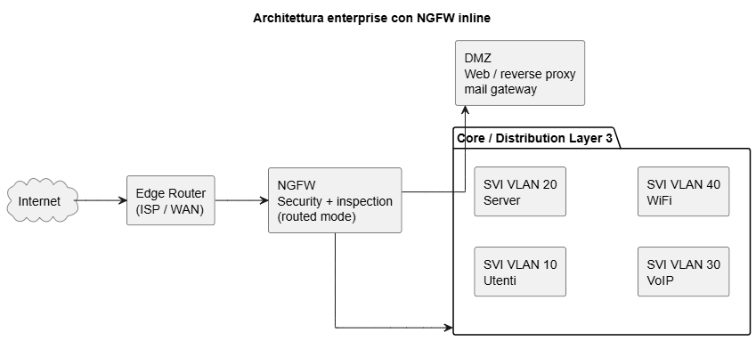

# Architetture di rete aziendali reali

Nelle aziende di dimensioni medio-grandi la rete è progettata seguendo un **modello gerarchico**.
Questo modello divide la rete in livelli con ruoli diversi per ottenere:

* scalabilità
* prestazioni prevedibili
* alta affidabilità
* facilità di gestione

Il modello più diffuso è il **modello a tre livelli**:

* Access layer
* Distribution layer
* Core layer

Questo approccio è usato nelle cosiddette **campus network**, cioè reti aziendali con uno o più edifici e centinaia o migliaia di utenti. ([NetworkLessons.com][1])

---

# 1. Schema generale di una rete aziendale reale

Schema tipico:

```
Internet
   |
   |
Router ISP / Edge router
   |
   |
Firewall aziendale
   |
   |
Core switch
   |
Distribution switch
   |
Access switch
   |
Dispositivi utenti
```

A questo si aggiungono spesso:

* **DMZ** per i server pubblici
* **server interni**
* **Wi-Fi aziendale e guest**

---

# 2. Router più esterno (edge router)

## Ruolo reale

Il router più esterno è spesso chiamato **edge router**.

Il suo compito principale è:

* collegare la rete aziendale al provider Internet
* gestire protocolli WAN
* scambiare rotte con l’ISP

Gli edge router collegano le reti interne con le reti del provider o con Internet. ([Allied Telesis][2])

---

## Fa routing su molte reti interne?

Nella maggior parte dei casi **no**.

Nelle reti moderne l’edge router:

* gestisce la **connettività WAN**
* non conosce le singole VLAN interne

Tipicamente vede solo:

```
rete aziendale
rete ISP
```

Ad esempio:

```
10.0.0.0/16  → rete aziendale
0.0.0.0/0    → ISP
```

Il router quindi **non gestisce direttamente le VLAN interne**.

Il routing interno è svolto da:

* firewall
* distribution switch
* core switch

---

## Quando invece fa routing complesso

In alcune aziende grandi il router può:

* terminare più connessioni ISP
* usare BGP
* gestire più reti pubbliche

Questo succede soprattutto quando l’azienda ha:

* Autonomous System
* collegamenti multipli a Internet
* data center grandi.

---

# 3. Firewall aziendale

## Il firewall è quasi sempre inline

Nelle reti moderne il firewall è **quasi sempre inline**. Questo significa che **tutto il traffico passa attraverso il firewall**.

Schema tipico:

```
Internet
   |
Router ISP
   |
Firewall
   |
LAN
```

Il firewall quindi è il **punto di controllo principale**.

---

## Il firewall fa routing?

Quasi sempre **sì**.

Il firewall collega più reti:

* WAN
* LAN
* DMZ
* eventuali reti interne separate

Esempio:

```
porta 1 → WAN
porta 2 → LAN
porta 3 → DMZ
porta 4 → rete guest
```

Poiché collega reti diverse, il firewall mantiene una **tabella di routing** e inoltra i pacchetti tra queste reti.

La differenza rispetto a un router è che prima applica:

* policy di sicurezza
* filtraggio
* ispezione del traffico.

---

## Architettura tipica con DMZ

```
Internet
   |
Router ISP
   |
Firewall
 |     |
LAN   DMZ
```

DMZ = rete per server pubblici:

* web server
* reverse proxy
* mail gateway

---

# 4. Core switch

Il **core switch** è il cuore della rete interna.

NB Il core switch **non** è il “coordinatore” o il router della rete. Il suo ruolo è:

* fornire una dorsale ad altissima velocità
* collegare i distribution switch
* trasportare grandi volumi di traffico

Il core deve essere:

* molto veloce
* ridondante
* con latenza minima

Le connessioni sono tipicamente:

* 10 Gbit
* 40 Gbit
* 100 Gbit.

Il core layer costituisce il backbone della rete e collega i vari segmenti distribuiti. ([Wikipedia][3])

NB Il core normalmente non implementa policy complesse.  
Linee guida classiche di progettazione:  
- evitare ACL sul core  
- evitare NAT  
- evitare filtri complessi  
- mantenere il core semplice e veloce  


---

# 5. Distribution switch

Il **distribution layer** è il livello intermedio.

Funzioni principali:

* aggregare gli access switch
* effettuare **routing** tra VLAN (cioè tra reti, di solito 1 vlan corrisponde a una (sotto) rete IP)
* applicare policy (ACL, QoS)
* isolare domini di broadcast

In molte reti aziendali il **routing tra VLAN avviene proprio qui** e il vero punto di controllo logico è il distribution layer.

Qui si trovano tipicamente:  
- routing tra VLAN  
- ACL  
- policy di rete  
- QoS  
- talvolta firewall interni  

Per questo motivo in molti testi Cisco il distribution layer è chiamato: policy layer


Esempio:

```
VLAN 10 → utenti
VLAN 20 → server
VLAN 30 → VoIP
VLAN 40 → guest
```

Il distribution switch possiede interfacce virtuali:

```
interface vlan 10 → gateway utenti
interface vlan 20 → gateway server
```

Il traffico tra VLAN passa da qui.

---

# 6. Access switch

Gli **access switch** sono quelli collegati direttamente ai dispositivi finali.

Dispositivi tipici:

* PC
* telefoni VoIP
* stampanti
* access point Wi-Fi
* videocamere IP

Funzioni principali:

* assegnazione VLAN
* PoE
* sicurezza delle porte.


---  
# 6 bis Errori frequenti  

---

### Errore: Pensare che il router esterno gestisca tutta la rete interna

Molti studenti immaginano una rete aziendale come una rete domestica ingrandita:

```
Internet - Router - Switch - PC
```

Questo schema è **quasi sempre falso nelle reti professionali**.

Nelle aziende il router esterno normalmente:

* termina la connessione con l’ISP
* gestisce protocolli WAN
* inoltra il traffico verso la rete aziendale

Ma **non gestisce direttamente le VLAN interne**.

Molto spesso vede solo una o poche reti interne, ad esempio:

```
10.0.0.0/16 → rete aziendale
```

Il routing tra le VLAN interne avviene invece su:

* switch Layer 3
* firewall
* distribution switch

---

### Errore: Pensare che tutte le VLAN passino dal router

Gli studenti spesso immaginano qualcosa del genere:

```
PC VLAN 10
      \
       Router
      /
PC VLAN 20
```

Questa configurazione esiste (router-on-a-stick), ma **non è quella più comune nelle reti medio-grandi**.

Nelle reti aziendali reali il routing tra VLAN viene quasi sempre fatto da:

* **switch Layer 3**

Esempio reale:

```
Access switch
      |
Distribution switch (routing VLAN)
      |
Core switch
```

Il router esterno **non è coinvolto nel traffico interno tra VLAN**.

---

### Errore: Pensare che il firewall sia sempre separato dal routing

Un errore molto comune è credere che:

* il router faccia routing
* il firewall faccia solo filtraggio

Nelle reti moderne **il firewall fa quasi sempre anche routing**.

Schema reale tipico:

```
Internet
   |
Router ISP
   |
Firewall
 |   |
LAN  DMZ
```

Il firewall possiede più interfacce:

```
porta WAN
porta LAN
porta DMZ
```

Poiché queste appartengono a reti diverse, il firewall:

* mantiene una **tabella di routing**
* inoltra pacchetti tra queste reti
* applica **policy di sicurezza prima dell’inoltro**

Quindi il firewall è contemporaneamente:

* router
* filtro di sicurezza
* punto di controllo della rete.

---

### Errore: credere che tutte le VLAN attraversino tutta la rete

Gli studenti spesso immaginano VLAN estese ovunque:

```
VLAN 10
presente su tutti gli switch
```

In molte reti moderne invece si cerca di **limitare l’estensione delle VLAN**.

Motivi principali:

* ridurre i domini di broadcast
* migliorare la scalabilità
* semplificare il troubleshooting

Quindi è comune trovare:

```
piano 1 → VLAN 10
piano 2 → VLAN 20
piano 3 → VLAN 30
```

Il traffico tra queste VLAN viene gestito da routing.


---

# 7. Varianti reali dell’architettura

Non tutte le reti hanno tre livelli.

---

## Architettura a due livelli

Molto comune nelle aziende medie.

```
Internet
   |
Firewall
   |
Core / Distribution (unico livello)
   |
Access switch
```

Qui **core e distribution coincidono**.

---

## Architettura con firewall centrale

Molte aziende fanno passare **anche il traffico interno tra VLAN attraverso il firewall**.

Schema:

```
Access switch
   |
Core switch
   |
Firewall
   |
Core switch
```

Questo permette:

* controllo di sicurezza tra VLAN
* segmentazione più forte.


### Puntualizzazione: Il NGFW è “on-line”? Fa routing?

Nelle architetture enterprise reali il **Next Generation Firewall (NGFW)** è molto spesso **inline (on-line)**, cioè posizionato direttamente nel percorso del traffico tra reti o zone diverse.

Esistono due modalità principali di funzionamento.

#### 1. Routed mode (Layer 3)

In questa modalità il firewall:

* ha **indirizzi IP sulle interfacce**
* mantiene una **tabella di routing**
* può fare **routing tra WAN, LAN e DMZ**
* applica policy di sicurezza durante l’inoltro dei pacchetti.

Documentazione Palo Alto Networks:
[https://docs.paloaltonetworks.com/ngfw/networking/configure-interfaces/layer-3-interfaces/configure-layer-3-interfaces](https://docs.paloaltonetworks.com/ngfw/networking/configure-interfaces/layer-3-interfaces/configure-layer-3-interfaces)

In questo caso il firewall funziona **in modo simile a un router**, ma con capacità di sicurezza molto più avanzate.


#### 2. Transparent mode / Virtual Wire

In questa modalità il firewall è comunque **inline**, ma lavora in modo **trasparente**.

Il firewall:

* non partecipa al routing
* non assegna indirizzi IP alle interfacce del traffico
* analizza e filtra i pacchetti mentre attraversano il dispositivo.

Documentazione Palo Alto Networks:
[https://docs.paloaltonetworks.com/pan-os/11-0/pan-os-networking-admin/configure-interfaces/virtual-wire-interfaces](https://docs.paloaltonetworks.com/pan-os/11-0/pan-os-networking-admin/configure-interfaces/virtual-wire-interfaces)

Questo modello viene usato quando si vuole aggiungere sicurezza **senza modificare l’architettura IP esistente**.

---

#### Architettura enterprise realistica con NGFW

In molte reti aziendali moderne la struttura è simile alla seguente.

##### Schema logico (diagramma testuale)

```
Internet
   |
   |
Edge Router / ISP Router
   |
   | rete di transito
   |
NGFW (inline)
   |        \
   |         \
   |          DMZ
   |
rete interna di transito
   |
Core / Distribution Layer 3 switch
   |
   + VLAN utenti
   + VLAN server
   + VLAN VoIP
   + VLAN WiFi
   + VLAN management
```

in formato grafico semplice  
<div></div>

Interpretazione:

* il **router edge** gestisce la connessione verso ISP o WAN
* il **NGFW è inline** e controlla il traffico tra zone
* il **NGFW può fare routing tra WAN, LAN e DMZ**
* il **core/distribution switch Layer 3** gestisce il routing tra VLAN interne.


---

## Architettura con routing sugli switch

Nelle reti moderne è comune che:

* gli switch facciano routing
* il firewall faccia solo sicurezza.

Esempio:

```
Access → Distribution (routing VLAN) → Core → Firewall → Internet
```

---

# 8. Chi fa veramente routing nella rete aziendale

Riassunto realistico:

| dispositivo         | routing                   |
| ------------------- | ------------------------- |
| router ISP          | routing verso Internet    |
| firewall            | routing tra WAN, LAN, DMZ |
| core switch         | routing backbone          |
| distribution switch | routing tra VLAN          |
| access switch       | raramente routing         |

---

# 9. Routing interno tipico

Il routing interno usa protocolli come:

* OSPF
* IS-IS
* talvolta BGP interno

I router aziendali possono anche scambiare rotte con ISP usando **BGP**. ([Wikipedia][4])

---

# 10. Architettura realistica completa

Schema semplificato:

```
                Internet
                    |
                Edge Router
                    |
                 Firewall
                    |
                Core Switch
                /        \
       Distribution1   Distribution2
          /    \           /     \
      Access  Access    Access  Access
       PC      AP        PC      VoIP
```

---

# 11. Punti fondamentali da ricordare   

1. Il router più esterno **non gestisce tutta la rete interna**.

2. Il firewall **è quasi sempre inline**.

3. Il firewall **spesso fa routing tra le zone**.

4. Il routing tra VLAN **avviene normalmente sugli switch Layer 3**.

5. Il modello core-distribution-access serve a rendere la rete **scalabile e gestibile**.


---   

## Architettura di rete tipica di un campus aziendale

NB Ripete quanto esposto precedentemente, in modo un po' più focalizzato  

Una **campus network** è la rete di un’organizzazione distribuita su uno o più edifici vicini (azienda, università, ospedale, ente pubblico).
Queste reti possono avere **centinaia o migliaia di dispositivi** e sono progettate per essere:

* scalabili
* altamente disponibili
* facilmente gestibili

Il modello più diffuso per le campus network è il **modello gerarchico**.

---

### 1. Struttura generale di una campus network

Schema logico tipico:

```
                Internet
                   |
               Edge Router
                   |
                Firewall
                   |
                Core Layer
               /          \
      Distribution A    Distribution B
        /      \          /      \
     Access   Access   Access   Access
      |        |        |        |
     PC       WiFi     VoIP    Stampanti
```

I livelli principali sono:

* **Access layer**
* **Distribution layer**
* **Core layer**

Questo modello è usato da molti vendor (Cisco, Juniper, Arista, HPE) nelle reti campus.

---

### 2. Access layer

L’**access layer** è il livello più vicino agli utenti.

Qui si trovano gli **access switch** che collegano:

* PC
* telefoni VoIP
* access point Wi-Fi
* stampanti
* telecamere IP
* IoT

Funzioni principali:

* assegnazione VLAN
* PoE per telefoni e access point
* port security
* autenticazione 802.1X

Tipicamente le porte sono configurate come:

* **access port**
* associate a una VLAN.

Esempio:

```id="9j0s2c"
porta 1 → VLAN 10 utenti
porta 2 → VLAN 20 VoIP
porta 3 → VLAN 30 WiFi
```

---

### 3. Distribution layer

Il **distribution layer** collega gli access switch al core.

Questo livello svolge funzioni molto importanti.

Funzioni tipiche:

* routing tra VLAN
* ACL
* QoS
* aggregazione degli access switch
* isolamento dei domini di broadcast

Per questo motivo viene spesso chiamato anche:

**policy layer**

Esempio:

```id="q1b3e7"
VLAN 10 → rete utenti
VLAN 20 → rete server
VLAN 30 → VoIP
VLAN 40 → guest WiFi
```

Il distribution switch possiede interfacce virtuali:

```id="w6m4t2"
interface vlan 10
interface vlan 20
interface vlan 30
```

che fungono da **gateway delle VLAN**.

---

### 4. Core layer

Il **core layer** è il cuore della rete.

Il suo compito è:

* collegare i distribution switch
* trasportare grandi volumi di traffico
* garantire latenza minima

Il core deve essere:

* molto veloce
* ridondato
* semplice (poche policy)

Velocità tipiche:

* 10 Gbit
* 40 Gbit
* 100 Gbit

Il core è quindi il **backbone della campus network**.

---

### 5. Ridondanza nella campus network

Le campus network reali sono quasi sempre ridondate.

Schema tipico:

```id="o7n9x4"
                 Core 1
                /      \
           Dist A      Dist B
           /   \        /   \
        Access Access Access Access
```

Caratteristiche:

* due core switch
* due distribution switch
* collegamenti multipli

Questo permette:

* continuità del servizio
* failover automatico
* manutenzione senza downtime.

---

### 6. Collegamenti trunk

Tra gli switch vengono usati collegamenti **trunk 802.1Q**.

Servono per trasportare più VLAN su un singolo collegamento.

Esempio:

```id="r3v8k1"
Access switch
     |
 trunk
     |
Distribution switch
```

Le VLAN possono quindi estendersi su più switch.

---

### 7. Collegamento verso Internet

La campus network si collega a Internet tramite:

* **edge router**
* **firewall**

Schema tipico:

```id="u2k4g8"
Internet
   |
Edge router
   |
Firewall
   |
Core layer
```

Il firewall separa:

* WAN
* LAN
* DMZ

---

### 8. Presenza di una DMZ

Nelle reti campus è molto comune una **DMZ**.

La DMZ ospita server pubblici:

* web server
* reverse proxy
* mail gateway
* VPN gateway

Schema tipico:

```id="p6d5h0"
Internet
   |
Firewall
 |      |
LAN    DMZ
```

La DMZ è isolata dalla LAN.

---

### 9. Esempio realistico di VLAN in un campus

Un campus aziendale può avere VLAN come queste:

| VLAN | funzione       |
| ---- | -------------- |
| 10   | utenti         |
| 20   | server         |
| 30   | VoIP           |
| 40   | WiFi aziendale |
| 50   | WiFi guest     |
| 60   | management     |

Il routing tra queste VLAN avviene nel distribution layer.

---

### 10. Architettura completa di esempio

Diagramma riassuntivo:

```id="p9x6t1"
                Internet
                    |
               Edge Router
                    |
                 Firewall
                /       \
             Core1     Core2
              |          |
       -------------------------
       |                       |
    Dist1                   Dist2
     |  |                    |  |
   Acc Acc                Acc Acc
    |   |                  |   |
   PC  AP                PC  VoIP
```

Caratteristiche:

* ridondanza del core
* ridondanza del distribution
* access switch distribuiti negli edifici

---

### 11. Perché questo modello è molto usato

Questo modello permette:

* crescita graduale della rete
* manutenzione più semplice
* isolamento dei problemi
* prestazioni elevate

Per questo è stato per anni **lo standard delle reti campus aziendali**.


---   


[1]: https://networklessons.com/network-fundamentals/cisco-campus-network-design-basics?utm_source=chatgpt.com "Cisco Campus Network Design Basics"
[2]: https://www.alliedtelesis.com/us/en/foundations/what-network-router?utm_source=chatgpt.com "What is a network router?"
[3]: https://en.wikipedia.org/wiki/Hierarchical_internetworking_model?utm_source=chatgpt.com "Hierarchical internetworking model"
[4]: https://en.wikipedia.org/wiki/Router_%28computing%29?utm_source=chatgpt.com "Router (computing)"
