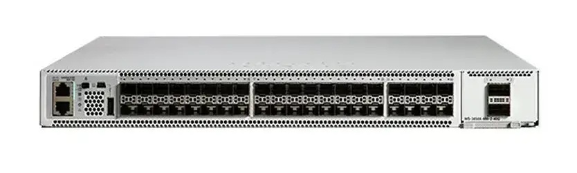
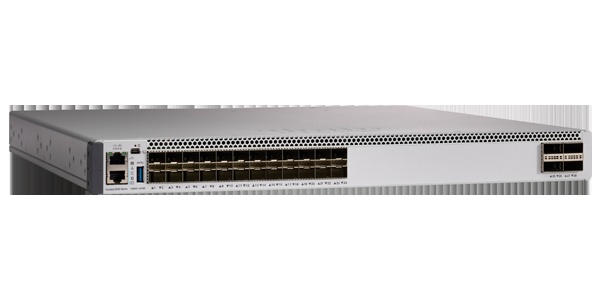
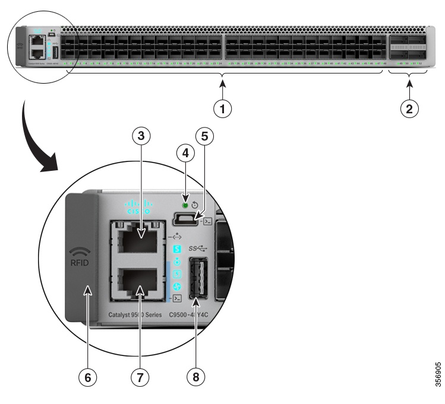
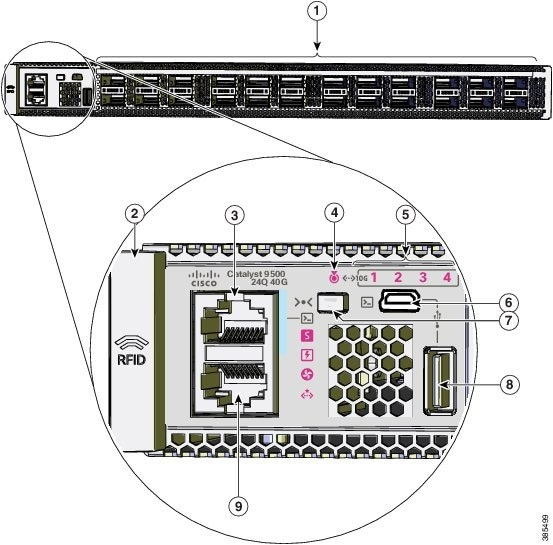
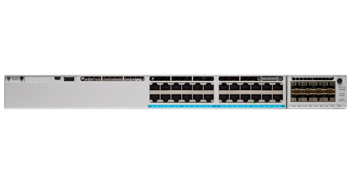
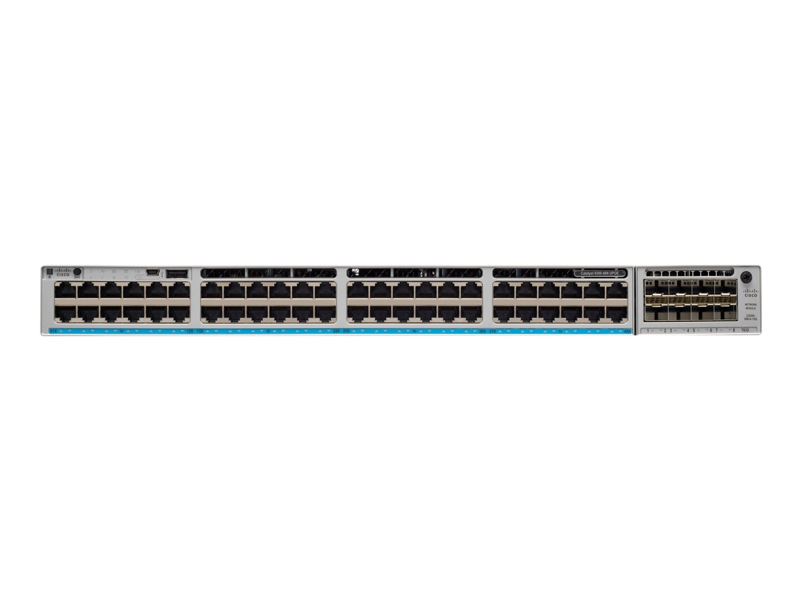
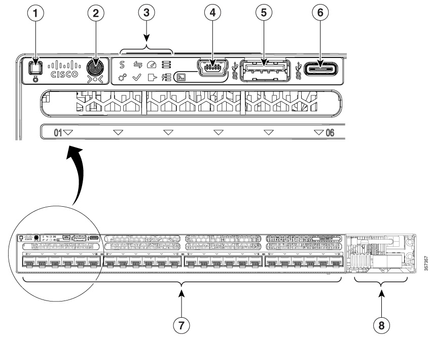
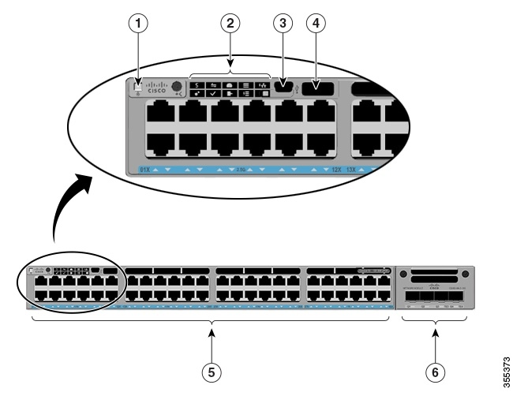
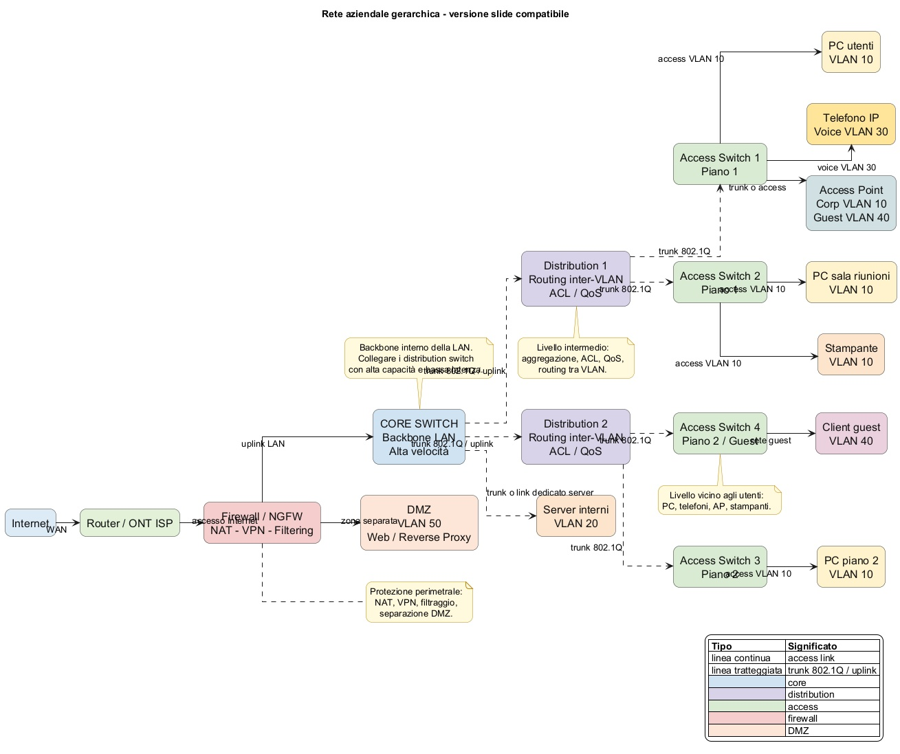

Nelle reti aziendali medio-grandi si utilizza spesso un’architettura **gerarchica a tre livelli** (hierarchical network design).
I livelli principali sono:

* **Access layer**
* **Distribution layer**
* **Core layer**

Questa architettura serve per migliorare **scalabilità, prestazioni e gestione della rete**. ([GeeksforGeeks][1])

Di seguito una spiegazione chiara dei tre livelli e dei dispositivi tipici.

---

# 1. Core Switch

## Che cos’è

Il **core switch** è lo switch posto **nel cuore della rete aziendale**.
Costituisce il **backbone della LAN** e collega tra loro i principali segmenti della rete. ([Router-Switch.com][2])

Il core switch:

* collega tra loro gli **switch di distribuzione**
* gestisce **grandi volumi di traffico**
* deve avere **latenza minima e massima affidabilità**

In altre parole, è l’equivalente della **“spina dorsale” della rete**.

## Caratteristiche tipiche

Un core switch professionale ha generalmente:

* altissima **capacità di switching**
* porte **10G / 40G / 100G**
* routing Layer 3 avanzato
* ridondanza alimentazione e ventilazione
* supporto per protocolli di alta disponibilità

## Esempio reale: Cisco Catalyst 9500









### Caratteristiche principali

* switch **core e aggregation enterprise**
* porte **25G / 40G / 100G**
* capacità fino a **12.8 Tbps**
* routing avanzato e virtualizzazione di rete
* progettato per reti campus di grandi dimensioni ([Cisco][3])

### Scheda prodotto

Cisco Catalyst 9500 Series
[https://www.cisco.com/site/us/en/products/networking/switches/catalyst-9500-series-switches/index.html](https://www.cisco.com/site/us/en/products/networking/switches/catalyst-9500-series-switches/index.html)

---

# 2. Distribution Switch

## Che cos’è

Il **distribution switch** si trova tra:

* **access layer**
* **core layer**

Serve come **livello intermedio** che aggrega il traffico proveniente dagli switch di accesso. ([fs.com][4])

Funzioni tipiche:

* aggregare il traffico degli access switch
* applicare **policy di rete**
* gestire **routing tra VLAN**
* filtrare il traffico

In molte reti il distribution layer è il punto dove avvengono:

* **ACL**
* **inter-VLAN routing**
* controllo QoS.

## Caratteristiche tipiche

Un distribution switch ha spesso:

* molte porte **10G**
* routing Layer 3
* funzioni di sicurezza e policy
* elevata affidabilità

## Esempio reale: Cisco Catalyst 9300









### Caratteristiche principali

* piattaforma enterprise **stackable**
* fino a **1 Tbps di bandwidth di stacking**
* uplink **1G / 10G / 40G / 100G**
* alimentazione ridondata
* supporto per gestione locale o cloud ([Cisco][5])

### Scheda prodotto

Cisco Catalyst 9300 Series
[https://www.cisco.com/site/us/en/products/networking/switches/catalyst-9300-series-switches/index.html](https://www.cisco.com/site/us/en/products/networking/switches/catalyst-9300-series-switches/index.html)

---

# 3. Access Switch (altra categoria importante)

Oltre a core e distribution esiste quasi sempre un terzo livello.

## Che cos’è

Lo **access switch** è lo switch che collega **direttamente i dispositivi degli utenti**:

* PC
* stampanti
* telefoni VoIP
* access point Wi-Fi

È il livello **più vicino agli utenti** della rete.

## Funzioni tipiche

* collegamento dispositivi finali
* VLAN
* PoE per telefoni IP e access point
* sicurezza delle porte (port security)

## Esempio tipico

Molti modelli della serie **Cisco Catalyst 9200** o **9300** vengono utilizzati come access switch.

---

# 4. Schema tipico di rete aziendale

Una rete aziendale medio-grande può essere organizzata così:

```
                 CORE
           +---------------+
           |   Core switch |
           +---------------+
               /       \
              /         \

        DISTRIBUTION  DISTRIBUTION
        +------------+ +------------+
        | Dist sw 1  | | Dist sw 2  |
        +------------+ +------------+
            /   \            /   \
           /     \          /     \

       ACCESS  ACCESS   ACCESS  ACCESS
       +----+  +----+   +----+  +----+
       |sw1 |  |sw2 |   |sw3 |  |sw4 |
       +----+  +----+   +----+  +----+

        PC   AP   Printer  Phone
```

---

# 5. Confronto sintetico

| Livello      | Ruolo                     | Dispositivi collegati |
| ------------ | ------------------------- | --------------------- |
| Access       | collegamento utenti       | PC, AP, telefoni      |
| Distribution | aggregazione e policy     | access switch         |
| Core         | backbone ad alta velocità | distribution switch   |

---

# 6. Quando questa architettura viene usata

Il modello gerarchico viene utilizzato quando:

* la rete ha **centinaia o migliaia di dispositivi**
* esistono **più edifici o piani**
* servono **alta affidabilità e scalabilità**

Nelle reti molto piccole spesso esistono solo:

* access switch
* router/firewall

senza distinzione tra core e distribution.

---
Di seguito uno **schema logico semplice ma realistico** di rete aziendale con:

* firewall perimetrale
* core switch
* distribution switch
* access switch
* VLAN utenti, server, VoIP, guest
* collegamenti trunk e access
* DMZ

Prima lo schema concettuale, poi il codice PlantUML.

Schema logico semplificato

```
Internet
   |
   |
[ Router / ONT ISP ]
   |
   |
[ Firewall / NGFW ]
   | \
   |  \
   |   \------ DMZ VLAN 50
   |
   |
[ Core Switch ]
   /        \
  /          \
 /            \
[Distribution 1]     [Distribution 2]
  /      \              /       \
 /        \            /         \
[Access1] [Access2]  [Access3]  [Access4]
  |          |          |          |
  |          |          |          |
PC/AP/VoIP PC/AP      PC/AP      Guest AP
```

Esempio di VLAN

```
VLAN 10  Utenti uffici
VLAN 20  Server interni
VLAN 30  VoIP
VLAN 40  Wi-Fi guest
VLAN 50  DMZ
```

Interpretazione dei livelli

Access layer
Collegare i dispositivi finali. Qui si trovano PC, telefoni IP, stampanti, access point.

Distribution layer
Aggregare gli switch di accesso. Spesso qui si applicano ACL, routing inter-VLAN, QoS, policy.

Core layer
Costituire la dorsale ad alta velocità della rete interna. Deve essere molto veloce, affidabile e ridondabile quando possibile.

Firewall / NGFW
Proteggere il perimetro, separare Internet dalla LAN, pubblicare servizi in DMZ, filtrare il traffico tra zone.

Versione PlantUML con colori, etichette e commenti esplicativi


```
@startuml
title Rete aziendale gerarchica - versione slide compatibile

left to right direction
skinparam backgroundColor white
skinparam shadowing false
skinparam defaultTextAlignment center
skinparam linetype ortho
skinparam packageStyle rectangle
skinparam nodesep 45
skinparam ranksep 35
skinparam roundcorner 18

skinparam rectangle {
  BorderColor #333333
  FontColor #111111
  FontSize 16
}

skinparam note {
  BackgroundColor #FFF8DC
  BorderColor #B8860B
  FontSize 13
}

rectangle "Internet" as INTERNET #DDEBF7
rectangle "Router / ONT ISP" as ISP #E2F0D9
rectangle "Firewall / NGFW\nNAT - VPN - Filtering" as FW #F4CCCC
rectangle "DMZ\nVLAN 50\nWeb / Reverse Proxy" as DMZ #FCE4D6

rectangle "CORE SWITCH\nBackbone LAN\nAlta velocità" as CORE #CFE2F3

rectangle "Distribution 1\nRouting inter-VLAN\nACL / QoS" as DIST1 #D9D2E9
rectangle "Distribution 2\nRouting inter-VLAN\nACL / QoS" as DIST2 #D9D2E9

rectangle "Access Switch 1\nPiano 1" as ACC1 #D9EAD3
rectangle "Access Switch 2\nPiano 1" as ACC2 #D9EAD3
rectangle "Access Switch 3\nPiano 2" as ACC3 #D9EAD3
rectangle "Access Switch 4\nPiano 2 / Guest" as ACC4 #D9EAD3

rectangle "PC utenti\nVLAN 10" as PC1 #FFF2CC
rectangle "Telefono IP\nVoice VLAN 30" as PH1 #FFE599
rectangle "Access Point\nCorp VLAN 10\nGuest VLAN 40" as AP1 #D0E0E3

rectangle "PC sala riunioni\nVLAN 10" as PC2 #FFF2CC
rectangle "Stampante\nVLAN 10" as PRN #FCE5CD
rectangle "PC piano 2\nVLAN 10" as PC3 #FFF2CC
rectangle "Server interni\nVLAN 20" as SRV #FCE5CD
rectangle "Client guest\nVLAN 40" as GUEST #EAD1DC

INTERNET --> ISP : WAN
ISP --> FW : accesso Internet
FW --> CORE : uplink LAN
FW --> DMZ : zona separata

CORE ..> DIST1 : trunk 802.1Q / uplink
CORE ..> DIST2 : trunk 802.1Q / uplink

DIST1 ..> ACC1 : trunk 802.1Q
DIST1 ..> ACC2 : trunk 802.1Q
DIST2 ..> ACC3 : trunk 802.1Q
DIST2 ..> ACC4 : trunk 802.1Q

CORE ..> SRV : trunk o link dedicato server

ACC1 --> PC1 : access VLAN 10
ACC1 --> PH1 : voice VLAN 30
ACC1 --> AP1 : trunk o access
ACC2 --> PC2 : access VLAN 10
ACC2 --> PRN : access VLAN 10
ACC3 --> PC3 : access VLAN 10
ACC4 --> GUEST : rete guest

note top of CORE
Backbone interno della LAN.
Collegare i distribution switch
con alta capacità e bassa latenza.
end note

note bottom of DIST1
Livello intermedio:
aggregazione, ACL, QoS,
routing tra VLAN.
end note

note bottom of ACC4
Livello vicino agli utenti:
PC, telefoni, AP, stampanti.
end note

note right of FW
Protezione perimetrale:
NAT, VPN, filtraggio,
separazione DMZ.
end note

legend right
|= Tipo |= Significato |
| linea continua | access link |
| linea tratteggiata | trunk 802.1Q / uplink |
|<#CFE2F3>| core |
|<#D9D2E9>| distribution |
|<#D9EAD3>| access |
|<#F4CCCC>| firewall |
|<#FCE4D6>| DMZ |
endlegend

@enduml


```

Osservazioni didattiche utili da spiegare accanto allo schema

1. I collegamenti tra access e distribution sono normalmente trunk 802.1Q, perché devono trasportare più VLAN contemporaneamente.

2. I collegamenti verso i PC sono normalmente access port, quindi il PC non vede tag VLAN.

3. Il routing tra VLAN può essere fatto:

   * dal distribution switch
   * dal core switch
   * in alcuni casi dal firewall
     a seconda dell’architettura.

4. La DMZ è una zona separata dalla LAN interna. I server pubblicati verso Internet non dovrebbero stare nella stessa VLAN dei PC interni.

5. In reti piccole i livelli core e distribution possono anche coincidere nello stesso apparato. In reti grandi invece si tende a separarli.

Versione ultra-sintetica da inserire sotto il diagramma

```
Access layer:
collegare gli endpoint.

Distribution layer:
aggregare gli switch di accesso e applicare policy/routing.

Core layer:
fornire dorsale interna ad alte prestazioni.

Firewall:
proteggere il perimetro e separare LAN, WAN e DMZ.
```


---   


[1]: https://www.geeksforgeeks.org/computer-networks/three-layer-hierarchical-model-in-cisco/?utm_source=chatgpt.com "Three-Layer Hierarchical Model in Cisco"
[2]: https://www.router-switch.com/faq/access-distribution-core-switch-comparison.html?utm_source=chatgpt.com "Access vs. Distribution vs. Core Switch Comparison Guide"
[3]: https://www.cisco.com/c/en/us/products/collateral/switches/catalyst-9500-series-switches/nb-06-cat9500-ser-data-sheet-cte-en.html?utm_source=chatgpt.com "Cisco Catalyst 9500 Series Switches Data Sheet"
[4]: https://www.fs.com/blog/explore-hierarchical-networks-access-distribution-core-layers-2073.html?utm_source=chatgpt.com "Explore Hierarchical Networks: Access, Distribution, Core ..."
[5]: https://www.cisco.com/c/en/us/products/collateral/switches/catalyst-9300-series-switches/nb-06-cat9300-ser-data-sheet-cte-en.html?utm_source=chatgpt.com "Catalyst 9300 Series Switches Data Sheet"
