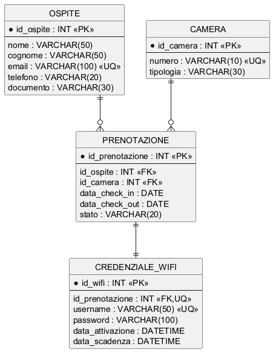

@startuml
hide circle
skinparam linetype ortho

entity "OSPITE" as OSP {
    * id_ospite : INT <<PK>>
    --
    nome : VARCHAR(50)
    cognome : VARCHAR(50)
    email : VARCHAR(100) <<UQ>>
    telefono : VARCHAR(20)
    documento : VARCHAR(30)
}

entity "CAMERA" as CAM {
    * id_camera : INT <<PK>>
    --
    numero : VARCHAR(10) <<UQ>>
    tipologia : VARCHAR(30)
}

entity "PRENOTAZIONE" as PRE {
    * id_prenotazione : INT <<PK>>
    --
    id_ospite : INT <<FK>>
    id_camera : INT <<FK>>
    data_check_in : DATE
    data_check_out : DATE
    stato : VARCHAR(20)
}

entity "CREDENZIALE_WIFI" as WIFI {
    * id_wifi : INT <<PK>>
    --
    id_prenotazione : INT <<FK,UQ>>
    username : VARCHAR(50) <<UQ>>
    password : VARCHAR(100)
    data_attivazione : DATETIME
    data_scadenza : DATETIME
}

OSP ||--o{ PRE
CAM ||--o{ PRE
PRE ||--|| WIFI
@enduml

