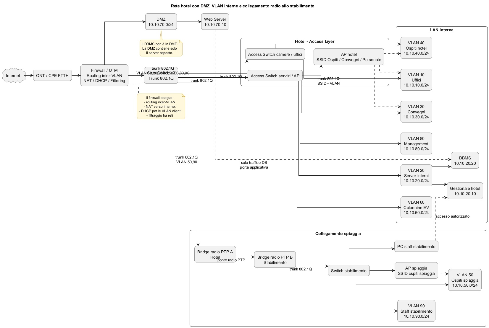
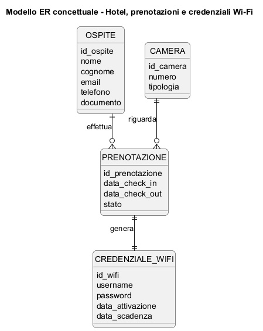
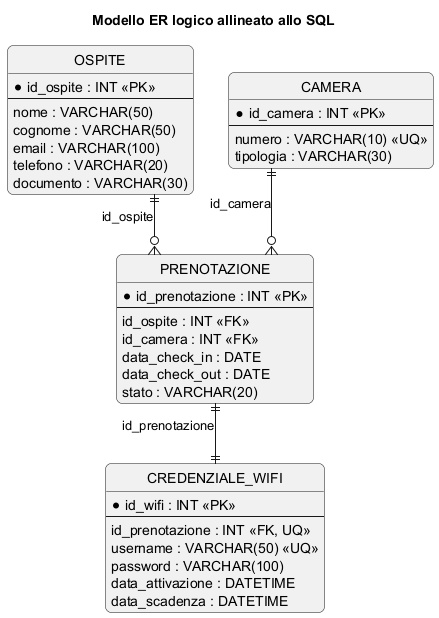

# SOLUZIONE

## 1. Impostazione generale del progetto

### Struttura/Architettura di rete

#### Nr. of layers

Si adotta una architettura a 2 layer, costituita da access e core, perché la struttura descritta ha dimensioni contenute e non presenta la complessità tipica di un grande campus.  
L’hotel e lo stabilimento balneare richiedono segmentazione logica, sicurezza e collegamenti ben organizzati, ma non un livello distribution separato.  
Inserire anche il distribution layer aumenterebbe numero di apparati, complessità progettuale e costo, senza apportare in questa traccia benefici proporzionati.  
Per questo è più razionale adottare una soluzione a 2 layer con:  
- access layer  
- core centrale  

#### Routing  

Il routing tra le reti non viene affidato a uno switch Layer 3 ma al firewall/UTM.  
La ragione è che qui la priorità non è massimizzare il throughput del routing interno, ma controllare con precisione i flussi tra reti con livelli di fiducia molto diversi: ospiti, convegni, uffici, server interni, management, colonnine di ricarica, staff dello stabilimento e DMZ.  

Centralizzare il routing inter-VLAN sul firewall permette di applicare in un unico punto filtraggio, NAT, logging, eventuali IDS/IPS e policy di sicurezza.  
In una rete più grande si potrebbe scegliere un core/distribution Layer 3 e lasciare al firewall solo il traffico verso Internet e verso la DMZ; in questa traccia, invece, la scelta del firewall come punto di instradamento è più coerente con i requisiti di sicurezza e più facile da motivare.  

#### Struttura

La topologia generale scelta è quindi la seguente:

```
Internet
ONT/CPE FTTH
Firewall/UTM
Core switch gestito
Access switch, access point, bridge radio per la spiaggia
```

La rete viene suddivisa in tre grandi zone logiche:  
- WAN, cioè il collegamento verso Internet  
- DMZ, per il server web esposto  
- LAN interna segmentata in VLAN, per tutti i servizi e gli utenti interni  

#### Diagramma di rete   

Nel PDF può risultare spostato in basso per problemi di impaginazione.  


## 2. Apparati necessari e motivazione delle scelte

### 2.1 ONT o CPE FTTH del provider

L’ONT o CPE del provider serve unicamente a terminare la connettività FTTH e a presentare una interfaccia Ethernet al sistema interno dell’hotel. Non viene usato come apparato di sicurezza principale, perché questa funzione deve essere svolta da un firewall controllato dall’organizzazione.

_**ONT (Optical Network Terminal)** è il dispositivo terminale delle reti **FTTH basate su tecnologia PON** che converte il segnale **ottico su fibra** proveniente dalla rete del provider in **segnale Ethernet elettrico**, permettendo ai dispositivi della rete locale (router o firewall) di collegarsi alla rete Internet._  

_**PON (Passive Optical Network)** è una tecnologia di accesso in fibra ottica in cui una singola fibra proveniente dalla centrale del provider viene **divisa passivamente tramite splitter ottici tra più utenti**, senza apparati attivi intermedi lungo il percorso._


### 2.2 Firewall/UTM

Il firewall è l’apparato centrale del progetto. Svolge le seguenti funzioni:

```
routing tra VLAN
NAT/PAT verso Internet
filtraggio del traffico
isolamento della DMZ
pubblicazione del server web
servizio DHCP per le reti client
logging e controllo degli accessi
```

La scelta del firewall come apparato centrale è motivata dal fatto che la traccia richiede sia segmentazione sia funzionamento in sicurezza.  
Se il routing fosse svolto da uno switch Layer 3 e il firewall fosse usato solo verso Internet, parte del traffico tra reti interne potrebbe bypassare controlli approfonditi. Invece, facendo passare l’inter-VLAN routing nel firewall, ogni comunicazione tra segmenti differenti può essere autorizzata o negata in modo esplicito.


### 2.3 Core switch gestito Layer 2

Si utilizza un core switch gestito Layer 2 come punto di concentrazione dei trunk 802.1Q provenienti dagli switch di accesso, dagli access point e dal bridge radio verso lo stabilimento.  
Non si sceglie un core Layer 3 perché, come detto, in questo scenario il routing viene volutamente centralizzato sul firewall.

La scelta di un solo core switch, e non di una coppia ridondata, è una semplificazione accettabile in un contesto didattico.  
In un progetto reale si valuterebbe invece una maggiore ridondanza.

### 2.4 Access switch **gestiti**  

Gli access switch collegano le prese LAN delle camere, gli uffici, le colonnine di ricarica, gli AP e gli altri dispositivi locali.  
Devono essere switch "gestiti" perché devono supportare VLAN, trunk, separazione logica del traffico e amministrazione centralizzata.

Uno **switch gestito** è uno switch di rete configurabile tramite interfaccia di amministrazione che consente di controllare e gestire il traffico della rete (ad esempio VLAN, monitoraggio e sicurezza). Uno switch non "gestito" non ha queste funzionalità.


### 2.5 Access point

Gli AP devono supportare più SSID **associati a VLAN differenti**.  
Questa scelta permette di offrire autenticazione distinta per ospiti, personale e utenti dei convegni, pur condividendo la stessa infrastruttura radio.

### 2.6 Bridge radio punto-punto hotel–stabilimento

Per collegare l’hotel con lo stabilimento balneare a 500 m si adotta un ponte radio punto-punto.  
Questa scelta viene dettagliata nella sezione sul collegamento tra le due sedi, si può comunque osservare da ora che è la soluzione più naturale quando esistono distanza contenuta, visibilità ottica e necessità di trasportare in modo trasparente più reti logiche tra due punti.

### 2.7 Switch nello stabilimento balneare

Nello stabilimento serve almeno uno switch gestito per distribuire il traffico delle VLAN trasportate dal ponte radio verso gli access point della spiaggia e verso i terminali del personale.

## 3. Scelta degli indirizzi IP e motivazione

Per tutta la rete interna si usano indirizzi privati RFC 1918.  
Questa è la scelta corretta perché tutte le reti interne dell’hotel, comprese quelle ospiti, uffici, server interni, management e dispositivi specializzati, non devono essere direttamente esposte su Internet.  

Si sceglie il blocco 10.10.0.0/16, suddiviso poi in sottoreti /24. La scelta del blocco 10.0.0.0/8, e in particolare dello schema 10.10.x.0, è motivata da tre ragioni:  
- leggibilità: ogni VLAN è immediatamente riconoscibile dal terzo ottetto  
- semplicità operativa: risulta facile associare numero VLAN e rete IP  
- estendibilità: restano molte reti disponibili per future espansioni  

La scelta di usare /24 per tutte le principali VLAN non deriva da un fabbisogno strettamente numerico, perché alcune reti avrebbero bisogno di molti meno host. Si tratta di una scelta di semplificazione e uniformità. In una struttura di queste dimensioni non vi è alcun problema a “sprecare” un po’ di spazio di indirizzamento privato; in compenso si ottengono configurazioni più semplici, troubleshooting più chiaro e maggiore facilità di crescita futura.

## 4. Segmentazione in VLAN e motivazione

La segmentazione adottata è la seguente:

```
VLAN 10   Uffici                  10.10.10.0/24
VLAN 20   Server interni          10.10.20.0/24
VLAN 30   Convegni                10.10.30.0/24
VLAN 40   Ospiti hotel            10.10.40.0/24
VLAN 50   Ospiti spiaggia         10.10.50.0/24
VLAN 60   Colonnine ricarica      10.10.60.0/24
VLAN 80   Management              10.10.80.0/24
VLAN 90   Staff stabilimento      10.10.90.0/24
DMZ       Server web              10.10.70.0/24
```

La rete 10.10.70.0/24 viene collegata direttamente a una interfaccia dedicata del firewall, quindi non viene trasportata come VLAN sui trunk della LAN. In questo modo la DMZ rimane una rete separata dalla LAN interna e non viene gestita come una normale VLAN della rete locale.

Le ragioni della segmentazione sono le seguenti.

- **Rete uffici**.  
Separare gli uffici permette di isolare le postazioni amministrative dal traffico degli ospiti e delle aree pubbliche.  
Gli uffici hanno bisogno di raggiungere il gestionale e di raggiungere altri servizi interni con privilegi maggiori rispetto ai client guest.

- **Rete server interni**.  
Il server gestionale e gli eventuali servizi interni non esposti devono stare in una rete separata sia dagli utenti sia dalla DMZ.  
Questo riduce la superficie di attacco e rende più chiara la politica di filtraggio.

- **Rete convegni**.  
I partecipanti ai convegni costituiscono un gruppo distinto dagli ospiti delle camere.  
Possono avere un accesso temporaneo e un profilo di autorizzazione diverso.

- **Rete ospiti hotel**. 
Gli ospiti devono poter navigare in Internet, ma non accedere alle reti interne della struttura.

- **Rete ospiti spiaggia**.  
Si sceglie di tenere separata la clientela connessa dalla spiaggia.  
Il requisito della traccia è avere le stesse modalità di identificazione, non necessariamente la stessa VLAN.  
Si possono quindi usare le stesse credenziali o lo stesso sistema di autenticazione centralizzato, ma mantenere una VLAN distinta per motivi di controllo, gestione del traffico e separazione fisica/organizzativa delle due aree.  

- **Rete colonnine di ricarica**.  
Le colonnine sono dispositivi specializzati e vanno isolate dai client generici.  
Devono poter raggiungere solo i servizi strettamente necessari, ad esempio la web app o i server applicativi coinvolti nella contabilizzazione.  

- **Rete management**.  
Le interfacce di amministrazione di switch, AP, bridge radio e altri apparati devono essere raggiungibili solo dagli amministratori e **mai dalle reti utenti**.

- **Rete staff stabilimento.**  
Il personale dello stabilimento ha necessità operative specifiche, per esempio l’accesso al gestionale dell’hotel.  
È quindi opportuno separarlo sia dagli ospiti sia dal personale amministrativo interno.

1. Routing e gateway

Il routing tra le reti viene effettuato dal firewall mediante subinterfacce 802.1Q sulla porta LAN trunk e una interfaccia separata per la DMZ.  
Ogni sottorete usa come gateway l’indirizzo .1 della propria rete:

```
VLAN 10    10.10.10.1
VLAN 20    10.10.20.1
VLAN 30    10.10.30.1
VLAN 40    10.10.40.1
VLAN 50    10.10.50.1
VLAN 60    10.10.60.1
VLAN 80    10.10.80.1
VLAN 90    10.10.90.1
DMZ        10.10.70.1
```

La ragione di questa scelta è mantenere coerenza e prevedibilità nella configurazione. In una rete articolata ma non enorme, avere sempre .1 come default gateway riduce la possibilità di errore e semplifica l’amministrazione.

## 6. DHCP e indirizzamento statico

Il DHCP viene fornito dal firewall.  
Questa scelta è adeguata perché la rete è di dimensioni moderate e il firewall conosce già tutte le reti e tutte le policy.  
Centralizzare DHCP nello stesso apparato semplifica l’amministrazione e permette di configurare facilmente scope diversi per ogni VLAN.

Si usano lease dinamici per le reti client e indirizzi statici per server e apparati di management. In particolare:

```
DHCP per VLAN 10 uffici
DHCP per VLAN 30 convegni
DHCP per VLAN 40 ospiti hotel
DHCP per VLAN 50 ospiti spiaggia
DHCP per VLAN 60 colonnine, salvo che i modelli richiedano IP statici
DHCP o statici per VLAN 90 staff stabilimento, a seconda del numero e della natura dei terminali
statici per VLAN 20 server interni
statici per VLAN 80 management
statici per DMZ
```

Questa distinzione è motivata dal fatto che server e apparati di rete devono avere indirizzi stabili e facilmente documentabili, mentre client e dispositivi temporanei beneficiano del DHCP.

## 7. Trunk 802.1Q e porte access

Le tratte trunk principali sono:

```
firewall     ↔ core switch
core switch  ↔ access switch
switch       ↔ access point
core switch  ↔ bridge radio
bridge radio ↔ switch stabilimento
```

Sul trunk tra firewall e core transitano le VLAN della LAN interna:

```
10, 20, 30, 40, 50, 60, 80, 90
```

La DMZ non transita su questo trunk, perché è su interfaccia dedicata del firewall.

Sui trunk verso gli AP transitano le VLAN corrispondenti ai SSID configurati. Qui occorre fare una scelta precisa e non lasciare ambiguità. Si può quindi stabilire:

```
SSID ospiti hotel     → VLAN 40
SSID convegni         → VLAN 30
SSID personale        → VLAN 10
```

In questo modo il personale wireless viene equiparato, ai fini di accesso, alla rete uffici.  
Se si volesse distinguere ulteriormente il personale tecnico o di servizio si potrebbe creare una VLAN aggiuntiva, ma la traccia non lo richiede.

Le porte verso host finali sono porte access nella VLAN appropriata.

## 8. Server web e DBMS: collocazione e motivazione

### 8.1 tipo di DMZ  

Si sceglie di usare **una DMZ con un solo firewall** (three-legged firewall), perché:

* la rete è di dimensioni limitate
* c’è **un solo servizio pubblico (web server)**
* la complessità deve restare contenuta
* il secondo firewall non porterebbe un beneficio proporzionato in questo scenario

Il modello non scelto **dual-firewall / screened subnet** è più tipico di:

* data center
* infrastrutture critiche
* hosting provider
* grandi aziende


### 8.2 Scelta adottata nella soluzione

#### 8.2.1 Ubicazione Servers WEB e DBMS

Il server web pubblico viene ovviamente collocato in DMZ dato che deve essere raggiungibile da Internet.  

Il DBMS, invece, viene collocato nella LAN server interna, cioè nella rete 10.10.20.0/24, e non nella DMZ.  
Questa scelta è preferibile perché il database non deve essere pubblicato su Internet e contiene dati che richiedono maggiore protezione. Tenerlo nella rete server interna riduce l’esposizione complessiva: anche in caso di compromissione del server web, il database non si trova nello stesso segmento esposto.  

La comunicazione consentita sarà quindi del tipo:  
- web server in DMZ → DBMS nella LAN server interna, solo sulla porta del DBMS  
- nessun accesso diretto Internet → DBMS  
- nessun accesso generalizzato da altre VLAN → DBMS  

#### 8.2.2 Connessione al WEB Server  

Il server web in DMZ può essere raggiunto da Internet in due modi.  
- il server mantiene un **indirizzo IP privato** e il firewall pubblica il servizio tramite **NAT (port forwarding)**: il traffico destinato all’indirizzo IP pubblico del firewall sulle porte HTTP e HTTPS viene tradotto e inoltrato verso l’indirizzo privato del server nella DMZ.  
- il server possiede **direttamente un indirizzo IP pubblico** assegnato dal provider e il firewall si limita a filtrare il traffico tra Internet e il server senza effettuare traduzioni di indirizzo.

In questa soluzione si sceglie la **pubblicazione tramite NAT**.  
La rete interna dell’hotel utilizza indirizzi privati e il firewall rappresenta l’unico punto di uscita verso Internet; utilizzare NAT permette quindi di esporre il server web mantenendo separato lo spazio di indirizzamento interno, riducendo il consumo di indirizzi pubblici e semplificando la gestione della sicurezza, perché tutte le comunicazioni tra Internet e la rete interna transitano e vengono controllate dal firewall.


### 8.3 Sarebbe accettabile mettere anche il DBMS in DMZ?

Tecnicamente, sì. Si potrebbe collocare in DMZ sia il web server sia il DBMS e impedire al database qualsiasi esposizione diretta verso Internet, autorizzando solo il traffico proveniente dal web server.

Dal punto di vista della sicurezza, non è la scelta preferibile. La DMZ è una zona più esposta della LAN interna.  
Anche se il DBMS non fosse pubblicato, si troverebbe comunque nello stesso segmento del front-end esposto a Internet, oppure comunque in una zona concepita per servizi più esposti. Questo aumenta il rischio in caso di compromissione del server web o di configurazioni errate.


## 9. Regole di sicurezza principali

Le principali politiche di filtraggio sono:

```
Internet → web server in DMZ: consentito solo su TCP 80 e 443
Internet → DBMS: negato
reti ospiti e convegni → LAN interna: negato
reti ospiti e convegni → Internet: consentito
staff stabilimento → server gestionale: consentito solo per i servizi necessari
management → apparati di rete: consentito
reti utenti → management: negato
DMZ → DBMS: consentito solo dal web server verso il DBMS sulla specifica porta applicativa
DMZ → altre reti interne: negato salvo eccezioni strettamente motivate
```

Queste regole applicano il classico principio del minimo privilegio  

## 10. Collegamento hotel–stabilimento e confronto tra soluzioni

Le principali alternative sono:  

- **seconda linea FTTH autonoma nello stabilimento con VPN site-to-site verso l’hotel**.  
Questa soluzione avrebbe il vantaggio di dare connettività Internet autonoma allo stabilimento e una certa indipendenza operativa. Tuttavia richiede un secondo contratto, due apparati di sicurezza completi, configurazione VPN e maggiore complessità di gestione.

- **collegamento cablato dedicato tra hotel e spiaggia**.  
A 500 m sarebbe in teoria possibile, ma in pratica risulta molto più costoso e invasivo, soprattutto in ambiente reale, dove scavi, permessi, protezioni meccaniche e manutenzione rendono l’opzione poco conveniente.

- **ponte radio punto-punto tra terrazza dell’hotel e stabilimento**.  
Questa è la soluzione scelta. La distanza è contenuta, la traccia indica visibilità ottica tra i due punti, il costo è inferiore rispetto a un collegamento fisico dedicato e il ponte radio può trasportare in modo trasparente le VLAN necessarie.

Per questi motivi il ponte radio punto-punto è la soluzione preferibile.

Sul collegamento radio vengono trasportate due VLAN:  
- VLAN 50 ospiti spiaggia  
- VLAN 90 staff stabilimento  

Questa scelta permette di offrire due servizi distinti:  
- gli ospiti della spiaggia ottengono accesso Internet con le stesse modalità di identificazione dell’hotel;  
- il personale dello stabilimento raggiunge il gestionale dell’albergo.  

## 11.  “Stesse modalità di identificazione” del Wi-Fi

La traccia richiede che gli ospiti in spiaggia possano accedere con le stesse modalità di identificazione usate in albergo. Questo va reso esplicito anche nella soluzione di rete.

La scelta è utilizzare un sistema di autenticazione centralizzato dell’hotel, basato sulle credenziali Wi-Fi associate alla prenotazione. Tali credenziali vengono verificate da un servizio centrale raggiungibile sia dagli access point dell’hotel sia da quelli della spiaggia attraverso il bridge radio. In questo modo:  
- l’utente usa la stessa coppia username/password collegata alla prenotazione
- la logica di autenticazione resta unica  
- si possono però mantenere VLAN diverse per hotel e spiaggia  


“Stesse modalità di identificazione” non implica “stessa rete IP”, ma “stesso meccanismo di autenticazione e di gestione credenziali”.

## 12. Funzionamento complessivo della rete

Il traffico segue queste regole operative:

```
gli ospiti dell’hotel navigano in Internet ma non raggiungono le reti interne
gli ospiti in spiaggia fanno lo stesso, usando le stesse credenziali della prenotazione
i partecipanti ai convegni usano una rete dedicata separata dagli ospiti delle camere e dagli uffici
gli uffici accedono al server gestionale nella LAN server interna
le colonnine di ricarica comunicano solo con i servizi necessari
lo staff dello stabilimento raggiunge il gestionale dell’hotel tramite la VLAN dedicata
il server web pubblico è raggiungibile da Internet in DMZ
il DBMS non è esposto e dialoga solo con il web server e con gli eventuali servizi interni autorizzati
```

Si replica il diagramma della rete   




## 13. Progetto della base di dati

La base di dati deve gestire:  
- anagrafiche degli ospiti con dati personali ed email
- camere con numero e tipologia  
- prenotazioni con periodo di permanenza  
- credenziali Wi-Fi relative alla prenotazione  


La la traccia specifica che le credenziali Wi-Fi sono **relative alla prenotazione e non direttamente all’ospite**.  
In questo modo si rappresenta correttamente il fatto che le credenziali valgono per uno specifico soggiorno e possono avere attivazione e scadenza coerenti con check-in e check-out.

Si assume che ogni prenotazione sia intestata a un ospite principale.  

## 14. Modello concettuale

Diagramma  




Entità:

```
OSPITE
CAMERA
PRENOTAZIONE
CREDENZIALE_WIFI
```

Relazioni:

```
un ospite può effettuare più prenotazioni nel tempo
una camera può comparire in più prenotazioni nel tempo
ogni prenotazione si riferisce a un solo ospite principale
ogni prenotazione si riferisce a una sola camera
ogni prenotazione genera una credenziale Wi-Fi
```

Cardinalità:

```
OSPITE 1 : N PRENOTAZIONE
CAMERA 1 : N PRENOTAZIONE
PRENOTAZIONE 1 : 1 CREDENZIALE_WIFI
```

La cardinalità 1:1 tra prenotazione e credenziale Wi-Fi è coerente con il testo della traccia, che lega le credenziali alla prenotazione. Se si volesse modellare una credenziale per ciascun ospite o per più dispositivi, il modello andrebbe esteso, ma qui non è necessario.

## 15. Modello logico relazionale

Diagramma





    OSPITE(
    id_ospite PK,
    nome,
    cognome,
    email,
    telefono,
    documento
    )

    CAMERA(
    id_camera PK,
    numero UNIQUE,
    tipologia
    )

    PRENOTAZIONE(
    id_prenotazione PK,
    id_ospite FK -> OSPITE(id_ospite),
    id_camera FK -> CAMERA(id_camera),
    data_check_in,
    data_check_out,
    stato
    )

    CREDENZIALE_WIFI(
    id_wifi PK,
    id_prenotazione FK UNIQUE -> PRENOTAZIONE(id_prenotazione),
    username UNIQUE,
    password,
    data_attivazione,
    data_scadenza
    )

Sulla email si può scegliere se imporre o meno un vincolo UNIQUE. In una soluzione didattica si può anche non imporlo rigidamente, perché casi reali differenti potrebbero condividere una stessa email di contatto. La scelta dipende dal livello di rigidità che si vuole adottare. Se si vuole evitare possibili eccezioni reali, conviene non renderla necessariamente univoca.

## 16. Vincoli applicativi importanti

Servono almeno i seguenti vincoli:

```
data_check_out > data_check_in
nessuna sovrapposizione di prenotazioni per la stessa camera negli stessi intervalli
username Wi-Fi univoco
credenziali Wi-Fi attive solo per il periodo autorizzato
eventuale generazione o attivazione delle credenziali al check-in o immediatamente prima dell’inizio del soggiorno
```

## 17. Seconda parte, quesito 1: colonnina e socket

Formato possibile del messaggio:

```
{
    "data_ora": "2026-03-20T10:15:00Z",
    "id_cliente": "CLI145",
    "percentuale_carica": 78,
    "energia_erogata_kWh": 12.4
}
```

Si può scegliere JSON perché è leggibile, standard e semplice da elaborare.  
I socket sono l’interfaccia software con cui due processi comunicano in rete.  
In questo caso è opportuno usare TCP (anzichè UDP), perché la trasmissione dei dati di contabilizzazione richiede affidabilità, ordinamento dei dati e controllo degli errori.  
Il server  
- crea un socket  
- esegue bind su una porta  
- listen  
- accept per ricevere la connessione.   

La colonnina:  
- crea un socket client  
- esegue connect verso il server remoto.   

Una volta stabilita la connessione, i dati vengono scambiati con send e recv oppure write e read.  
Al termine, la sessione viene chiusa con close. In un sistema reale sarebbe opportuno proteggere anche la comunicazione con TLS.

## 18. Seconda parte, quesito 2: filtraggio contenuti a scuola  

Una possibile soluzione consiste nell’utilizzare uno switch gestito con VLAN e un firewall/UTM centrale.  
Lo switch separa la rete in VLAN studenti e VLAN uffici in modo che il traffico dei due gruppi resti logicamente isolato.  
In particolare la separazione tramite VLAN impedisce ai dispositivi della rete studenti di accedere direttamente alla rete degli uffici. Il firewall applica politiche di filtraggio del traffico diverse alle due VLAN.  
Il firewall viene configurato come default gateway delle VLAN, in modo che tutto il traffico verso Internet sia obbligato a transitare attraverso il firewall, che può applicare le politiche di filtraggio e controllo della navigazione.  

Il filtraggio dei contenuti può essere implementato tramite content filtering o proxy web, spesso integrati negli apparati firewall/UTM, che analizzano il traffico HTTP/HTTPS e bloccano l’accesso a siti appartenenti a categorie non consentite.  
In alternativa o in aggiunta è possibile usare **DNS filtering**, che impedisce la risoluzione dei nomi di domini vietati.  

Sulla **VLAN studenti** vengono applicate regole più restrittive, con blocco di categorie di siti non appropriati e registrazione delle attività di navigazione. La **VLAN uffici** utilizza regole più permissive ma resta comunque isolata dalla rete didattica per motivi di sicurezza.  

Questa soluzione consente:  
- separazione logica delle reti,  
- controllo centralizzato della navigazione e  
- maggiore sicurezza.  

I limiti principali sono  
- i costi degli apparati,  
- la complessità di gestione e  
- la difficoltà di analizzare completamente il traffico HTTPS, che può richiedere tecniche di ispezione TLS.

Schema logico:

```
INTERNET
    |
Firewall / UTM
(default gateway)
    |
Switch gestito
  |           |
VLAN studenti  VLAN uffici
```

---


## 19.  Seconda parte, quesito 3: HTTP e HTTPS

HTTP trasmette i dati in chiaro, mentre HTTPS è HTTP protetto da TLS.  
I vantaggi principali per il visitatore sono tre:  
- cifratura del traffico,  
- autenticazione del server tramite certificato  
- integrità dei dati trasmessi.  

Con HTTPS il browser verifica il certificato del sito e stabilisce una sessione sicura in cui i dati applicativi viaggiano cifrati. Questo protegge credenziali, dati personali e pagamenti e riduce il rischio di intercettazione o alterazione del traffico.

## 20.  Seconda parte, quesito 4: PC che non apre siti esterni ma vede la LAN

La risposta è corretta ma **manca l’elemento operativo richiesto implicitamente dalla traccia**: mostrare come il tecnico esegue le verifiche. Conviene quindi inserire i **comandi tipici di diagnostica di rete**. In un contesto scolastico è ragionevole usare i comandi disponibili su Windows.

Mantengo la struttura originale e aggiungo i comandi dove necessario.

---

## 20. Seconda parte, quesito 4: PC che non apre siti esterni ma vede la LAN

La sequenza di verifica deve procedere per esclusione.

Prima controllare la configurazione IP del PC per verificare indirizzo IP, subnet mask, gateway 192.168.24.1 e DNS 192.168.24.5.

```
ipconfig /all
```

Poi verificare la raggiungibilità del gateway con ping.

```
ping 192.168.24.1
```

Se il gateway non risponde il problema è probabilmente locale (configurazione IP errata, cavo di rete, switch o configurazione della rete).

Se il gateway risponde, verificare la raggiungibilità IP del server DNS.

```
ping 192.168.24.5
```

Successivamente provare a raggiungere un IP pubblico, ad esempio il DNS pubblico di Google.

```
ping 8.8.8.8
```

Se questo comando funziona significa che la connettività verso Internet è presente.
Se invece non funziona il problema può essere nel gateway, nel NAT, nel firewall o nella connessione Internet del router.

Se l’IP pubblico risponde ma i siti web non si aprono, il problema è probabilmente DNS. In questo caso verificare la risoluzione dei nomi.

```
nslookup www.google.com
```

Se nslookup non restituisce un indirizzo IP, il server DNS potrebbe non funzionare o essere configurato in modo errato.

Per capire dove il traffico verso Internet si interrompe si può usare il comando traceroute (tracert in Windows).

```
tracert 8.8.8.8
```

Infine controllare se nel browser è configurato un **proxy errato**, che potrebbe impedire l’accesso ai siti web anche se la connettività di rete è corretta.
