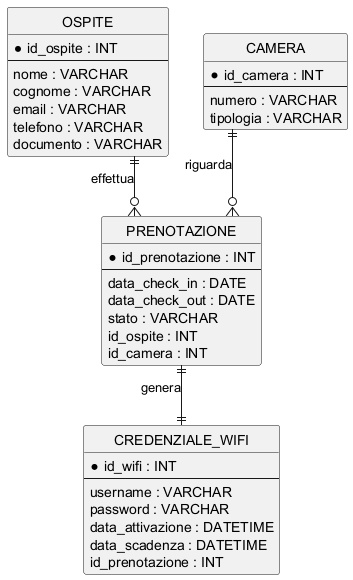

## Soluzione

### Architettura di rete: apparati, funzioni e collegamenti

Questa sezione descrive **in modo preciso e completo** il funzionamento della rete, specificando apparati, routing, DHCP, trunk 802.1Q e collegamenti tra i dispositivi.

---

## 1. Struttura generale della rete

La rete dell’hotel è organizzata in tre zone principali:

* **WAN (Internet)**
* **DMZ**
* **LAN interna segmentata in VLAN**

Il dispositivo centrale è il **firewall/UTM**, che svolge le seguenti funzioni:

* routing tra le VLAN
* NAT verso Internet
* server DHCP
* filtraggio del traffico
* pubblicazione del web server
* isolamento della DMZ
* logging e controllo degli accessi

Topologia semplificata:

Internet
→ ONT/CPE FTTH
→ Firewall/UTM
→ Core switch gestito
→ Access switch / Access Point / Bridge radio

---

# 2. Apparati di rete

### Apparati lato hotel

1. **ONT / CPE FTTH del provider**

Funzione:

* terminazione della linea FTTH
* conversione fibra → Ethernet

Collegamento:

ONT → porta WAN firewall

---

2. **Firewall / UTM**

Il firewall è il nodo centrale della rete.

Funzioni principali:

* routing inter-VLAN
* NAT verso Internet
* server DHCP
* filtraggio del traffico
* gestione DMZ
* VPN futura
* logging

Interfacce configurate:

WAN
collegata all’ONT

LAN trunk
collegata al core switch con **802.1Q**

DMZ
rete separata per i server esposti

---

3. **Core Switch gestito (Layer 2)**

Funzioni:

* distribuzione delle VLAN
* trunk verso access switch
* trunk verso firewall
* trunk verso bridge radio

Il core switch **non esegue routing** perché il routing è svolto dal firewall.

Collegamenti principali:

* trunk 802.1Q verso firewall
* trunk 802.1Q verso access switch
* trunk 802.1Q verso access point
* trunk 802.1Q verso ponte radio

---

4. **Access Switch gestiti**

Funzioni:

* collegamento delle prese LAN delle camere
* collegamento dei PC degli uffici
* collegamento degli access point
* collegamento delle colonnine di ricarica

Tipologia porte:

porte access (untagged) per host finali

porte trunk per uplink verso core switch.

---

5. **Access Point**

Gli access point supportano più SSID.

Ogni SSID è associato a una VLAN.

Collegamento:

switch → AP tramite porta trunk 802.1Q.

---

6. **Bridge radio punto-punto**

Due apparati radio collegano hotel e stabilimento.

Funzione:

* trasporto Layer 2 delle VLAN
* collegamento trasparente tra le due sedi

Il link radio trasporta **due VLAN**:

* VLAN ospiti spiaggia
* VLAN staff stabilimento

---

7. **Switch stabilimento balneare**

Funzioni:

* distribuzione delle VLAN locali
* collegamento access point spiaggia
* collegamento PC del personale

---

# 3. Segmentazione VLAN

Le VLAN configurate sono:

| VLAN | Funzione           | Rete          |
| ---- | ------------------ | ------------- |
| 10   | Uffici             | 10.10.10.0/24 |
| 20   | Servizi interni    | 10.10.20.0/24 |
| 30   | Convegni           | 10.10.30.0/24 |
| 40   | Ospiti hotel       | 10.10.40.0/24 |
| 50   | Ospiti spiaggia    | 10.10.50.0/24 |
| 60   | Colonnine ricarica | 10.10.60.0/24 |
| 70   | DMZ                | 10.10.70.0/24 |
| 80   | Management         | 10.10.80.0/24 |
| 90   | Staff stabilimento | 10.10.90.0/24 |

---

# 4. Routing tra le reti

Il **routing tra VLAN è svolto dal firewall**.

Il firewall dispone di subinterfacce VLAN sulla porta LAN trunk.

Esempio configurazione logica:

interfaccia LAN.10
IP 10.10.10.1

interfaccia LAN.20
IP 10.10.20.1

interfaccia LAN.30
IP 10.10.30.1

interfaccia LAN.40
IP 10.10.40.1

interfaccia LAN.50
IP 10.10.50.1

interfaccia LAN.60
IP 10.10.60.1

interfaccia LAN.80
IP 10.10.80.1

interfaccia LAN.90
IP 10.10.90.1

interfaccia DMZ
IP 10.10.70.1

Ogni subnet utilizza l’indirizzo .1 come **default gateway**.

---

# 5. Server DHCP

Il servizio DHCP è fornito dal firewall.

Per ogni VLAN viene configurato uno **scope DHCP separato**.

Esempio.

VLAN 10 UFFICI

range DHCP
10.10.10.50 – 10.10.10.200

gateway
10.10.10.1

DNS
server DNS pubblico o interno.

---

VLAN 40 OSPITI HOTEL

range DHCP
10.10.40.50 – 10.10.40.250

gateway
10.10.40.1

DNS
DNS pubblico o DNS filtrato.

---

VLAN 50 OSPITI SPIAGGIA

range DHCP
10.10.50.50 – 10.10.50.250

gateway
10.10.50.1

---

Le reti server e management utilizzano invece **indirizzi statici**.

---

# 6. Configurazione trunk 802.1Q

Le tratte trunk sono le seguenti.

Firewall ↔ Core Switch

porta trunk 802.1Q
trasporta VLAN:

10
20
30
40
50
60
80
90

La DMZ è su interfaccia separata.

---

Core Switch ↔ Access Switch

porta trunk 802.1Q

trasporta VLAN:

10
20
30
40
60
80

---

Switch ↔ Access Point

porta trunk 802.1Q

trasporta VLAN:

30 (convegni)
40 (ospiti hotel)
10 o 20 (dipendenti)

---

Core Switch ↔ Bridge radio

porta trunk 802.1Q

trasporta VLAN:

50 ospiti spiaggia
90 staff stabilimento

---

Bridge radio ↔ Switch stabilimento

porta trunk 802.1Q

trasporta VLAN:

50
90

---

# 7. Configurazione porte access

Le porte verso host finali sono porte access.

Esempi.

PC uffici
VLAN 10

server gestionale
VLAN 20

colonnine EV
VLAN 60

PC stabilimento
VLAN 90

---

# 8. Pubblicazione del web server

Il firewall esegue NAT.

IP pubblico → WEB server.

Esempio.

203.0.113.10:80
→ 10.10.70.10:80

203.0.113.10:443
→ 10.10.70.10:443

---

# 9. Comunicazione WEB server – DBMS

Il DBMS non è pubblicato.

Regola firewall:

WEB server → DBMS

porta database.

Esempio:

10.10.70.10 → 10.10.70.20
porta TCP 3306

Tutte le altre connessioni verso il DBMS sono bloccate.

---

# 10. Politiche di sicurezza

Principali regole firewall.

Internet → WEB server
consentito su 80 e 443

Internet → DBMS
negato

Guest VLAN → LAN interna
negato

Guest VLAN → Internet
consentito

Staff stabilimento → server gestionale
consentito

DMZ → LAN interna
negato

Management → apparati di rete
consentito

---

# 11. Collegamento con lo stabilimento

Il collegamento è realizzato tramite **ponte radio punto-punto**.

Caratteristiche:

* distanza 500 m
* linea di vista
* throughput elevato
* trasporto VLAN

Il link trasporta due VLAN:

* ospiti spiaggia
* staff stabilimento

In questo modo lo stabilimento utilizza gli stessi servizi dell’hotel.

---

# 12. Funzionamento complessivo

Il traffico segue queste regole:

gli ospiti hotel e spiaggia accedono a Internet ma non alle reti interne;

il personale degli uffici accede al server gestionale;

il personale dello stabilimento accede al gestionale tramite VLAN dedicata;

il web server pubblica il sito Internet;

il database è accessibile solo dal web server;

il firewall controlla e filtra tutte le comunicazioni tra le reti.

---

Questa architettura soddisfa tutti i requisiti della traccia:

* rete segmentata
* separazione ospiti / uffici / servizi
* sicurezza tramite firewall e DMZ
* collegamento allo stabilimento
* supporto Wi-Fi differenziato
* isolamento dei sistemi critici.


### 12. Progetto della base di dati

La base di dati deve gestire:

* anagrafiche ospiti con dati personali ed email;
* camere con numero e tipologia;
* prenotazioni con check-in e check-out;
* credenziali Wi-Fi legate alla prenotazione. 

La scelta migliore è modellare le credenziali Wi-Fi come entità separata collegata alla prenotazione. In questo modo si rappresenta correttamente il fatto che **la credenziale vale per uno specifico soggiorno** e non genericamente per l’ospite.

### 13. Modello concettuale

Entità:

* OSPITE
* CAMERA
* PRENOTAZIONE
* CREDENZIALE_WIFI

Relazioni:

* un ospite effettua molte prenotazioni nel tempo;
* una camera compare in molte prenotazioni nel tempo;
* ogni prenotazione si riferisce a un solo ospite e a una sola camera;
* ogni prenotazione genera una credenziale Wi-Fi.

### 14. PlantUML del modello concettuale

```
@startuml
hide circle
skinparam linetype ortho

entity OSPITE {
    * id_ospite : INT
    --
    nome : VARCHAR
    cognome : VARCHAR
    email : VARCHAR
    telefono : VARCHAR
    documento : VARCHAR
}

entity CAMERA {
    * id_camera : INT
    --
    numero : VARCHAR
    tipologia : VARCHAR
}

entity PRENOTAZIONE {
    * id_prenotazione : INT
    --
    data_check_in : DATE
    data_check_out : DATE
    stato : VARCHAR
    id_ospite : INT
    id_camera : INT
}

entity CREDENZIALE_WIFI {
    * id_wifi : INT
    --
    username : VARCHAR
    password : VARCHAR
    data_attivazione : DATETIME
    data_scadenza : DATETIME
    id_prenotazione : INT
}

OSPITE ||--o{ PRENOTAZIONE : effettua
CAMERA ||--o{ PRENOTAZIONE : riguarda
PRENOTAZIONE ||--|| CREDENZIALE_WIFI : genera
@enduml


```

### 15. Motivazione delle cardinalità

Cardinalità OSPITE 1:N PRENOTAZIONE perché uno stesso ospite può soggiornare più volte. 
Cardinalità CAMERA 1:N PRENOTAZIONE perché una stessa camera può essere prenotata molte volte, ma in periodi diversi. 
Cardinalità PRENOTAZIONE 1:1 CREDENZIALE_WIFI: una prenotazione produce una coppia username-password per l’accesso Wi-Fi.

### 16. Modello logico relazionale

```
OSPITE(
    id_ospite PK,
    nome,
    cognome,
    email UNIQUE,
    telefono,
    documento
)

CAMERA(
    id_camera PK,
    numero UNIQUE,
    tipologia
)

PRENOTAZIONE(
    id_prenotazione PK,
    id_ospite FK -> OSPITE(id_ospite),
    id_camera FK -> CAMERA(id_camera),
    data_check_in,
    data_check_out,
    stato
)

CREDENZIALE_WIFI(
    id_wifi PK,
    id_prenotazione FK UNIQUE -> PRENOTAZIONE(id_prenotazione),
    username UNIQUE,
    password,
    data_attivazione,
    data_scadenza
)
```

### 17. PlantUML del modello logico

```
@startuml
hide circle
skinparam linetype ortho

entity "OSPITE" as OSP {
    * id_ospite : INT <<PK>>
    --
    nome : VARCHAR(50)
    cognome : VARCHAR(50)
    email : VARCHAR(100) <<UQ>>
    telefono : VARCHAR(20)
    documento : VARCHAR(30)
}

entity "CAMERA" as CAM {
    * id_camera : INT <<PK>>
    --
    numero : VARCHAR(10) <<UQ>>
    tipologia : VARCHAR(30)
}

entity "PRENOTAZIONE" as PRE {
    * id_prenotazione : INT <<PK>>
    --
    id_ospite : INT <<FK>>
    id_camera : INT <<FK>>
    data_check_in : DATE
    data_check_out : DATE
    stato : VARCHAR(20)
}

entity "CREDENZIALE_WIFI" as WIFI {
    * id_wifi : INT <<PK>>
    --
    id_prenotazione : INT <<FK,UQ>>
    username : VARCHAR(50) <<UQ>>
    password : VARCHAR(100)
    data_attivazione : DATETIME
    data_scadenza : DATETIME
}

OSP ||--o{ PRE
CAM ||--o{ PRE
PRE ||--|| WIFI
@enduml


```

### 18. Vincoli applicativi importanti

Per rendere il sistema corretto servono almeno questi controlli:

* data_check_out > data_check_in;
* non sovrapporre prenotazioni della stessa camera nello stesso periodo;
* username Wi-Fi univoco;
* eventuale scadenza automatica delle credenziali al termine del soggiorno.

### 19. Seconda parte, quesito 1: colonnina di ricarica e socket

Formato di trasmissione possibile:

```
{
  "data_ora": "2026-03-20T10:15:00Z",
  "id_cliente": "CLI145",
  "percentuale_carica": 78,
  "energia_erogata_kWh": 12.4
}
```

Scelgo JSON perché è leggibile, semplice da trasmettere e facile da interpretare sia da microcontrollore sia dal server.

I socket rappresentano l’interfaccia software con cui due processi in rete comunicano.  
In una soluzione con connessione e  affidabilite (non nel senso "forte" di robusta) usare TCP. Il server crea un socket, esegue bind su una porta, poi listen e accept per ricevere la connessione.  
La colonnina crea il socket client ed esegue connect verso il server remoto.  
Una volta stabilita la connessione, i dati vengono inviati e ricevuti con send/recv oppure write/read.  
Al termine della sessione entrambi chiudono il socket con close.  

TCP è preferibile a UDP perché **garantisce** consegna, ordine dei dati e controllo degli errori, aspetti importanti quando si trasmettono dati di contabilizzazione energetica.

Schema:

```
[Colonnina]
    |
socket TCP client
    |
  rete
    |
socket TCP server
    |
 [Server]
```

### 20. Seconda parte, quesito 2: filtraggio contenuti a scuola

Per una scuola userei  
- firewall/UTM,  
- switch gestito con VLAN,  
- proxy o content filter e  
- DNS filtering.  

Gli studenti starebbero in una VLAN separata da quella degli uffici.  
Il firewall distinguerebbe le politiche: sulla rete studenti si applicherebbero filtri più rigidi, blocco di categorie, DNS filtrato, logging e limiti applicativi.  
Sulla rete uffici si userebbero regole più permissive ma sempre isolate dalla rete didattica. Il content filter può controllare il traffico web, mentre il DNS filtering impedisce di risolvere domini vietati.  
Il vantaggio è una navigazione più sicura e una separazione chiara dei contesti d’uso.  
I limiti sono i costi, la complessità e il fatto che parte del traffico HTTPS possa richiedere analisi più avanzate.

Schema:

```
INTERNET
   |
[Firewall / UTM + filtro contenuti]
   |
[Switch gestito]
  |                 |
VLAN studenti    VLAN uffici
```

### 21. Seconda parte, quesito 3: differenza tra HTTP e HTTPS

HTTP è un protocollo applicativo usato per scambiare pagine web e risorse, ma in chiaro. HTTPS è HTTP protetto da TLS. Questo comporta tre vantaggi fondamentali:  
- cifratura,  
- autenticazione del server tramite certificato,  
- integrità dei dati.  

Con HTTP un intercettatore può leggere o modificare il traffico; con HTTPS il browser verifica il certificato e crea un canale cifrato col server. Per il visitatore del sito ciò significa maggiore protezione di credenziali, dati personali e pagamenti, oltre a minore rischio di attacchi man-in-the-middle e alterazione dei contenuti.

Schema:

```
HTTP
Browser ---- dati in chiaro ---- Server

HTTPS
Browser ==== canale TLS cifrato ==== Server
```

### 22. Seconda parte, quesito 4: PC che non apre siti esterni ma vede la LAN

La sequenza corretta di verifiche è procedere per esclusione. Per prima cosa  
- controllare configurazione IP, subnet mask, gateway 192.168.24.1 e DNS 192.168.24.5.  
- Poi eseguire il ping del gateway. Se non risponde, il problema è locale o di instradamento interno.  
- Se risponde, verificare il DNS locale con ping 192.168.24.5.  
- Successivamente provare il ping verso un IP pubblico, ad esempio 8.8.8.8.  
- Se questo funziona ma i siti non si aprono, è probabile un problema DNS; allora usare nslookup per verificare la risoluzione dei nomi.  
- Se invece non si raggiunge l’IP pubblico, il problema può stare nel gateway, nel NAT, nel firewall o nella connettività Internet.  
- Infine controllare eventuale proxy errato nel browser e usare tracert per capire dove il traffico si interrompe.

Schema:

```
1. controllare IP / mask / gateway / DNS
2. ping 192.168.24.1
3. ping 192.168.24.5
4. ping IP pubblico
5. nslookup dominio
6. tracert
7. controllare proxy browser
```

### 23. Conclusione finale

La soluzione proposta rispetta i requisiti posti dalla traccia perché usa una rete segmentata, protegge i servizi esposti con una DMZ, mantiene il gestionale nella rete interna, collega in modo sicuro lo stabilimento balneare e modella correttamente le prenotazioni e le credenziali Wi-Fi.  
La scelta della DMZ unica con WEB server e RDBMS nello stesso segmento è valida purché il database non sia pubblicato e accetti connessioni solo dal WEB server. In questo modo si ottiene una soluzione realistica, ordinata e tecnicamente coerente. 

