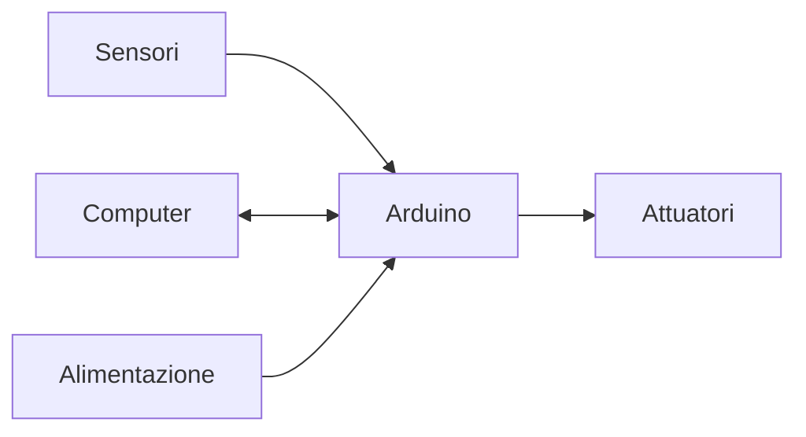
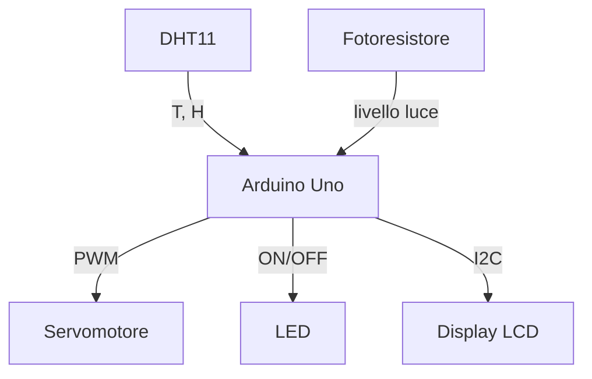

---

# Lezione di Arduino: dall’accensione di un LED ai primi sensori

## Obiettivi della lezione
- Comprendere cos’è Arduino e a cosa serve.
- Conoscere le principali versioni di schede Arduino.
- Imparare i fondamenti dell’elettronica necessari (tensione, corrente, resistenza, ground).
- Identificare e utilizzare componenti elettronici di base: resistori, LED, pulsanti, potenziometri, sensori, attuatori.
- Scrivere programmi in C++ per Arduino usando le funzioni specifiche della piattaforma.
- Realizzare esperimenti pratici di livello intermedio: lettura di sensori analogici/digitali, controllo di attuatori, comunicazione seriale, PWM.
- Acquisire le competenze per progettare autonomamente piccoli progetti.

## Prerequisiti
- Programmazione in C/C++ (variabili, funzioni, cicli, condizioni, array, struct, puntatori non indispensabili ma utili).

---

## 1. Cos’è Arduino?

Arduino è una piattaforma **open-source** composta da:
- **Hardware**: schede a microcontrollore con ingressi/uscite (I/O).
- **Software**: ambiente di sviluppo (IDE) e librerie semplificate.

Nasce per rendere accessibile l’elettronica a artisti, designer, hobbisti e studenti. Il suo punto di forza è l’astrazione: invece di programmare direttamente il microcontrollore con linguaggi complessi, si usa un **C++ semplificato** con funzioni come `digitalWrite()` e `analogRead()`.

Ecco come appare una scheda Arduino Uno:


### Schema a blocchi di un sistema basato su Arduino


- **Sensori**: rilevano grandezze fisiche (luce, temperatura, distanza).
- **Attuatori**: compiono azioni (accendere un LED, muovere un motore).
- **Microcontrollore**: il cervello che esegue il programma.
- **Computer**: carica il programma e può scambiare dati via seriale.

---

## 2. Le varie versioni di Arduino (e compatibili)

Esistono decine di modelli. I più comuni:

| Scheda         | Microcontrollore | Tensione | Pin digitali | Pin analogici | Memoria Flash | Utilizzo tipico |
|----------------|-----------------|----------|--------------|---------------|---------------|------------------|
| **Arduino Uno R3** | ATmega328P       | 5V       | 14 (6 PWM)   | 6             | 32 KB         | Progetti base, didattica |
| **Arduino Nano**   | ATmega328P       | 5V       | 14 (6 PWM)   | 8             | 32 KB         | Compatto, breadboard |
| **Arduino Mega 2560** | ATmega2560    | 5V       | 54 (15 PWM)  | 16            | 256 KB        | Progetti con molti sensori |
| **Arduino Leonardo** | ATmega32U4   | 5V       | 20 (7 PWM)   | 12            | 32 KB         | Supporto nativo USB HID |
| **Arduino Due**     | SAM3X8E (ARM)  | 3.3V     | 54 (12 PWM)  | 12            | 512 KB        | 32-bit, più potente |
| **Arduino 101**     | Intel Curie     | 3.3V     | 14 (4 PWM)   | 6             | 196 KB        | Con Bluetooth e accelerometro |

> **Nota**: le schede a 3.3V non tollerano 5V sugli input! Verifica sempre la tensione di funzionamento.

Ecco una panoramica dei pin di Arduino Uno:


**Immagini delle principali schede Arduino:**

*Arduino Uno:*  


*Arduino Nano:*  


*Arduino Mega 2560:*  
*(Nota: immagine non disponibile su Wikimedia Commons, consultare la documentazione ufficiale)*

*Arduino Leonardo:*  


*Arduino Due:*  
*(Nota: immagine non disponibile su Wikimedia Commons, consultare la documentazione ufficiale)*

*Arduino 101:*  
*(Nota: immagine non disponibile su Wikimedia Commons, consultare la documentazione ufficiale)*

### Altre varianti utili
- **Arduino Micro**: come Leonardo ma più piccolo.
- **Arduino Pro Mini**: senza convertitore USB, per progetti embedded.
- **ESP8266/ESP32**: non sono Arduino ufficiali, ma usabili con IDE Arduino; integrano Wi-Fi/Bluetooth.

### Come scegliere?
- **Uno** per iniziare.
- **Nano** per progetti su breadboard.
- **Mega** quando servono molti pin o molta memoria.
- **ESP32** se serve connettività wireless.

---

## 3. Componenti accessori fondamentali (con immagini)

Prima di programmare, dobbiamo conoscere i “mattoni” dell’elettronica. Ecco ogni componente con la sua immagine.

### 3.1 Breadboard (protoboard)
Piastra con fori collegati internamente. Permette di montare circuiti senza saldare.


*Struttura interna: due blocchi laterali per alimentazione (linee rosse/blu) e colonne centrali per i componenti.*

### 3.2 Cavi jumper
Filo con connettori maschio/maschio, maschio/femmina, femmina/femmina.


### 3.3 Resistori
Componente passivo che limita la corrente. Si misura in **Ohm (Ω)**.  
**Legge di Ohm**: \( V = I \times R \) (tensione = corrente × resistenza).  
Esempio: per un LED (richiede 20 mA = 0.02 A) con alimentazione 5V, la resistenza necessaria è:
\[
R = \frac{V}{I} = \frac{5V - 2V_{LED}}{0.02A} = 150\Omega \]
(si usa 220Ω per sicurezza).

**Codice colori**: bande sul corpo indicano il valore.


### 3.4 LED (Light Emitting Diode)
Diodo che emette luce quando polarizzato direttamente. Ha **anodo (+) e catodo (-)**. Il catodo è il piedino più corto o la parte piatta del bordo.


### 3.5 Pulsanti e interruttori
Componenti che chiudono o aprono un circuito. I pulsanti hanno 4 piedini; due coppie normalmente aperte (NO).


### 3.6 Potenziometro
Resistenza variabile con tre terminali. Due estremi e un cursore. Fornisce una tensione variabile da 0 a Vcc.


### 3.7 Sensori (famiglie principali)

#### Fotoresistore (LDR – Light Dependent Resistor)
Resistenza che varia con la luce.


#### Sensore di temperatura LM35
Uscita analogica lineare: 10 mV per °C.


#### Sensore DHT11 (temperatura e umidità)
Comunicazione digitale a 1 filo.


#### Sensore a ultrasuoni HC-SR04
Misura distanza con onde sonore.


#### Sensore a infrarossi (evitamento ostacoli)
Emette e riceve luce IR.

*(Nota: immagine non disponibile su Wikimedia Commons, consultare la documentazione del produttore)*

### 3.8 Attuatori

#### Servomotore (es. SG90)
Motore con controllo angolare preciso (0-180°).


#### Motore DC
Rotazione continua, richiede driver (ponte H) per controllo direzione/velocità.


#### Relè
Interruttore comandato elettricamente. Permette di accendere/spegnere carichi ad alta tensione/corrente.


#### Display LCD 16x2 (con interfaccia I2C opzionale)
Mostra testo su due righe.


### 3.9 Alimentazione
- USB (5V) dalla computer.
- Jack esterno (7-12V) – regolatore integrato.
- Pin Vin o batteria.


---

## 4. L’ambiente di sviluppo (IDE)

Scarica l’IDE da [arduino.cc](https://www.arduino.cc/en/software).  
Scrivi il codice in **setup()** (eseguito una volta) e **loop()** (ripetuto all’infinito).

Struttura minima:
```cpp
void setup() {
  // inizializzazioni
}

void loop() {
  // codice principale
}
```

### 4.1 Compilazione e upload
1. Seleziona scheda (Tools → Board).
2. Seleziona porta (Tools → Port).
3. Clicca “Verify” (compila) e “Upload”.

### 4.2 Serial Monitor
Permette di inviare/ricevere testo via USB. Si apre da Tools → Serial Monitor.  
Velocità (baud rate) impostata con `Serial.begin(9600)`.

---

## 5. Fondamenti di elettronica per Arduino

Anche se conosci C++, devi capire cosa succede sui pin.

### Tensione (V)
Differenza di potenziale. I pin digitali di Arduino forniscono **0V (LOW) o 5V (HIGH)** (o 3.3V su schede 3.3V).

### Corrente (I)
Flusso di cariche. Ogni pin può erogare al massimo **20 mA** (40 mA assoluti). Non collegare mai un motore direttamente al pin!

### Ground (GND)
Il riferimento 0V. Tutti i circuiti devono avere un GND comune con Arduino.

### Uscite digitali
`pinMode(pin, OUTPUT)`, poi `digitalWrite(pin, HIGH/LOW)`.

### Ingressi digitali
`pinMode(pin, INPUT)` (o INPUT_PULLUP per abilitare la resistenza interna di pull-up).  
Si legge con `digitalRead(pin)` → restituisce HIGH o LOW.

### Ingressi analogici
Solo su pin contrassegnati “A0…A5” (Uno). Misurano tensione da 0 a 5V e la convertono in un intero da 0 a 1023 (risoluzione 10 bit).  
`analogRead(pin)`.

### Uscite analogiche (PWM)
Non vera analogica, ma modulazione di larghezza di impulso. Permette di simulare tensioni intermedie (0-5V) su alcuni pin (contrassegnati “~”).  
`analogWrite(pin, valore)` con valore da 0 a 255.

### Temporizzazione
- `delay(ms)`: ferma il programma per millisecondi (bloccante).
- `millis()`: restituisce i millisecondi dall’accensione (non bloccante).

---

## 6. Il linguaggio Arduino (C++ specifico)

Arduino usa C++ ma nasconde il `main()`. In realtà il vero main è:
```cpp
int main() {
  init();
  setup();
  for (;;) loop();
}
```

### Funzioni e costanti utili
- `pinMode(pin, mode)`
- `digitalWrite(pin, value)`
- `digitalRead(pin)`
- `analogRead(pin)`
- `analogWrite(pin, value)`
- `delay(ms)`, `delayMicroseconds(us)`
- `millis()`, `micros()`
- `Serial.begin(baud)`
- `Serial.print()`, `Serial.println()`, `Serial.available()`, `Serial.read()`
- `tone(pin, frequency)` per generare suoni (su pin specifici).
- `noTone(pin)`
- `pulseIn(pin, value)` misura la durata di un impulso.

### Variabili speciali
- `HIGH` / `LOW`
- `INPUT`, `OUTPUT`, `INPUT_PULLUP`
- `LED_BUILTIN` (pin del LED sulla scheda, di solito 13)

### Operatori bitwise utili per i registri
Poiché i pin sono organizzati in porte (es. PORTB, PORTC), a volte si usano `digitalWrite` è lenta. Per operazioni veloci:
```cpp
DDRB = B00100000;  // pin 13 come output (PORTB bit 5)
PORTB |= B00100000; // set HIGH
PORTB &= ~B00100000; // set LOW
```

Ma per i nostri scopi, useremo le funzioni standard.

---

## 7. Primo laboratorio: LED lampeggiante (Blink)

Obiettivo: far lampeggiare il LED interno o un LED esterno ogni secondo.

### Schema elettrico (LED esterno)

```
Arduino Uno:
Pin 13 ----[220Ω]----|>|---- GND
                         LED
```
*Il LED ha anodo (piedino lungo) verso la resistenza.*

### Codice
```cpp
const int ledPin = 13;   // LED built-in su pin 13

void setup() {
  pinMode(ledPin, OUTPUT);
}

void loop() {
  digitalWrite(ledPin, HIGH);
  delay(1000);
  digitalWrite(ledPin, LOW);
  delay(1000);
}
```

**Spiegazione**:  
- `setup()` configura il pin come output.  
- `loop()` alterna HIGH e LOW con pause di 1 secondo.

**Variante con millis()** (non bloccante):
```cpp
unsigned long previousMillis = 0;
const long interval = 1000;
int ledState = LOW;

void setup() {
  pinMode(LED_BUILTIN, OUTPUT);
}

void loop() {
  unsigned long currentMillis = millis();
  if (currentMillis - previousMillis >= interval) {
    previousMillis = currentMillis;
    ledState = !ledState;
    digitalWrite(LED_BUILTIN, ledState);
  }
  // qui puoi fare altro mentre il LED lampeggia
}
```

---

## 8. Secondo laboratorio: lettura di un pulsante

Obiettivo: accendere un LED quando si preme un pulsante.

### Componenti
- Pulsante (4 pin)
- Resistenza da 10kΩ (pull-down)
- LED + resistenza 220Ω

### Schema
```
+5V ---[pulsante]--- Pin 2 ---[10kΩ]--- GND
                        |
                      Pin 2 (lettura)

LED su Pin 9 con resistenza 220Ω a GND.
```
*Quando il pulsante è premuto, Pin 2 vede 5V (HIGH); quando rilasciato, la resistenza pull-down lo porta a GND (LOW).*

### Codice
```cpp
const int buttonPin = 2;
const int ledPin = 9;
int buttonState = 0;

void setup() {
  pinMode(buttonPin, INPUT);
  pinMode(ledPin, OUTPUT);
  Serial.begin(9600);
}

void loop() {
  buttonState = digitalRead(buttonPin);
  if (buttonState == HIGH) {
    digitalWrite(ledPin, HIGH);
    Serial.println("Pulsante premuto");
  } else {
    digitalWrite(ledPin, LOW);
  }
  delay(50); // piccolo debounce
}
```

**Nota**: i pulsanti meccanici “rimbalzano” (bounce). Per evitare letture errate si può usare un delay (semplice) o una libreria (Bounce2).

---

## 9. Terzo laboratorio: potenziometro e ingresso analogico

Obiettivo: leggere il valore di un potenziometro e controllare la luminosità di un LED (PWM).

### Schema
```
Potenziometro:
Terminale sinistro --- GND
Terminale centrale --- Pin A0
Terminale destro  --- +5V

LED su Pin 11 (PWM) con resistenza 220Ω a GND.
```

### Codice
```cpp
const int potPin = A0;
const int ledPin = 11;
int potValue = 0;
int brightness = 0;

void setup() {
  pinMode(ledPin, OUTPUT);
  Serial.begin(9600);
}

void loop() {
  potValue = analogRead(potPin);      // range 0-1023
  brightness = map(potValue, 0, 1023, 0, 255);  // mappa a 0-255
  analogWrite(ledPin, brightness);
  
  Serial.print("Pot value: ");
  Serial.print(potValue);
  Serial.print(" -> Brightness: ");
  Serial.println(brightness);
  delay(100);
}
```

**Spiegazione**:  
- `analogRead()` restituisce 0-1023.  
- `map()` ridimensiona linearmente.  
- `analogWrite()` produce PWM sul pin ~11.

---

## 10. Quarto laboratorio: servomotore

Un servomotore (es. SG90) ha tre fili: rosso (Vcc, 5V), marrone (GND), arancione (segnale). Il segnale PWM controlla l’angolo (0°–180°).

### Schema
```
Arduino:
5V  --- rosso servo
GND --- marrone servo
Pin 9 --- arancione servo
```
*Attenzione: il servo può assorbire molta corrente; se si blocca, usa alimentazione esterna.*

### Codice
```cpp
#include <Servo.h>

Servo myServo;
const int servoPin = 9;
int angle = 0;

void setup() {
  myServo.attach(servoPin);
}

void loop() {
  for (angle = 0; angle <= 180; angle++) {
    myServo.write(angle);
    delay(15);
  }
  for (angle = 180; angle >= 0; angle--) {
    myServo.write(angle);
    delay(15);
  }
}
```

---

## 11. Quinto laboratorio: sensore a ultrasuoni HC-SR04

Misura distanza emettendo un suono ad alta frequenza e misurando il tempo di ritorno.

### Specifiche
- Trigger: pin che invia un impulso di 10 µs.
- Echo: pin che diventa HIGH per la durata del ritorno.
- Distanza = (durata * velocità del suono) / 2. Velocità = 343 m/s → 0.0343 cm/µs.

### Schema
```
HC-SR04:
VCC  -> 5V
GND  -> GND
Trig -> Pin 12
Echo -> Pin 11
```

### Codice
```cpp
const int trigPin = 12;
const int echoPin = 11;
float duration, distance;

void setup() {
  Serial.begin(9600);
  pinMode(trigPin, OUTPUT);
  pinMode(echoPin, INPUT);
}

void loop() {
  digitalWrite(trigPin, LOW);
  delayMicroseconds(2);
  digitalWrite(trigPin, HIGH);
  delayMicroseconds(10);
  digitalWrite(trigPin, LOW);
  
  duration = pulseIn(echoPin, HIGH);  // microsecondi
  distance = duration * 0.0343 / 2;
  
  Serial.print("Distance: ");
  Serial.print(distance);
  Serial.println(" cm");
  delay(500);
}
```

**Laboratorio avanzato**: se la distanza < 20 cm, accendi un LED.

---

## 12. Sesto laboratorio: comunicazione seriale con computer

Leggere comandi dalla Serial Monitor per controllare un LED.

```cpp
const int ledPin = 13;
char incomingChar;

void setup() {
  pinMode(ledPin, OUTPUT);
  Serial.begin(9600);
  Serial.println("Invia '1' per accendere, '0' per spegnere");
}

void loop() {
  if (Serial.available() > 0) {
    incomingChar = Serial.read();
    if (incomingChar == '1') {
      digitalWrite(ledPin, HIGH);
      Serial.println("LED acceso");
    } else if (incomingChar == '0') {
      digitalWrite(ledPin, LOW);
      Serial.println("LED spento");
    }
  }
}
```

---

## 13. Concetti intermedi: interrupt e timer

### Interrupt esterni
Permettono di eseguire codice immediatamente quando un pin cambia stato, anche durante un `delay()`.

Solo su pin specifici: su Uno i pin 2 e 3.
```cpp
volatile bool buttonPressed = false;

void setup() {
  pinMode(2, INPUT_PULLUP);
  attachInterrupt(digitalPinToInterrupt(2), myISR, FALLING);
  Serial.begin(9600);
}

void myISR() {
  buttonPressed = true;
}

void loop() {
  if (buttonPressed) {
    Serial.println("Interrupt!");
    buttonPressed = false;
  }
}
```

### Timer interni
Per generare eventi periodici senza `delay()`, si possono usare librerie come `MsTimer2` o i registri Timer1.

---

## 14. Librerie utili

Arduino IDE ha un gestore librerie (Sketch → Include Library → Manage Libraries).

- **Servo.h** – controllo servomotori.
- **LiquidCrystal.h** – display LCD 16x2.
- **DHT.h** – sensori di temperatura/umidità DHT11/DHT22.
- **Adafruit_NeoPixel.h** – strisce LED indirizzabili.
- **SD.h** – lettura/scrittura su scheda SD.

Esempio con DHT11:
```cpp
#include <DHT.h>
#define DHTPIN 2
#define DHTTYPE DHT11
DHT dht(DHTPIN, DHTTYPE);

void setup() {
  Serial.begin(9600);
  dht.begin();
}

void loop() {
  float h = dht.readHumidity();
  float t = dht.readTemperature();
  if (isnan(h) || isnan(t)) {
    Serial.println("Errore lettura");
  } else {
    Serial.print("Umidità: "); Serial.print(h);
    Serial.print(" %\t Temperatura: "); Serial.println(t);
  }
  delay(2000);
}
```

---

## 15. Progetto finale di livello medio

**Sistema di controllo automatico di una serra**  
Componenti:  
- DHT11 (temperatura/umidità)  
- Sensore di luce (fotoresistore)  
- Servomotore per aprire una finestra  
- LED per illuminazione supplementare  
- Display LCD 16x2  

Funzionalità:  
- Legge T, H, luce ogni 2 secondi.  
- Se temperatura > 28°C, servo si muove a 90° (apri).  
- Se temperatura < 20°C, servo a 0° (chiudi).  
- Se luce < 300 (scuro) accendi LED.  
- Mostra tutto sul display.

**Schema a blocchi**:


---

## 16. Risoluzione dei problemi comuni

| Problema                      | Possibile causa                      | Soluzione                              |
|-------------------------------|--------------------------------------|----------------------------------------|
| Il LED non si accende         | Polarità invertita, resistenza sbagliata, pin sbagliato | Controlla anodo/catodo, usa 220Ω, verifica pinMode |
| Il pulsante non funziona      | Pull-down mancante o configurazione INPUT_PULLUP errata | Aggiungi resistenza 10kΩ a GND o usa INPUT_PULLUP |
| Valori analogici instabili    | Alimentazione rumorosa                | Aggiungi condensatore da 100nF tra A0 e GND |
| Il servo sussulta             | Corrente insufficiente                | Alimentazione esterna 5V/1A             |
| L’IDE non vede la porta       | Driver non installato (clone CH340)   | Installa driver CH340                   |
| Compilazione: “not declared”  | Libreria mancante                     | Installa libreria tramite gestore       |

---

## 17. Approfondimenti: tecniche avanzate

### Programmazione a stati (state machine)
Per evitare `delay()` in progetti complessi, si usano variabili di stato ed intervalli con `millis()`.

### Comunicazione I2C e SPI
- **I2C** (due fili SDA/SCL) per connettere più dispositivi (display OLED, sensori BME280).
- **SPI** (quattro fili) per comunicazione veloce (schede SD, Ethernet).

### Low Power
Per progetti a batteria si può usare `LowPower.h` per mettere in sleep il microcontrollore.

---

## 18. Dove acquistare e risorse

- **Kit starter** : Arduino Uno + breadboard + componenti (cerca “Arduino starter kit”).
- **Singoli componenti** : Mouser, DigiKey, Amazon, eBay.
- **Simulatore online** : Wokwi, Tinkercad Circuits (ottimo per testare prima di montare).
- **Documentazione** : [Arduino Reference](https://www.arduino.cc/reference/en/).

---

## 19. Verifica delle conoscenze (domande)

1. Qual è la differenza tra `pinMode(pin, INPUT)` e `INPUT_PULLUP`?
2. Perché non possiamo collegare un motore DC direttamente a un pin digitale?
3. Cosa restituisce `analogRead(A0)` se la tensione è 2.5V su una scheda a 5V?
4. Spiega il vantaggio di `millis()` rispetto a `delay()`.
5. Quali pin di Arduino Uno supportano gli interrupt esterni?

**Risposte** (da verificare durante la lezione).

---

## 20. Conclusione

Hai ora le basi teoriche e pratiche per progettare sistemi interattivi con Arduino. Dalla semplice accensione di un LED alla lettura di sensori complessi e al controllo di servomotori, il passo successivo è combinare i laboratori per creare un tuo progetto personale. Ricorda: l’elettronica richiede pazienza e sperimentazione – bruciare un LED è un rito di passaggio!

**Ora accendi il tuo Arduino e inizia a programmare!**